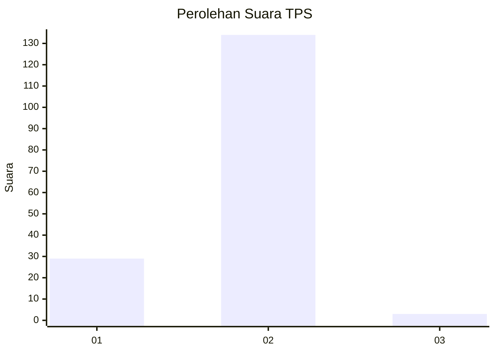
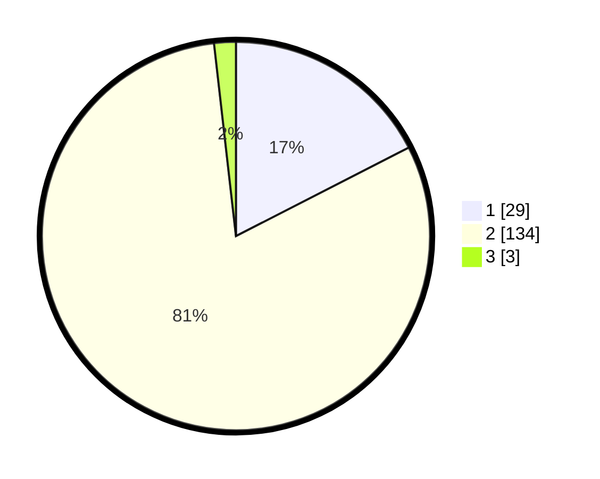

# Hasil

## Grafik

## Tabel

| No. | Nama Paslon    | Suara | Suara (raw) | Persentase |
|:--- |:-------------- | -----:| -----------:| ----------:|
| 1   | ANIES MUHAIMIN | 29    | [29][p-1]   | 17,47      |
| 2   | PRABOWO GIBRAN | 134   | [134][p-2]  | 80,72      |
| 3   | GANJAR MAHFUD  | 3     | [3][p-3]    | 1,81       |

[p-1]: https://github.com/gigit-pemilu/pemilu-2024/blob/main/pilpres/hitung-suara/sub/35-jawa-timur/sub/09-jember/sub/29-sukowono/sub/2006-sukorejo/sub/014-tps/sub/paslon-1.txt
[p-2]: https://github.com/gigit-pemilu/pemilu-2024/blob/main/pilpres/hitung-suara/sub/35-jawa-timur/sub/09-jember/sub/29-sukowono/sub/2006-sukorejo/sub/014-tps/sub/paslon-2.txt
[p-3]: https://github.com/gigit-pemilu/pemilu-2024/blob/main/pilpres/hitung-suara/sub/35-jawa-timur/sub/09-jember/sub/29-sukowono/sub/2006-sukorejo/sub/014-tps/sub/paslon-3.txt

## Foto C Plano

https://sirekap-obj-formc.kpu.go.id/0053/pemilu/ppwp/35/09/29/20/06/3509292006014-20240214-231516--d06a11bb-988f-49dd-8ce1-ec700699c6e5.jpg

https://sirekap-obj-formc.kpu.go.id/0053/pemilu/ppwp/35/09/29/20/06/3509292006014-20240214-231811--26b7335d-24a6-47ad-a8fd-1631f915575a.jpg

https://sirekap-obj-formc.kpu.go.id/0053/pemilu/ppwp/35/09/29/20/06/3509292006014-20240214-232121--bc7ce7d2-c621-4332-86f3-cb30c8b4bbfa.jpg

## Metadata

| Key        | Value               |
| ---------- | ------------------- |
| Time Stamp | 2024-02-15 20:00:44 |

