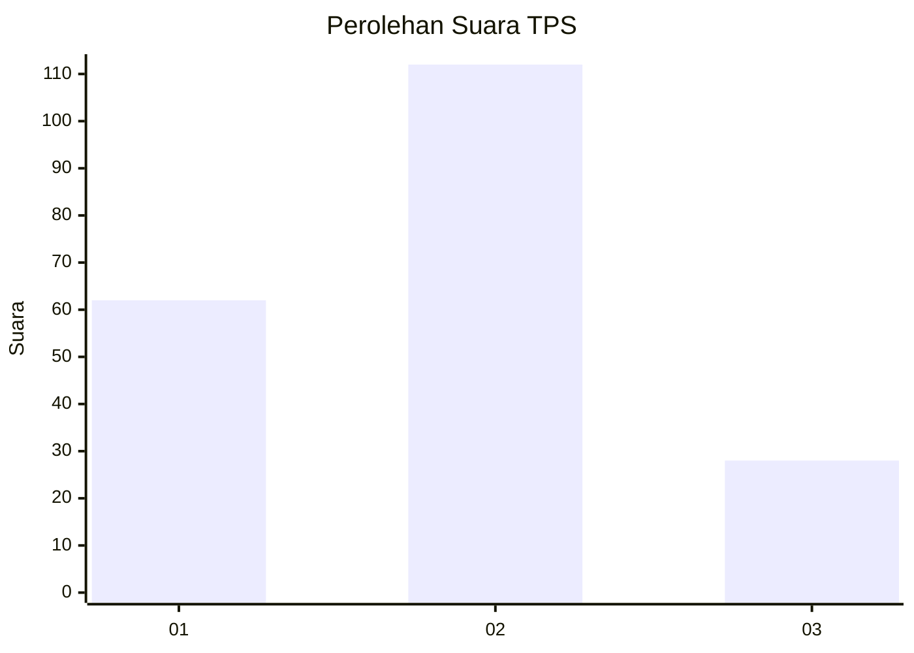
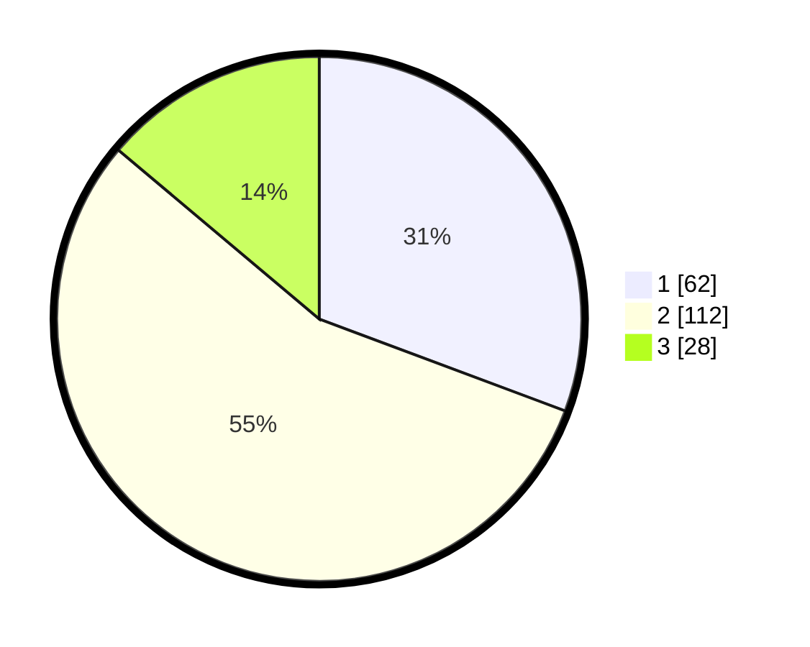

# Hasil

## Grafik

## Tabel

| No. | Nama Paslon    | Suara | Suara (raw) | Persentase |
|:--- |:-------------- | -----:| -----------:| ----------:|
| 1   | ANIES MUHAIMIN | 62    | [62][p-1]   | 30,69      |
| 2   | PRABOWO GIBRAN | 112   | [112][p-2]  | 55,45      |
| 3   | GANJAR MAHFUD  | 28    | [28][p-3]   | 13,86      |

[p-1]: https://github.com/gigit-pemilu/pemilu-2024-35-jawa-timur/blob/main/pilpres/hitung-suara/sub/35-jawa-timur/sub/09-jember/sub/29-sukowono/sub/2007-sukosari/sub/020-tps/sub/paslon-1.txt
[p-2]: https://github.com/gigit-pemilu/pemilu-2024-35-jawa-timur/blob/main/pilpres/hitung-suara/sub/35-jawa-timur/sub/09-jember/sub/29-sukowono/sub/2007-sukosari/sub/020-tps/sub/paslon-2.txt
[p-3]: https://github.com/gigit-pemilu/pemilu-2024-35-jawa-timur/blob/main/pilpres/hitung-suara/sub/35-jawa-timur/sub/09-jember/sub/29-sukowono/sub/2007-sukosari/sub/020-tps/sub/paslon-3.txt

## Foto C Plano

https://sirekap-obj-formc.kpu.go.id/c87f/pemilu/ppwp/35/09/29/20/07/3509292007020-20240215-014551--1e2d7aae-c313-45cf-a048-b1acb2f905a4.jpg

https://sirekap-obj-formc.kpu.go.id/c87f/pemilu/ppwp/35/09/29/20/07/3509292007020-20240215-014609--ef79ab42-7902-481a-8524-e98b4880c6ce.jpg

https://sirekap-obj-formc.kpu.go.id/c87f/pemilu/ppwp/35/09/29/20/07/3509292007020-20240215-014629--b5366823-7f2a-43f7-bc03-b22142983fd3.jpg

## Metadata

| Key        | Value               |
| ---------- | ------------------- |
| Time Stamp | 2024-02-15 20:00:44 |

