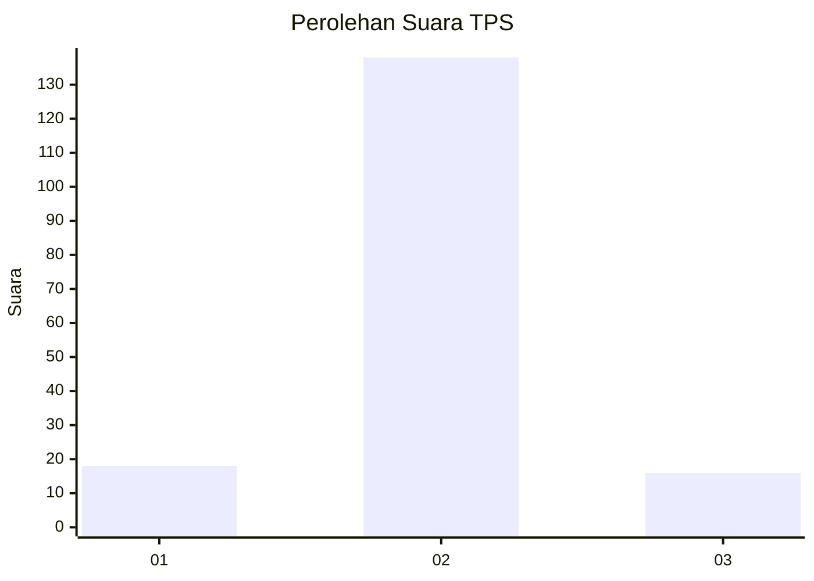
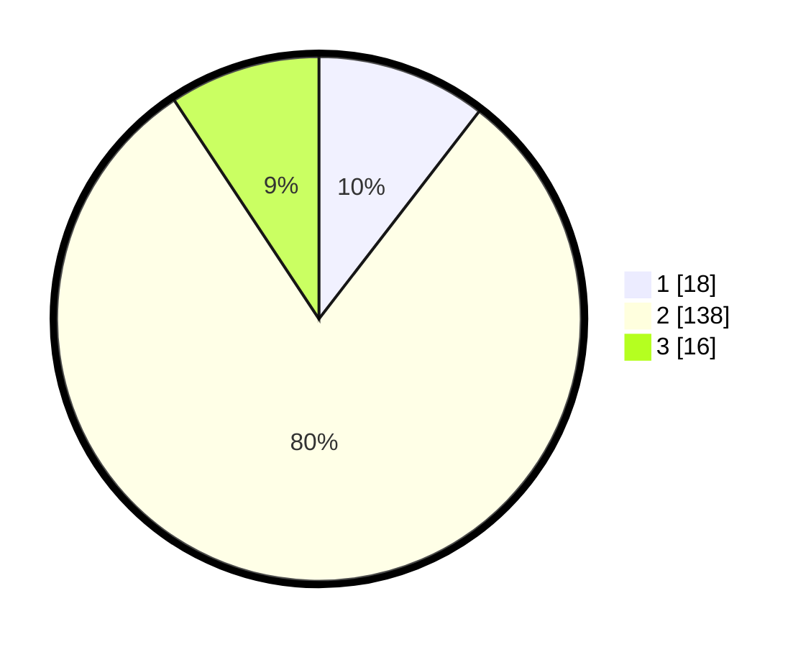

# Hasil

## Grafik

## Tabel

| No. | Nama Paslon    | Suara | Suara (raw) | Persentase |
|:--- |:-------------- | -----:| -----------:| ----------:|
| 1   | ANIES MUHAIMIN | 18    | [18][p-1]   | 10,47      |
| 2   | PRABOWO GIBRAN | 138   | [138][p-2]  | 80,23      |
| 3   | GANJAR MAHFUD  | 16    | [16][p-3]   | 9,30       |

[p-1]: https://github.com/gigit-pemilu/pemilu-2024/blob/main/pilpres/hitung-suara/sub/35-jawa-timur/sub/09-jember/sub/29-sukowono/sub/2007-sukosari/sub/021-tps/sub/paslon-1.txt
[p-2]: https://github.com/gigit-pemilu/pemilu-2024/blob/main/pilpres/hitung-suara/sub/35-jawa-timur/sub/09-jember/sub/29-sukowono/sub/2007-sukosari/sub/021-tps/sub/paslon-2.txt
[p-3]: https://github.com/gigit-pemilu/pemilu-2024/blob/main/pilpres/hitung-suara/sub/35-jawa-timur/sub/09-jember/sub/29-sukowono/sub/2007-sukosari/sub/021-tps/sub/paslon-3.txt

## Foto C Plano

https://sirekap-obj-formc.kpu.go.id/5e37/pemilu/ppwp/35/09/29/20/07/3509292007021-20240214-232606--c333f5b1-1374-426d-8b8e-defd8afd4e16.jpg

https://sirekap-obj-formc.kpu.go.id/5e37/pemilu/ppwp/35/09/29/20/07/3509292007021-20240214-232727--73bb14ba-389a-46dd-b413-c55864117861.jpg

https://sirekap-obj-formc.kpu.go.id/5e37/pemilu/ppwp/35/09/29/20/07/3509292007021-20240214-232801--a37b067d-5d6a-4cba-a8a7-e3f5f6ec7bf2.jpg

## Metadata

| Key        | Value               |
| ---------- | ------------------- |
| Time Stamp | 2024-02-15 20:00:44 |

