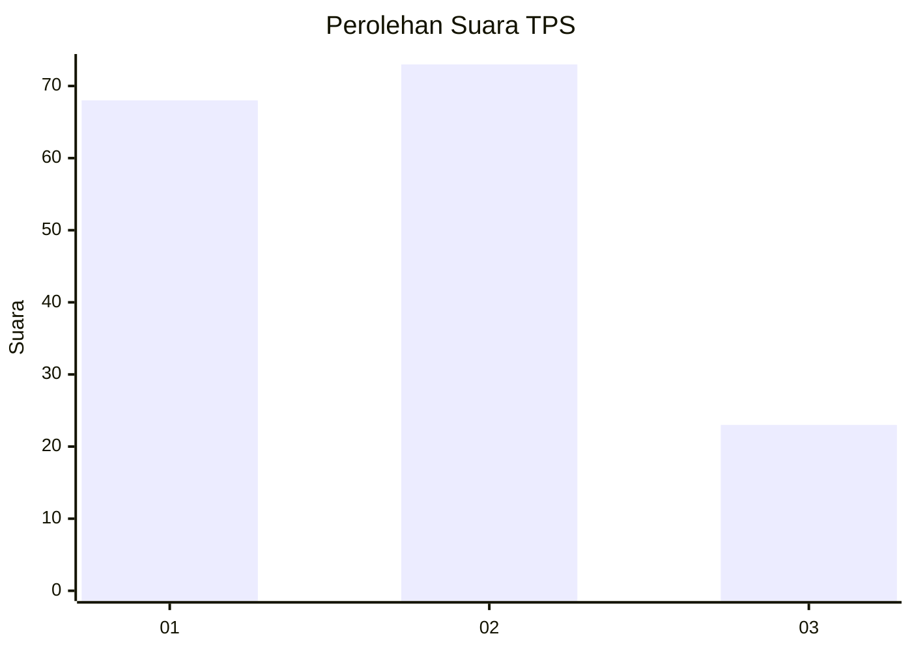
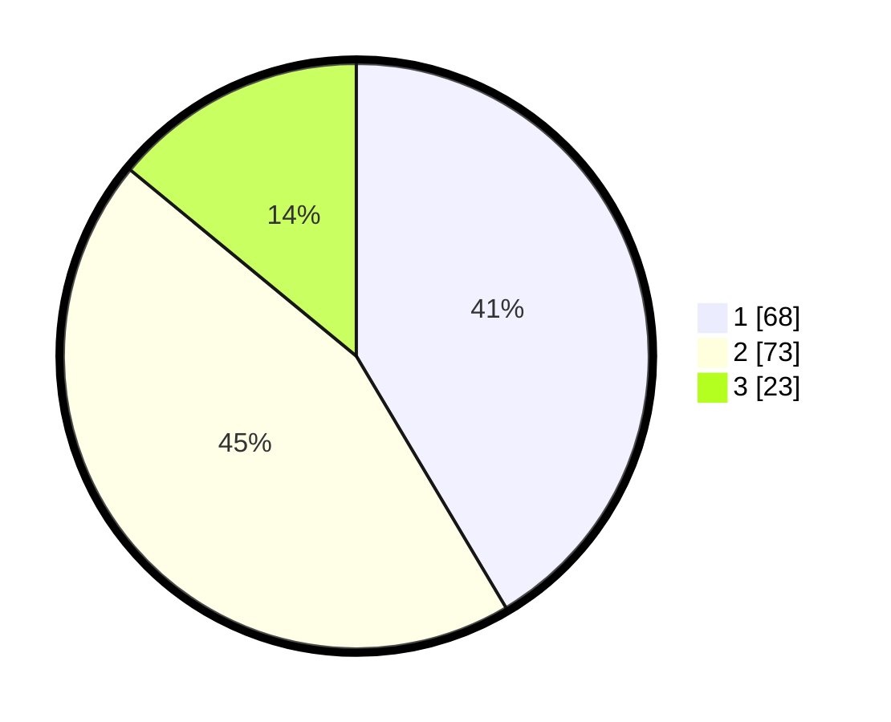

# Hasil

## Grafik

## Tabel

| No. | Nama Paslon    | Suara | Suara (raw) | Persentase |
|:--- |:-------------- | -----:| -----------:| ----------:|
| 1   | ANIES MUHAIMIN | 68    | [68][p-1]   | 41,46      |
| 2   | PRABOWO GIBRAN | 73    | [73][p-2]   | 44,51      |
| 3   | GANJAR MAHFUD  | 23    | [23][p-3]   | 14,02      |

[p-1]: https://github.com/gigit-pemilu/pemilu-2024/blob/main/pilpres/hitung-suara/sub/35-jawa-timur/sub/09-jember/sub/29-sukowono/sub/2008-arjasa/sub/006-tps/sub/paslon-1.txt
[p-2]: https://github.com/gigit-pemilu/pemilu-2024/blob/main/pilpres/hitung-suara/sub/35-jawa-timur/sub/09-jember/sub/29-sukowono/sub/2008-arjasa/sub/006-tps/sub/paslon-2.txt
[p-3]: https://github.com/gigit-pemilu/pemilu-2024/blob/main/pilpres/hitung-suara/sub/35-jawa-timur/sub/09-jember/sub/29-sukowono/sub/2008-arjasa/sub/006-tps/sub/paslon-3.txt

## Foto C Plano

https://sirekap-obj-formc.kpu.go.id/49b2/pemilu/ppwp/35/09/29/20/08/3509292008006-20240215-135219--53f5c1e8-a1d5-4d9c-b663-6046de954d35.jpg

https://sirekap-obj-formc.kpu.go.id/49b2/pemilu/ppwp/35/09/29/20/08/3509292008006-20240215-135322--3778ae81-adf3-4699-b72a-866ad75e9584.jpg

https://sirekap-obj-formc.kpu.go.id/49b2/pemilu/ppwp/35/09/29/20/08/3509292008006-20240215-135433--ffcf61fc-690e-4f57-84eb-1673f2549242.jpg

## Metadata

| Key        | Value               |
| ---------- | ------------------- |
| Time Stamp | 2024-02-15 20:30:46 |

