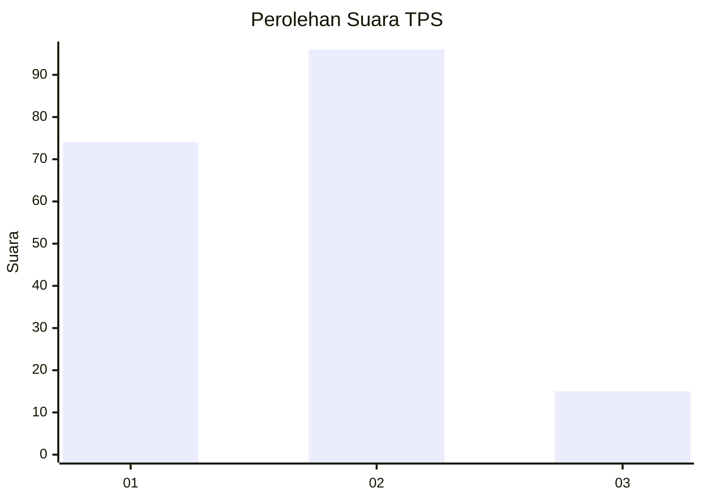

# Hasil

## Grafik

## Tabel

| No. | Nama Paslon    | Suara | Suara (raw) | Persentase |
|:--- |:-------------- | -----:| -----------:| ----------:|
| 1   | ANIES MUHAIMIN | 74    | [74][p-1]   | 40,00      |
| 2   | PRABOWO GIBRAN | 96    | [96][p-2]   | 51,89      |
| 3   | GANJAR MAHFUD  | 15    | [15][p-3]   | 8,11       |

[p-1]: https://github.com/gigit-pemilu/pemilu-2024/blob/main/pilpres/hitung-suara/sub/35-jawa-timur/sub/09-jember/sub/29-sukowono/sub/2008-arjasa/sub/008-tps/sub/paslon-1.txt
[p-2]: https://github.com/gigit-pemilu/pemilu-2024/blob/main/pilpres/hitung-suara/sub/35-jawa-timur/sub/09-jember/sub/29-sukowono/sub/2008-arjasa/sub/008-tps/sub/paslon-2.txt
[p-3]: https://github.com/gigit-pemilu/pemilu-2024/blob/main/pilpres/hitung-suara/sub/35-jawa-timur/sub/09-jember/sub/29-sukowono/sub/2008-arjasa/sub/008-tps/sub/paslon-3.txt

## Foto C Plano

https://sirekap-obj-formc.kpu.go.id/4673/pemilu/ppwp/35/09/29/20/08/3509292008008-20240214-141254--7b92496e-e258-4937-b7ed-16379cf890c8.jpg

https://sirekap-obj-formc.kpu.go.id/4673/pemilu/ppwp/35/09/29/20/08/3509292008008-20240214-141435--3b9295db-3c65-4c73-8f41-a144ffd21622.jpg

https://sirekap-obj-formc.kpu.go.id/4673/pemilu/ppwp/35/09/29/20/08/3509292008008-20240214-141309--4ec58e51-65b5-4261-9a51-4d2e2c72600c.jpg

## Metadata

| Key        | Value               |
| ---------- | ------------------- |
| Time Stamp | 2024-02-15 15:00:29 |

