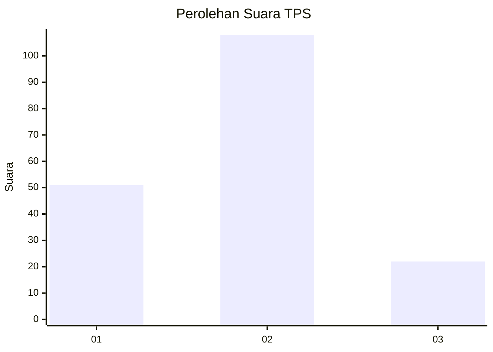
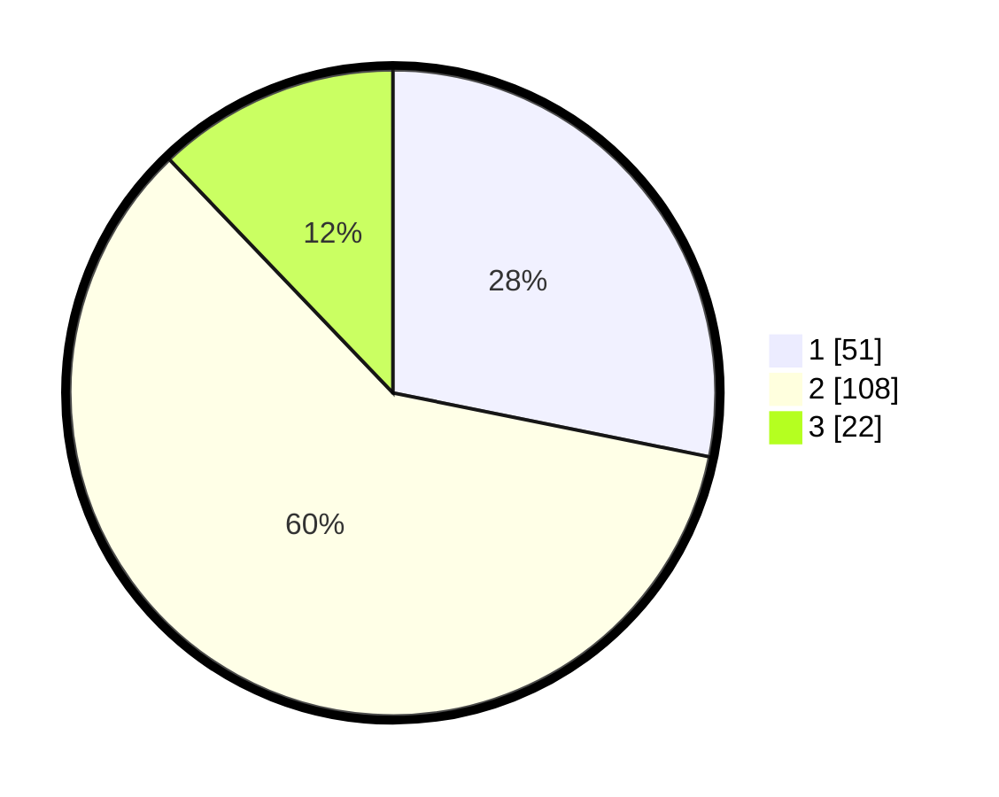

# Hasil

## Grafik

## Tabel

| No. | Nama Paslon    | Suara | Suara (raw) | Persentase |
|:--- |:-------------- | -----:| -----------:| ----------:|
| 1   | ANIES MUHAIMIN | 51    | [51][p-1]   | 28,18      |
| 2   | PRABOWO GIBRAN | 108   | [108][p-2]  | 59,67      |
| 3   | GANJAR MAHFUD  | 22    | [22][p-3]   | 12,15      |

[p-1]: https://github.com/gigit-pemilu/pemilu-2024/blob/main/pilpres/hitung-suara/sub/35-jawa-timur/sub/09-jember/sub/29-sukowono/sub/2009-sumberdanti/sub/006-tps/sub/paslon-1.txt
[p-2]: https://github.com/gigit-pemilu/pemilu-2024/blob/main/pilpres/hitung-suara/sub/35-jawa-timur/sub/09-jember/sub/29-sukowono/sub/2009-sumberdanti/sub/006-tps/sub/paslon-2.txt
[p-3]: https://github.com/gigit-pemilu/pemilu-2024/blob/main/pilpres/hitung-suara/sub/35-jawa-timur/sub/09-jember/sub/29-sukowono/sub/2009-sumberdanti/sub/006-tps/sub/paslon-3.txt

## Foto C Plano

https://sirekap-obj-formc.kpu.go.id/a702/pemilu/ppwp/35/09/29/20/09/3509292009006-20240214-221014--1665422a-20ea-400e-9e0a-700b1ce66650.jpg

https://sirekap-obj-formc.kpu.go.id/a702/pemilu/ppwp/35/09/29/20/09/3509292009006-20240214-221139--e7b6cdf3-05e6-40c6-a4d9-41738ba7f386.jpg

https://sirekap-obj-formc.kpu.go.id/a702/pemilu/ppwp/35/09/29/20/09/3509292009006-20240214-221257--2acfafd8-5493-4f4a-95f9-270bb8161420.jpg

## Metadata

| Key        | Value               |
| ---------- | ------------------- |
| Time Stamp | 2024-02-15 21:01:18 |

