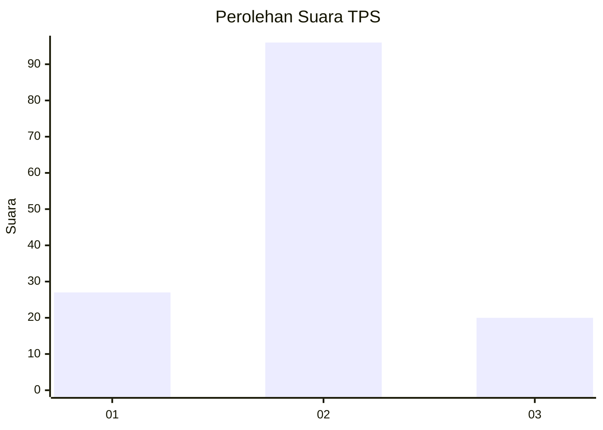
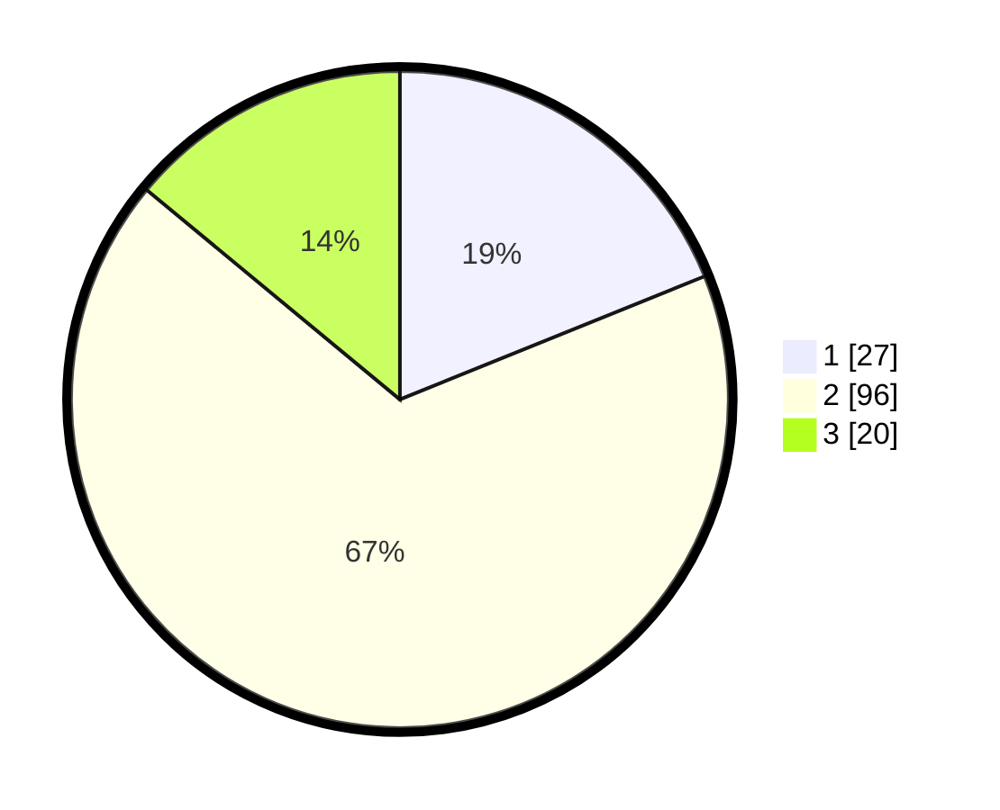

# Hasil

## Grafik

## Tabel

| No. | Nama Paslon    | Suara | Suara (raw) | Persentase |
|:--- |:-------------- | -----:| -----------:| ----------:|
| 1   | ANIES MUHAIMIN | 27    | [27][p-1]   | 18,88      |
| 2   | PRABOWO GIBRAN | 96    | [96][p-2]   | 67,13      |
| 3   | GANJAR MAHFUD  | 20    | [20][p-3]   | 13,99      |

[p-1]: https://github.com/gigit-pemilu/pemilu-2024-35-jawa-timur/blob/main/pilpres/hitung-suara/sub/35-jawa-timur/sub/09-jember/sub/29-sukowono/sub/2009-sumberdanti/sub/017-tps/sub/paslon-1.txt
[p-2]: https://github.com/gigit-pemilu/pemilu-2024-35-jawa-timur/blob/main/pilpres/hitung-suara/sub/35-jawa-timur/sub/09-jember/sub/29-sukowono/sub/2009-sumberdanti/sub/017-tps/sub/paslon-2.txt
[p-3]: https://github.com/gigit-pemilu/pemilu-2024-35-jawa-timur/blob/main/pilpres/hitung-suara/sub/35-jawa-timur/sub/09-jember/sub/29-sukowono/sub/2009-sumberdanti/sub/017-tps/sub/paslon-3.txt

## Foto C Plano

https://sirekap-obj-formc.kpu.go.id/528a/pemilu/ppwp/35/09/29/20/09/3509292009017-20240215-002024--61f45860-7d00-46fe-971a-78836ace4ff2.jpg

https://sirekap-obj-formc.kpu.go.id/528a/pemilu/ppwp/35/09/29/20/09/3509292009017-20240215-002201--5831489d-255e-44f1-be82-6e99167ddc7d.jpg

https://sirekap-obj-formc.kpu.go.id/528a/pemilu/ppwp/35/09/29/20/09/3509292009017-20240215-002329--d44ca809-f241-4d10-94fb-3ebd473fe3f9.jpg

## Metadata

| Key        | Value               |
| ---------- | ------------------- |
| Time Stamp | 2024-02-15 20:00:44 |

