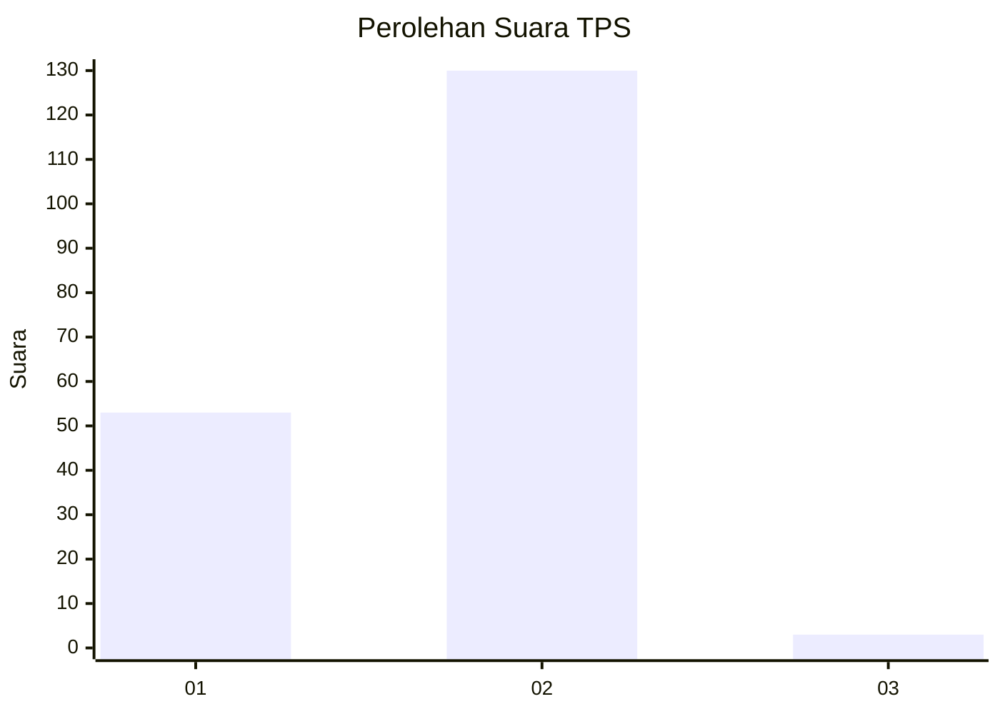
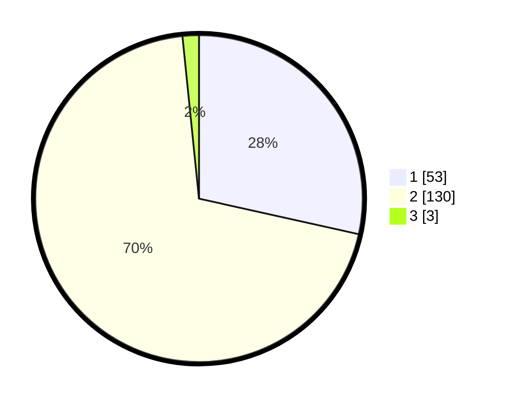

# Hasil

## Grafik

## Tabel

| No. | Nama Paslon    | Suara | Suara (raw) | Persentase |
|:--- |:-------------- | -----:| -----------:| ----------:|
| 1   | ANIES MUHAIMIN | 53    | [53][p-1]   | 28,49      |
| 2   | PRABOWO GIBRAN | 130   | [130][p-2]  | 69,89      |
| 3   | GANJAR MAHFUD  | 3     | [3][p-3]    | 1,61       |

[p-1]: https://github.com/gigit-pemilu/pemilu-2024/blob/main/pilpres/hitung-suara/sub/35-jawa-timur/sub/09-jember/sub/29-sukowono/sub/2010-pocangan/sub/002-tps/sub/paslon-1.txt
[p-2]: https://github.com/gigit-pemilu/pemilu-2024/blob/main/pilpres/hitung-suara/sub/35-jawa-timur/sub/09-jember/sub/29-sukowono/sub/2010-pocangan/sub/002-tps/sub/paslon-2.txt
[p-3]: https://github.com/gigit-pemilu/pemilu-2024/blob/main/pilpres/hitung-suara/sub/35-jawa-timur/sub/09-jember/sub/29-sukowono/sub/2010-pocangan/sub/002-tps/sub/paslon-3.txt

## Foto C Plano

https://sirekap-obj-formc.kpu.go.id/0a0a/pemilu/ppwp/35/09/29/20/10/3509292010002-20240220-132814--2b560893-67f3-4c2f-8486-f6d31608ebd7.jpg

https://sirekap-obj-formc.kpu.go.id/0a0a/pemilu/ppwp/35/09/29/20/10/3509292010002-20240220-133012--82af10b9-729c-450d-b4a0-f3534395e40a.jpg

https://sirekap-obj-formc.kpu.go.id/0a0a/pemilu/ppwp/35/09/29/20/10/3509292010002-20240220-133335--edd43d66-7f27-40ba-abc2-f2b5c880930d.jpg

## Metadata

| Key        | Value               |
| ---------- | ------------------- |
| Time Stamp | 2024-02-24 22:31:28 |

