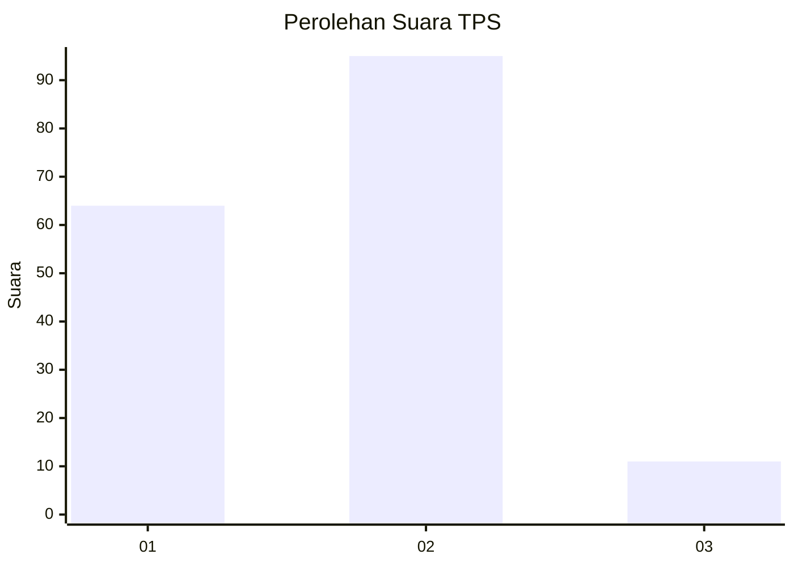
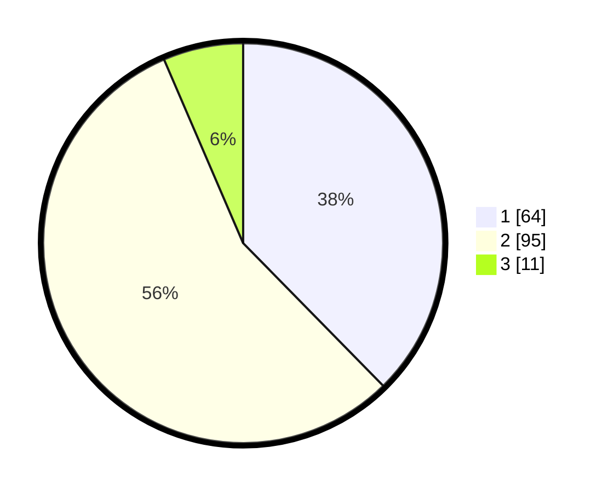

# Hasil

## Grafik

## Tabel

| No. | Nama Paslon    | Suara | Suara (raw) | Persentase |
|:--- |:-------------- | -----:| -----------:| ----------:|
| 1   | ANIES MUHAIMIN | 64    | [64][p-1]   | 37,65      |
| 2   | PRABOWO GIBRAN | 95    | [95][p-2]   | 55,88      |
| 3   | GANJAR MAHFUD  | 11    | [11][p-3]   | 6,47       |

[p-1]: https://github.com/gigit-pemilu/pemilu-2024/blob/main/pilpres/hitung-suara/sub/35-jawa-timur/sub/09-jember/sub/29-sukowono/sub/2010-pocangan/sub/005-tps/sub/paslon-1.txt
[p-2]: https://github.com/gigit-pemilu/pemilu-2024/blob/main/pilpres/hitung-suara/sub/35-jawa-timur/sub/09-jember/sub/29-sukowono/sub/2010-pocangan/sub/005-tps/sub/paslon-2.txt
[p-3]: https://github.com/gigit-pemilu/pemilu-2024/blob/main/pilpres/hitung-suara/sub/35-jawa-timur/sub/09-jember/sub/29-sukowono/sub/2010-pocangan/sub/005-tps/sub/paslon-3.txt

## Foto C Plano

https://sirekap-obj-formc.kpu.go.id/78cf/pemilu/ppwp/35/09/29/20/10/3509292010005-20240214-233245--d9c392c3-1f77-46ce-9a37-cb805dea60d6.jpg

https://sirekap-obj-formc.kpu.go.id/78cf/pemilu/ppwp/35/09/29/20/10/3509292010005-20240214-200305--e9a8ec13-acba-4298-8623-d2694642798b.jpg

https://sirekap-obj-formc.kpu.go.id/78cf/pemilu/ppwp/35/09/29/20/10/3509292010005-20240214-200338--a51a9d00-1400-4190-8be1-d4f7fde9f181.jpg

## Metadata

| Key        | Value               |
| ---------- | ------------------- |
| Time Stamp | 2024-02-15 18:30:25 |

