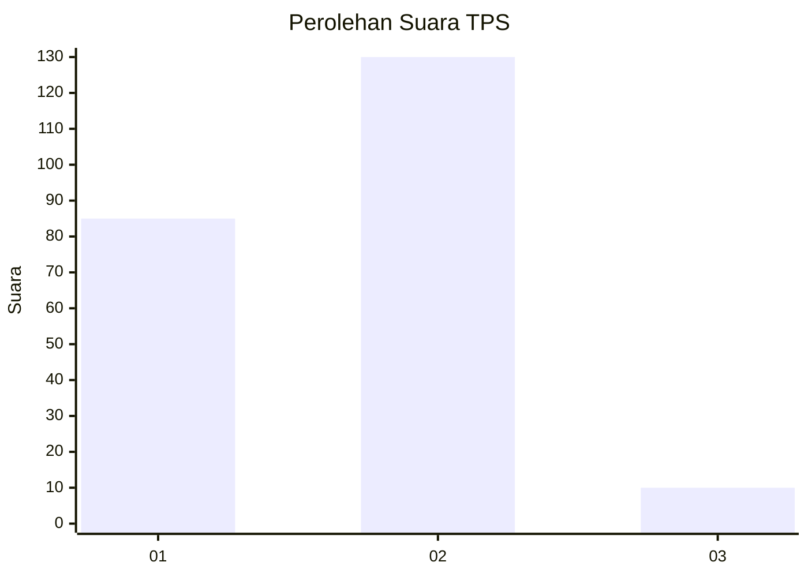
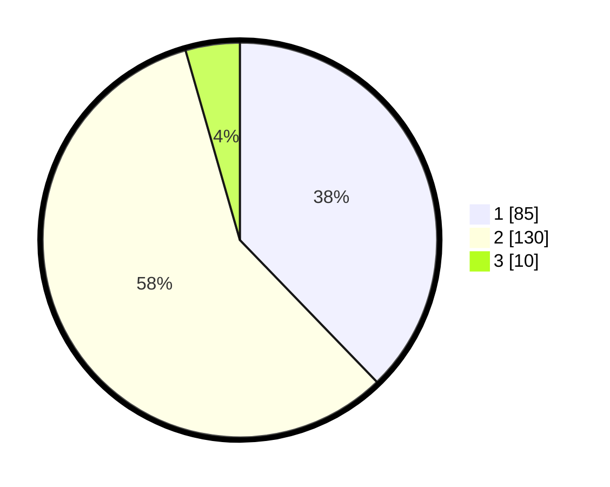

# Hasil

## Grafik

## Tabel

| No. | Nama Paslon    | Suara | Suara (raw) | Persentase |
|:--- |:-------------- | -----:| -----------:| ----------:|
| 1   | ANIES MUHAIMIN | 85    | [85][p-1]   | 37,78      |
| 2   | PRABOWO GIBRAN | 130   | [130][p-2]  | 57,78      |
| 3   | GANJAR MAHFUD  | 10    | [10][p-3]   | 4,44       |

[p-1]: https://github.com/gigit-pemilu/pemilu-2024/blob/main/pilpres/hitung-suara/sub/35-jawa-timur/sub/09-jember/sub/29-sukowono/sub/2010-pocangan/sub/007-tps/sub/paslon-1.txt
[p-2]: https://github.com/gigit-pemilu/pemilu-2024/blob/main/pilpres/hitung-suara/sub/35-jawa-timur/sub/09-jember/sub/29-sukowono/sub/2010-pocangan/sub/007-tps/sub/paslon-2.txt
[p-3]: https://github.com/gigit-pemilu/pemilu-2024/blob/main/pilpres/hitung-suara/sub/35-jawa-timur/sub/09-jember/sub/29-sukowono/sub/2010-pocangan/sub/007-tps/sub/paslon-3.txt

## Foto C Plano

https://sirekap-obj-formc.kpu.go.id/d39a/pemilu/ppwp/35/09/29/20/10/3509292010007-20240215-032932--c4cf2e67-ac00-4336-b3dd-0e2db9ea52a1.jpg

https://sirekap-obj-formc.kpu.go.id/d39a/pemilu/ppwp/35/09/29/20/10/3509292010007-20240215-033014--9f6a800c-e2ff-4137-9dbd-9b9820310244.jpg

https://sirekap-obj-formc.kpu.go.id/d39a/pemilu/ppwp/35/09/29/20/10/3509292010007-20240215-033111--91a36e9f-f2db-4e70-8247-b6547d277dbb.jpg

## Metadata

| Key        | Value               |
| ---------- | ------------------- |
| Time Stamp | 2024-02-15 20:00:44 |

