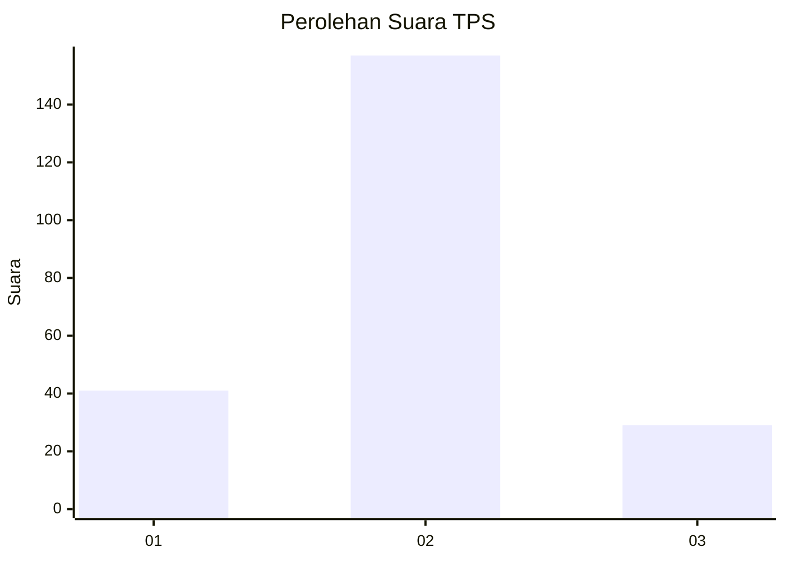
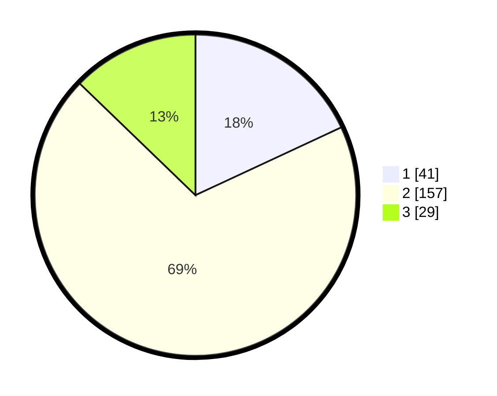

# Hasil

## Grafik

## Tabel

| No. | Nama Paslon    | Suara | Suara (raw) | Persentase |
|:--- |:-------------- | -----:| -----------:| ----------:|
| 1   | ANIES MUHAIMIN | 41    | [41][p-1]   | 18,06      |
| 2   | PRABOWO GIBRAN | 157   | [157][p-2]  | 69,16      |
| 3   | GANJAR MAHFUD  | 29    | [29][p-3]   | 12,78      |

[p-1]: https://github.com/gigit-pemilu/pemilu-2024/blob/main/pilpres/hitung-suara/sub/35-jawa-timur/sub/09-jember/sub/29-sukowono/sub/2011-dawuhanmangli/sub/006-tps/sub/paslon-1.txt
[p-2]: https://github.com/gigit-pemilu/pemilu-2024/blob/main/pilpres/hitung-suara/sub/35-jawa-timur/sub/09-jember/sub/29-sukowono/sub/2011-dawuhanmangli/sub/006-tps/sub/paslon-2.txt
[p-3]: https://github.com/gigit-pemilu/pemilu-2024/blob/main/pilpres/hitung-suara/sub/35-jawa-timur/sub/09-jember/sub/29-sukowono/sub/2011-dawuhanmangli/sub/006-tps/sub/paslon-3.txt

## Foto C Plano

https://sirekap-obj-formc.kpu.go.id/8752/pemilu/ppwp/35/09/29/20/11/3509292011006-20240215-010701--7e6125b8-b21d-4f6c-88a7-bf4dd0e544b8.jpg

https://sirekap-obj-formc.kpu.go.id/8752/pemilu/ppwp/35/09/29/20/11/3509292011006-20240215-010825--c0c0787f-498f-491a-9f11-20028e33956a.jpg

https://sirekap-obj-formc.kpu.go.id/8752/pemilu/ppwp/35/09/29/20/11/3509292011006-20240215-011334--42aeb7b8-cd58-473a-9c46-6f9524e02a8c.jpg

## Metadata

| Key        | Value               |
| ---------- | ------------------- |
| Time Stamp | 2024-02-15 18:30:25 |

