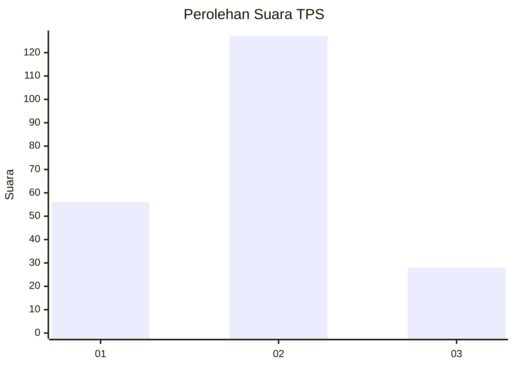
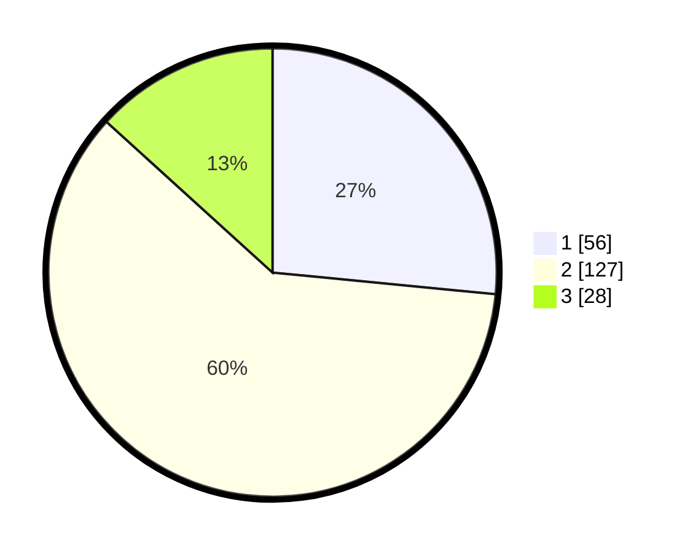

# Hasil

## Grafik

## Tabel

| No. | Nama Paslon    | Suara | Suara (raw) | Persentase |
|:--- |:-------------- | -----:| -----------:| ----------:|
| 1   | ANIES MUHAIMIN | 56    | [56][p-1]   | 26,54      |
| 2   | PRABOWO GIBRAN | 127   | [127][p-2]  | 60,19      |
| 3   | GANJAR MAHFUD  | 28    | [28][p-3]   | 13,27      |

[p-1]: https://github.com/gigit-pemilu/pemilu-2024/blob/main/pilpres/hitung-suara/sub/35-jawa-timur/sub/09-jember/sub/29-sukowono/sub/2011-dawuhanmangli/sub/009-tps/sub/paslon-1.txt
[p-2]: https://github.com/gigit-pemilu/pemilu-2024/blob/main/pilpres/hitung-suara/sub/35-jawa-timur/sub/09-jember/sub/29-sukowono/sub/2011-dawuhanmangli/sub/009-tps/sub/paslon-2.txt
[p-3]: https://github.com/gigit-pemilu/pemilu-2024/blob/main/pilpres/hitung-suara/sub/35-jawa-timur/sub/09-jember/sub/29-sukowono/sub/2011-dawuhanmangli/sub/009-tps/sub/paslon-3.txt

## Foto C Plano

https://sirekap-obj-formc.kpu.go.id/af00/pemilu/ppwp/35/09/29/20/11/3509292011009-20240215-055803--c7f0cd8d-2e33-4d1a-ad38-4ed91f0b22bd.jpg

https://sirekap-obj-formc.kpu.go.id/af00/pemilu/ppwp/35/09/29/20/11/3509292011009-20240215-060039--341b9180-d988-4a30-b17d-ab81fd7365f9.jpg

https://sirekap-obj-formc.kpu.go.id/af00/pemilu/ppwp/35/09/29/20/11/3509292011009-20240215-060105--345a30c3-0130-4ecc-a8d0-a50e2873590a.jpg

## Metadata

| Key        | Value               |
| ---------- | ------------------- |
| Time Stamp | 2024-02-15 22:00:27 |

