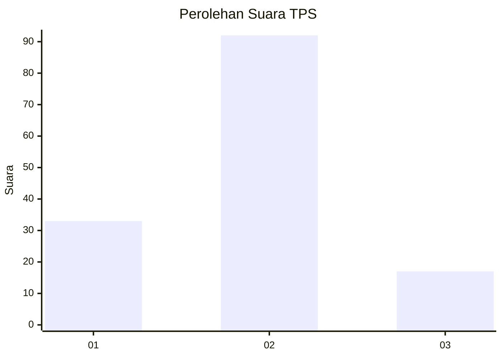
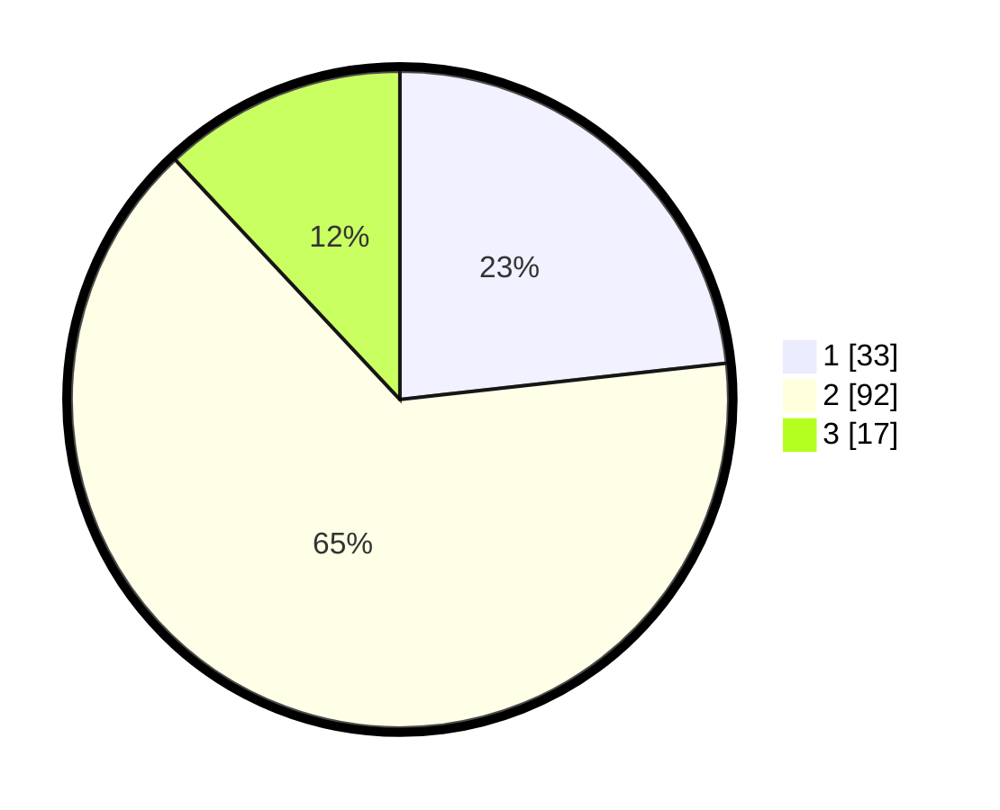

# Hasil

## Grafik

## Tabel

| No. | Nama Paslon    | Suara | Suara (raw) | Persentase |
|:--- |:-------------- | -----:| -----------:| ----------:|
| 1   | ANIES MUHAIMIN | 33    | [33][p-1]   | 23,24      |
| 2   | PRABOWO GIBRAN | 92    | [92][p-2]   | 64,79      |
| 3   | GANJAR MAHFUD  | 17    | [17][p-3]   | 11,97      |

[p-1]: https://github.com/gigit-pemilu/pemilu-2024/blob/main/pilpres/hitung-suara/sub/35-jawa-timur/sub/09-jember/sub/29-sukowono/sub/2011-dawuhanmangli/sub/012-tps/sub/paslon-1.txt
[p-2]: https://github.com/gigit-pemilu/pemilu-2024/blob/main/pilpres/hitung-suara/sub/35-jawa-timur/sub/09-jember/sub/29-sukowono/sub/2011-dawuhanmangli/sub/012-tps/sub/paslon-2.txt
[p-3]: https://github.com/gigit-pemilu/pemilu-2024/blob/main/pilpres/hitung-suara/sub/35-jawa-timur/sub/09-jember/sub/29-sukowono/sub/2011-dawuhanmangli/sub/012-tps/sub/paslon-3.txt

## Foto C Plano

https://sirekap-obj-formc.kpu.go.id/c8be/pemilu/ppwp/35/09/29/20/11/3509292011012-20240214-191141--43228910-ebcd-4d98-8952-e053ca5d7d93.jpg

https://sirekap-obj-formc.kpu.go.id/c8be/pemilu/ppwp/35/09/29/20/11/3509292011012-20240214-191150--570f5eba-1e86-4490-ae71-a2f94f538c54.jpg

https://sirekap-obj-formc.kpu.go.id/c8be/pemilu/ppwp/35/09/29/20/11/3509292011012-20240214-191156--a0906189-1b41-4253-bbab-6f5419ae3230.jpg

## Metadata

| Key        | Value               |
| ---------- | ------------------- |
| Time Stamp | 2024-02-15 18:30:25 |

