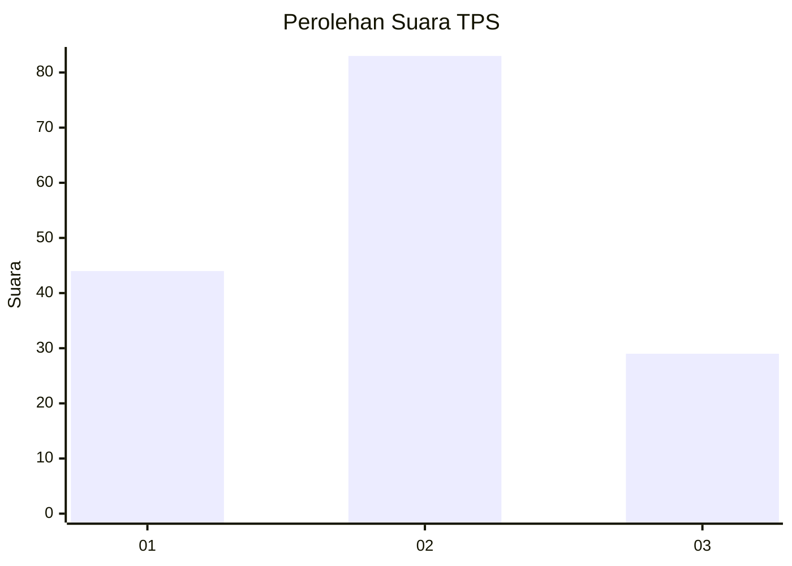
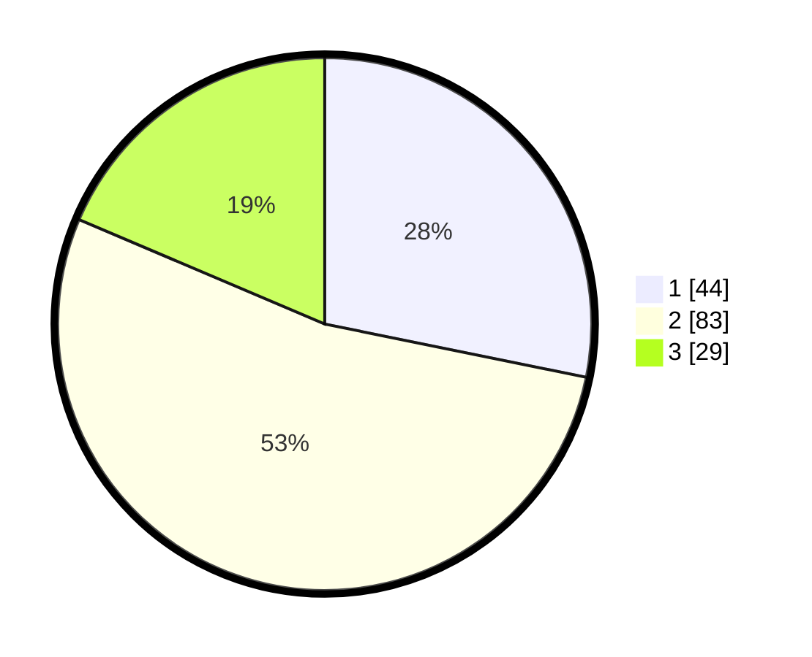

# Hasil

## Grafik

## Tabel

| No. | Nama Paslon    | Suara | Suara (raw) | Persentase |
|:--- |:-------------- | -----:| -----------:| ----------:|
| 1   | ANIES MUHAIMIN | 44    | [44][p-1]   | 28,21      |
| 2   | PRABOWO GIBRAN | 83    | [83][p-2]   | 53,21      |
| 3   | GANJAR MAHFUD  | 29    | [29][p-3]   | 18,59      |

[p-1]: https://github.com/gigit-pemilu/pemilu-2024-35-jawa-timur/blob/main/pilpres/hitung-suara/sub/35-jawa-timur/sub/09-jember/sub/29-sukowono/sub/2012-mojogemi/sub/001-tps/sub/paslon-1.txt
[p-2]: https://github.com/gigit-pemilu/pemilu-2024-35-jawa-timur/blob/main/pilpres/hitung-suara/sub/35-jawa-timur/sub/09-jember/sub/29-sukowono/sub/2012-mojogemi/sub/001-tps/sub/paslon-2.txt
[p-3]: https://github.com/gigit-pemilu/pemilu-2024-35-jawa-timur/blob/main/pilpres/hitung-suara/sub/35-jawa-timur/sub/09-jember/sub/29-sukowono/sub/2012-mojogemi/sub/001-tps/sub/paslon-3.txt

## Foto C Plano

https://sirekap-obj-formc.kpu.go.id/73f9/pemilu/ppwp/35/09/29/20/12/3509292012001-20240214-195403--5ec6d9a2-49ad-41e1-828b-bd7051dc5024.jpg

https://sirekap-obj-formc.kpu.go.id/73f9/pemilu/ppwp/35/09/29/20/12/3509292012001-20240214-200445--cb51adfe-f1b2-4b8b-b574-19a7a99a6559.jpg

https://sirekap-obj-formc.kpu.go.id/73f9/pemilu/ppwp/35/09/29/20/12/3509292012001-20240214-200705--c66a2a23-03bf-4059-8efc-3df82827e70f.jpg

## Metadata

| Key        | Value               |
| ---------- | ------------------- |
| Time Stamp | 2024-02-15 00:41:44 |

