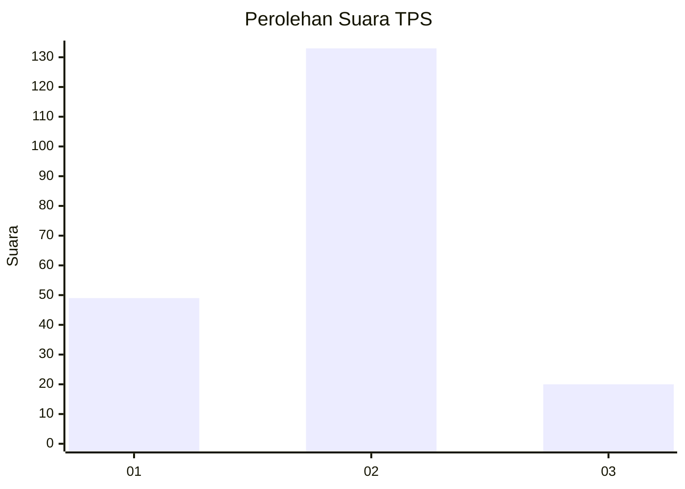

# Hasil

## Grafik

## Tabel

| No. | Nama Paslon    | Suara | Suara (raw) | Persentase |
|:--- |:-------------- | -----:| -----------:| ----------:|
| 1   | ANIES MUHAIMIN | 49    | [49][p-1]   | 24,26      |
| 2   | PRABOWO GIBRAN | 133   | [133][p-2]  | 65,84      |
| 3   | GANJAR MAHFUD  | 20    | [20][p-3]   | 9,90       |

[p-1]: https://github.com/gigit-pemilu/pemilu-2024/blob/main/pilpres/hitung-suara/sub/35-jawa-timur/sub/09-jember/sub/29-sukowono/sub/2012-mojogemi/sub/002-tps/sub/paslon-1.txt
[p-2]: https://github.com/gigit-pemilu/pemilu-2024/blob/main/pilpres/hitung-suara/sub/35-jawa-timur/sub/09-jember/sub/29-sukowono/sub/2012-mojogemi/sub/002-tps/sub/paslon-2.txt
[p-3]: https://github.com/gigit-pemilu/pemilu-2024/blob/main/pilpres/hitung-suara/sub/35-jawa-timur/sub/09-jember/sub/29-sukowono/sub/2012-mojogemi/sub/002-tps/sub/paslon-3.txt

## Foto C Plano

https://sirekap-obj-formc.kpu.go.id/b23d/pemilu/ppwp/35/09/29/20/12/3509292012002-20240217-123449--03e01f84-df40-4523-b1d0-5d1f051175f6.jpg

https://sirekap-obj-formc.kpu.go.id/b23d/pemilu/ppwp/35/09/29/20/12/3509292012002-20240217-123656--05a7522b-18c7-4626-982f-a0b681654dc4.jpg

https://sirekap-obj-formc.kpu.go.id/b23d/pemilu/ppwp/35/09/29/20/12/3509292012002-20240217-123248--272fc883-ee50-4323-ae09-ba4b4d67777f.jpg

## Metadata

| Key        | Value               |
| ---------- | ------------------- |
| Time Stamp | 2024-02-25 15:00:00 |

