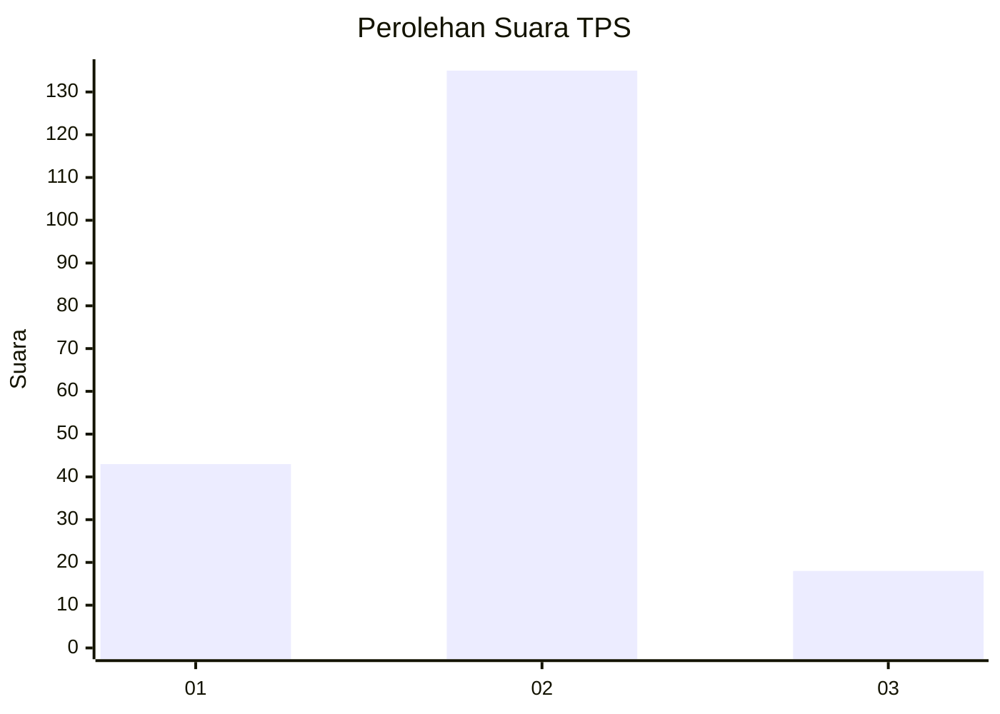

# Hasil

## Grafik

## Tabel

| No. | Nama Paslon    | Suara | Suara (raw) | Persentase |
|:--- |:-------------- | -----:| -----------:| ----------:|
| 1   | ANIES MUHAIMIN | 43    | [43][p-1]   | 21,94      |
| 2   | PRABOWO GIBRAN | 135   | [135][p-2]  | 68,88      |
| 3   | GANJAR MAHFUD  | 18    | [18][p-3]   | 9,18       |

[p-1]: https://github.com/gigit-pemilu/pemilu-2024/blob/main/pilpres/hitung-suara/sub/35-jawa-timur/sub/09-jember/sub/29-sukowono/sub/2012-mojogemi/sub/006-tps/sub/paslon-1.txt
[p-2]: https://github.com/gigit-pemilu/pemilu-2024/blob/main/pilpres/hitung-suara/sub/35-jawa-timur/sub/09-jember/sub/29-sukowono/sub/2012-mojogemi/sub/006-tps/sub/paslon-2.txt
[p-3]: https://github.com/gigit-pemilu/pemilu-2024/blob/main/pilpres/hitung-suara/sub/35-jawa-timur/sub/09-jember/sub/29-sukowono/sub/2012-mojogemi/sub/006-tps/sub/paslon-3.txt

## Foto C Plano

https://sirekap-obj-formc.kpu.go.id/4efb/pemilu/ppwp/35/09/29/20/12/3509292012006-20240214-223953--d1a6d824-b115-4865-afba-f71980daaebd.jpg

https://sirekap-obj-formc.kpu.go.id/4efb/pemilu/ppwp/35/09/29/20/12/3509292012006-20240214-225645--480ed3c7-43ee-4297-b224-b8d17ab7a5cf.jpg

https://sirekap-obj-formc.kpu.go.id/4efb/pemilu/ppwp/35/09/29/20/12/3509292012006-20240214-225838--76569e31-e308-4c95-95c6-2523260f3826.jpg

## Metadata

| Key        | Value               |
| ---------- | ------------------- |
| Time Stamp | 2024-02-15 18:30:25 |

