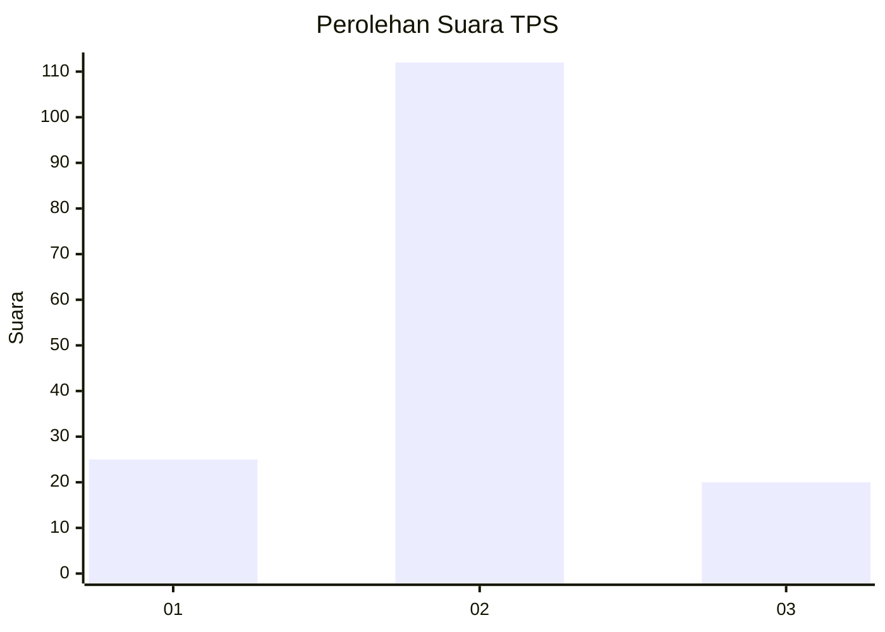
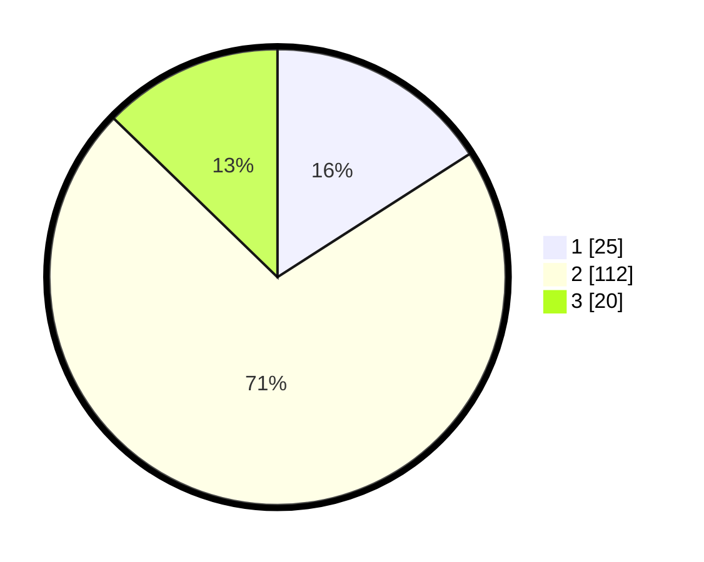

# Hasil

## Grafik

## Tabel

| No. | Nama Paslon    | Suara | Suara (raw) | Persentase |
|:--- |:-------------- | -----:| -----------:| ----------:|
| 1   | ANIES MUHAIMIN | 25    | [25][p-1]   | 15,92      |
| 2   | PRABOWO GIBRAN | 112   | [112][p-2]  | 71,34      |
| 3   | GANJAR MAHFUD  | 20    | [20][p-3]   | 12,74      |

[p-1]: https://github.com/gigit-pemilu/pemilu-2024-35-jawa-timur/blob/main/pilpres/hitung-suara/sub/35-jawa-timur/sub/09-jember/sub/29-sukowono/sub/2012-mojogemi/sub/007-tps/sub/paslon-1.txt
[p-2]: https://github.com/gigit-pemilu/pemilu-2024-35-jawa-timur/blob/main/pilpres/hitung-suara/sub/35-jawa-timur/sub/09-jember/sub/29-sukowono/sub/2012-mojogemi/sub/007-tps/sub/paslon-2.txt
[p-3]: https://github.com/gigit-pemilu/pemilu-2024-35-jawa-timur/blob/main/pilpres/hitung-suara/sub/35-jawa-timur/sub/09-jember/sub/29-sukowono/sub/2012-mojogemi/sub/007-tps/sub/paslon-3.txt

## Foto C Plano

https://sirekap-obj-formc.kpu.go.id/a912/pemilu/ppwp/35/09/29/20/12/3509292012007-20240214-201820--b81a5847-eb02-4d6c-bf82-8eb0fd8f1ab4.jpg

https://sirekap-obj-formc.kpu.go.id/a912/pemilu/ppwp/35/09/29/20/12/3509292012007-20240214-202007--be3cc314-c28b-4e35-8ca0-b01ec8d27902.jpg

https://sirekap-obj-formc.kpu.go.id/a912/pemilu/ppwp/35/09/29/20/12/3509292012007-20240214-202116--483a9b4f-04da-4882-8ef0-d7419630341a.jpg

## Metadata

| Key        | Value               |
| ---------- | ------------------- |
| Time Stamp | 2024-02-15 18:30:25 |

