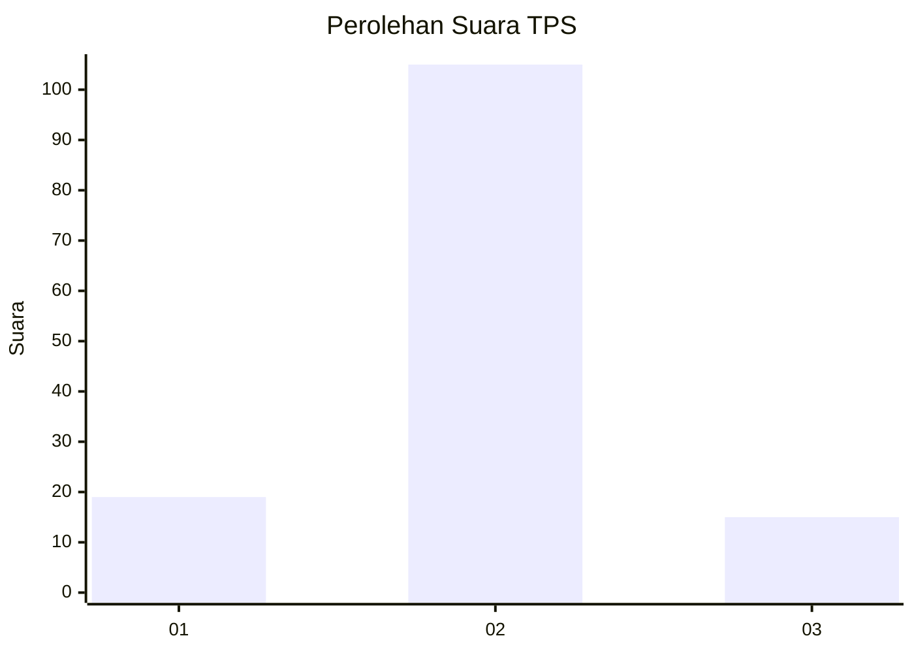
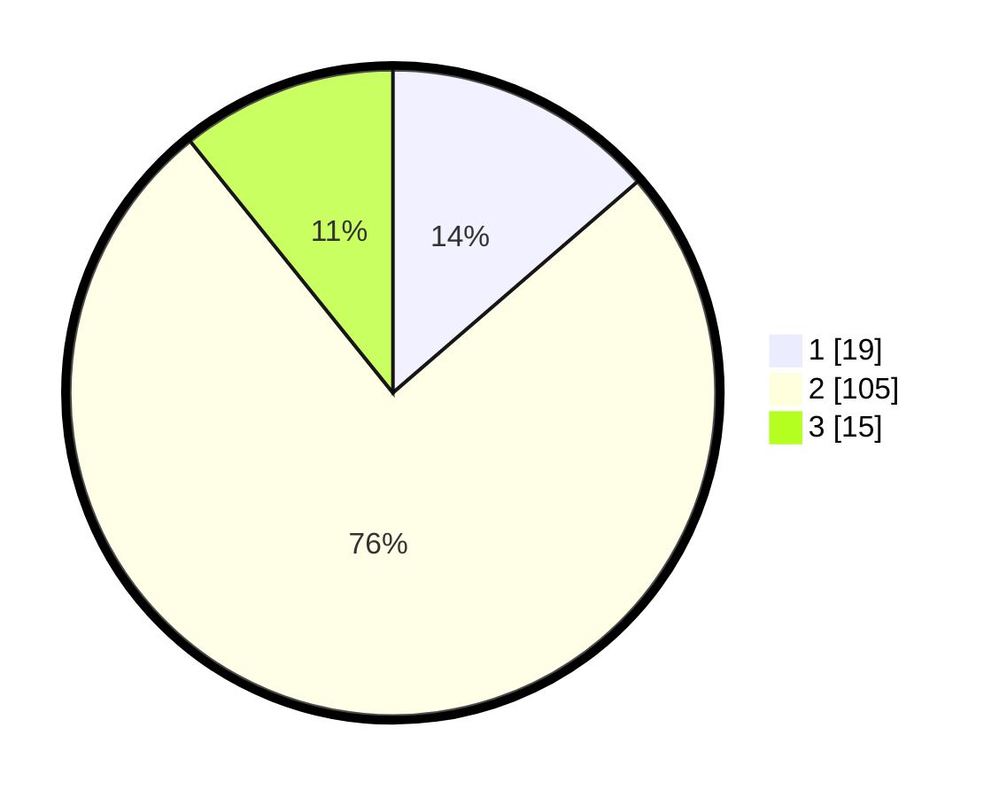

# Hasil

## Grafik

## Tabel

| No. | Nama Paslon    | Suara | Suara (raw) | Persentase |
|:--- |:-------------- | -----:| -----------:| ----------:|
| 1   | ANIES MUHAIMIN | 19    | [19][p-1]   | 13,67      |
| 2   | PRABOWO GIBRAN | 105   | [105][p-2]  | 75,54      |
| 3   | GANJAR MAHFUD  | 15    | [15][p-3]   | 10,79      |

[p-1]: https://github.com/gigit-pemilu/pemilu-2024-35-jawa-timur/blob/main/pilpres/hitung-suara/sub/35-jawa-timur/sub/09-jember/sub/30-silo/sub/2001-sempolan/sub/001-tps/sub/paslon-1.txt
[p-2]: https://github.com/gigit-pemilu/pemilu-2024-35-jawa-timur/blob/main/pilpres/hitung-suara/sub/35-jawa-timur/sub/09-jember/sub/30-silo/sub/2001-sempolan/sub/001-tps/sub/paslon-2.txt
[p-3]: https://github.com/gigit-pemilu/pemilu-2024-35-jawa-timur/blob/main/pilpres/hitung-suara/sub/35-jawa-timur/sub/09-jember/sub/30-silo/sub/2001-sempolan/sub/001-tps/sub/paslon-3.txt

## Foto C Plano

https://sirekap-obj-formc.kpu.go.id/769a/pemilu/ppwp/35/09/30/20/01/3509302001001-20240215-180221--05316a60-dbb4-49f5-b2c5-211112109711.jpg

https://sirekap-obj-formc.kpu.go.id/769a/pemilu/ppwp/35/09/30/20/01/3509302001001-20240215-180228--4e52fa1c-8216-4033-8e01-ccb1a8b72cfe.jpg

## Metadata

| Key        | Value               |
| ---------- | ------------------- |
| Time Stamp | 2024-02-25 16:00:00 |

