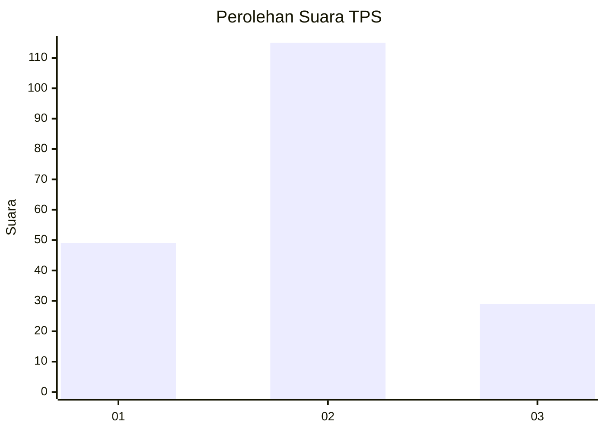

# Hasil

## Grafik

## Tabel

| No. | Nama Paslon    | Suara | Suara (raw) | Persentase |
|:--- |:-------------- | -----:| -----------:| ----------:|
| 1   | ANIES MUHAIMIN | 49    | [49][p-1]   | 25,39      |
| 2   | PRABOWO GIBRAN | 115   | [115][p-2]  | 59,59      |
| 3   | GANJAR MAHFUD  | 29    | [29][p-3]   | 15,03      |

[p-1]: https://github.com/gigit-pemilu/pemilu-2024-35-jawa-timur/blob/main/pilpres/hitung-suara/sub/35-jawa-timur/sub/09-jember/sub/30-silo/sub/2001-sempolan/sub/004-tps/sub/paslon-1.txt
[p-2]: https://github.com/gigit-pemilu/pemilu-2024-35-jawa-timur/blob/main/pilpres/hitung-suara/sub/35-jawa-timur/sub/09-jember/sub/30-silo/sub/2001-sempolan/sub/004-tps/sub/paslon-2.txt
[p-3]: https://github.com/gigit-pemilu/pemilu-2024-35-jawa-timur/blob/main/pilpres/hitung-suara/sub/35-jawa-timur/sub/09-jember/sub/30-silo/sub/2001-sempolan/sub/004-tps/sub/paslon-3.txt

## Foto C Plano

https://sirekap-obj-formc.kpu.go.id/61ea/pemilu/ppwp/35/09/30/20/01/3509302001004-20240214-204557--1873962f-0788-44b4-a50a-215e6321ec6a.jpg

https://sirekap-obj-formc.kpu.go.id/61ea/pemilu/ppwp/35/09/30/20/01/3509302001004-20240214-204821--b8f5279b-443d-4531-8aed-e57f526d5dd7.jpg

https://sirekap-obj-formc.kpu.go.id/61ea/pemilu/ppwp/35/09/30/20/01/3509302001004-20240214-205742--6b411ee7-cce8-40ad-877c-2bdbf9578936.jpg

## Metadata

| Key        | Value               |
| ---------- | ------------------- |
| Time Stamp | 2024-02-21 22:00:00 |

