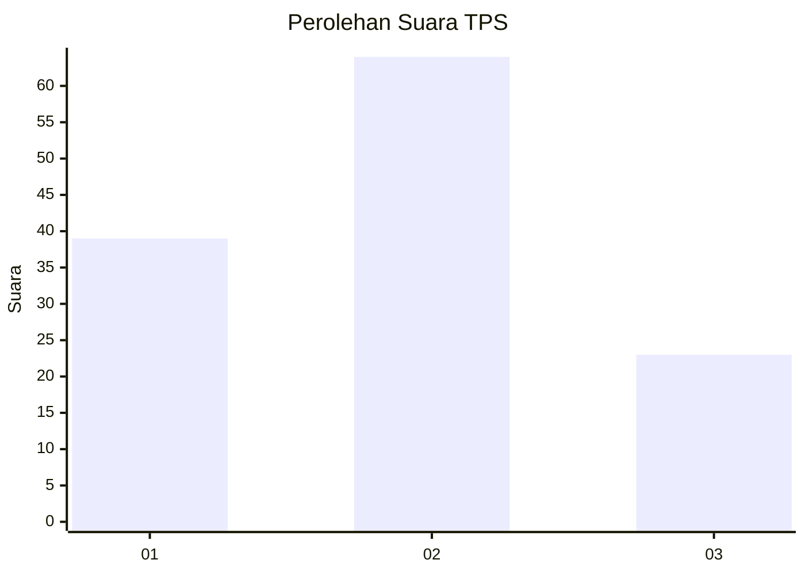
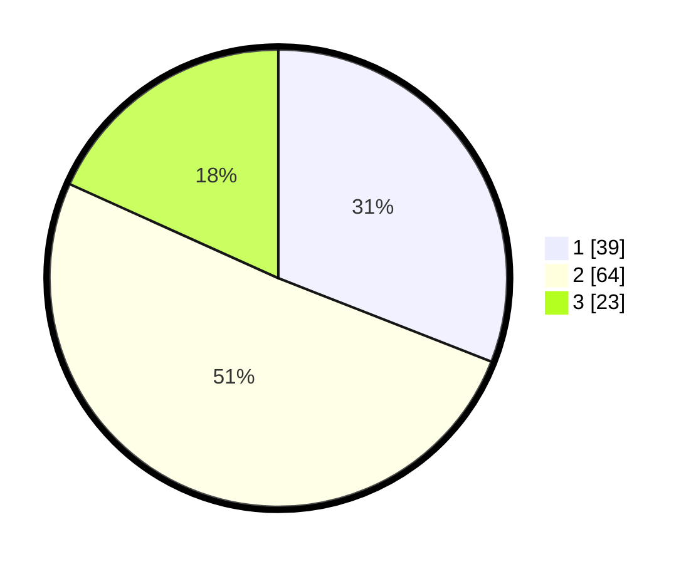

# Hasil

## Grafik

## Tabel

| No. | Nama Paslon    | Suara | Suara (raw) | Persentase |
|:--- |:-------------- | -----:| -----------:| ----------:|
| 1   | ANIES MUHAIMIN | 39    | [39][p-1]   | 30,95      |
| 2   | PRABOWO GIBRAN | 64    | [64][p-2]   | 50,79      |
| 3   | GANJAR MAHFUD  | 23    | [23][p-3]   | 18,25      |

[p-1]: https://github.com/gigit-pemilu/pemilu-2024/blob/main/pilpres/hitung-suara/sub/35-jawa-timur/sub/09-jember/sub/30-silo/sub/2001-sempolan/sub/006-tps/sub/paslon-1.txt
[p-2]: https://github.com/gigit-pemilu/pemilu-2024/blob/main/pilpres/hitung-suara/sub/35-jawa-timur/sub/09-jember/sub/30-silo/sub/2001-sempolan/sub/006-tps/sub/paslon-2.txt
[p-3]: https://github.com/gigit-pemilu/pemilu-2024/blob/main/pilpres/hitung-suara/sub/35-jawa-timur/sub/09-jember/sub/30-silo/sub/2001-sempolan/sub/006-tps/sub/paslon-3.txt

## Foto C Plano

https://sirekap-obj-formc.kpu.go.id/0b6b/pemilu/ppwp/35/09/30/20/01/3509302001006-20240217-211959--4f7c2b5d-bebe-4d51-9687-9ca935bb4a26.jpg

https://sirekap-obj-formc.kpu.go.id/0b6b/pemilu/ppwp/35/09/30/20/01/3509302001006-20240217-212000--1e91a310-f86c-4bf4-a7af-386e478c8d2b.jpg

https://sirekap-obj-formc.kpu.go.id/0b6b/pemilu/ppwp/35/09/30/20/01/3509302001006-20240217-212000--fdc43ee8-4c65-41b3-94b9-13d622c59789.jpg

## Metadata

| Key        | Value               |
| ---------- | ------------------- |
| Time Stamp | 2024-02-22 00:00:00 |

## DATA PEMILIH TETAP

Jumlah pemilih dalam DPT: **168**.
 * L: **88**.
 * P: **80**.

## DATA PENGGUNA HAK PILIH

Jumlah pengguna hak pilih dalam DPT: **126**.
 * L: **65**.
 * P: **61**.

Jumlah pengguna hak pilih dalam DPTb: **0**.
 * L: **0**.
 * P: **0**.

Jumlah pengguna hak pilih dalam DPK: **0**.
 * L: **0**.
 * P: **0**.

Jumlah pengguna hak pilih: **126**.
 * L: **65**.
 * P: **61**.

## JUMLAH SUARA SAH DAN TIDAK SAH

JUMLAH SELURUH SUARA SAH: **126**.

JUMLAH SUARA TIDAK SAH: **0**.

JUMLAH SELURUH SUARA SAH DAN SUARA TIDAK SAH: **126**.

