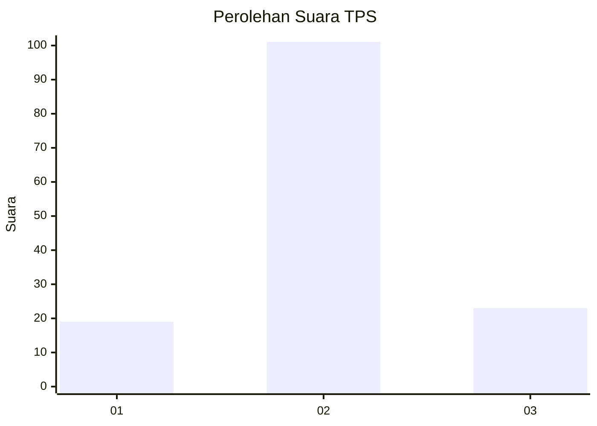
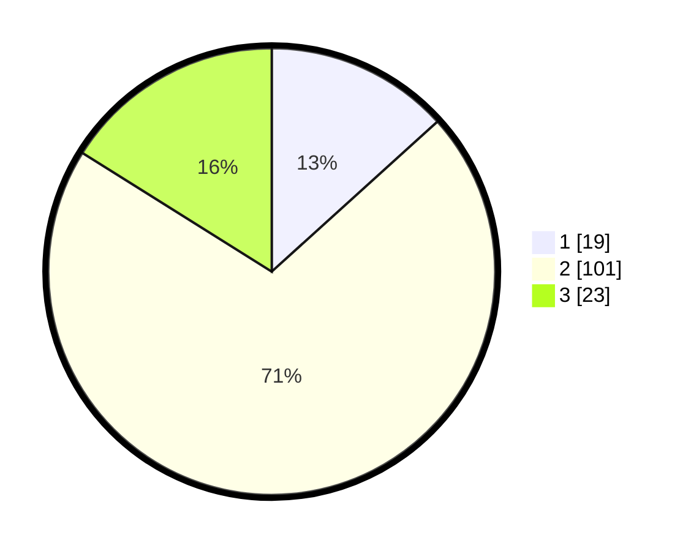

# Hasil

## Grafik

## Tabel

| No. | Nama Paslon    | Suara | Suara (raw) | Persentase |
|:--- |:-------------- | -----:| -----------:| ----------:|
| 1   | ANIES MUHAIMIN | 19    | [19][p-1]   | 13,29      |
| 2   | PRABOWO GIBRAN | 101   | [101][p-2]  | 70,63      |
| 3   | GANJAR MAHFUD  | 23    | [23][p-3]   | 16,08      |

[p-1]: https://github.com/gigit-pemilu/pemilu-2024-35-jawa-timur/blob/main/pilpres/hitung-suara/sub/35-jawa-timur/sub/09-jember/sub/30-silo/sub/2001-sempolan/sub/022-tps/sub/paslon-1.txt
[p-2]: https://github.com/gigit-pemilu/pemilu-2024-35-jawa-timur/blob/main/pilpres/hitung-suara/sub/35-jawa-timur/sub/09-jember/sub/30-silo/sub/2001-sempolan/sub/022-tps/sub/paslon-2.txt
[p-3]: https://github.com/gigit-pemilu/pemilu-2024-35-jawa-timur/blob/main/pilpres/hitung-suara/sub/35-jawa-timur/sub/09-jember/sub/30-silo/sub/2001-sempolan/sub/022-tps/sub/paslon-3.txt

## Foto C Plano

https://sirekap-obj-formc.kpu.go.id/62f2/pemilu/ppwp/35/09/30/20/01/3509302001022-20240220-141557--378215c7-e5d5-4b7d-b297-4c53b9b952dc.jpg

https://sirekap-obj-formc.kpu.go.id/62f2/pemilu/ppwp/35/09/30/20/01/3509302001022-20240220-141738--01fa26e2-0a78-4c2a-8706-47fa6da5d61d.jpg

https://sirekap-obj-formc.kpu.go.id/62f2/pemilu/ppwp/35/09/30/20/01/3509302001022-20240220-141901--966b134a-0d14-4add-b1b9-2780bb5a723c.jpg

## Metadata

| Key        | Value               |
| ---------- | ------------------- |
| Time Stamp | 2024-02-25 11:00:00 |

