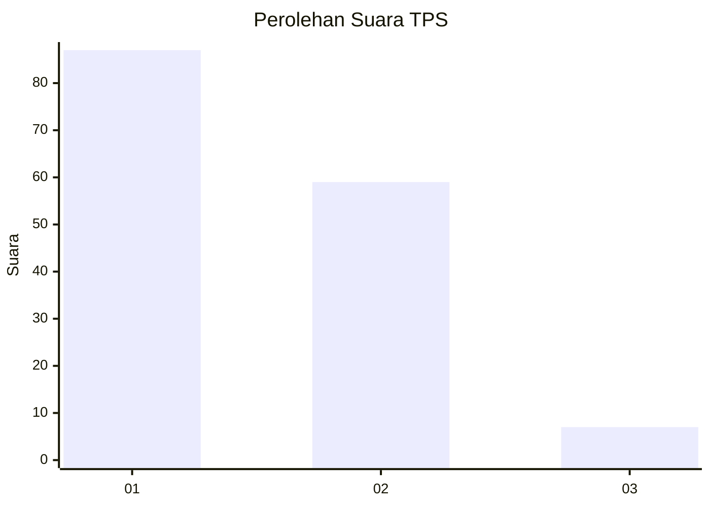
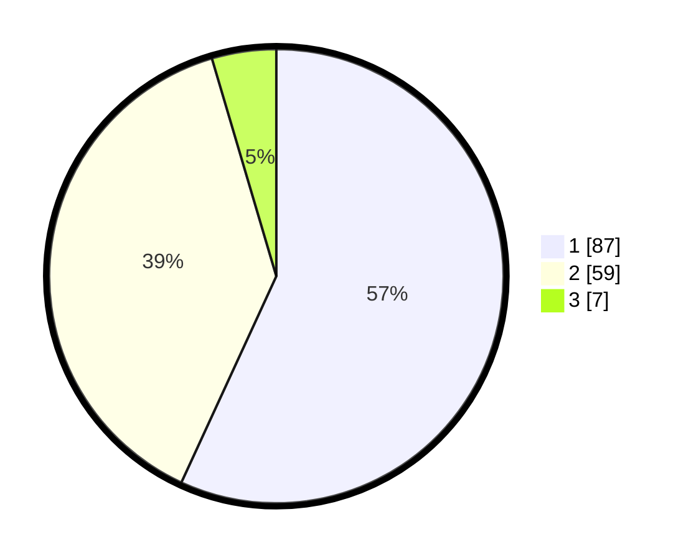

# Hasil

## Grafik

## Tabel

| No. | Nama Paslon    | Suara | Suara (raw) | Persentase |
|:--- |:-------------- | -----:| -----------:| ----------:|
| 1   | ANIES MUHAIMIN | 87    | [87][p-1]   | 56,86      |
| 2   | PRABOWO GIBRAN | 59    | [59][p-2]   | 38,56      |
| 3   | GANJAR MAHFUD  | 7     | [7][p-3]    | 4,58       |

[p-1]: https://github.com/gigit-pemilu/pemilu-2024/blob/main/pilpres/hitung-suara/sub/35-jawa-timur/sub/09-jember/sub/30-silo/sub/2001-sempolan/sub/025-tps/sub/paslon-1.txt
[p-2]: https://github.com/gigit-pemilu/pemilu-2024/blob/main/pilpres/hitung-suara/sub/35-jawa-timur/sub/09-jember/sub/30-silo/sub/2001-sempolan/sub/025-tps/sub/paslon-2.txt
[p-3]: https://github.com/gigit-pemilu/pemilu-2024/blob/main/pilpres/hitung-suara/sub/35-jawa-timur/sub/09-jember/sub/30-silo/sub/2001-sempolan/sub/025-tps/sub/paslon-3.txt

## Foto C Plano

https://sirekap-obj-formc.kpu.go.id/f5f9/pemilu/ppwp/35/09/30/20/01/3509302001025-20240220-141741--0f648e97-ebcf-4cde-be99-9a00f76df3a4.jpg

https://sirekap-obj-formc.kpu.go.id/f5f9/pemilu/ppwp/35/09/30/20/01/3509302001025-20240220-155604--d1216f49-0b16-42ff-8633-b1d669542604.jpg

https://sirekap-obj-formc.kpu.go.id/f5f9/pemilu/ppwp/35/09/30/20/01/3509302001025-20240220-155736--1fad2315-1caa-485b-9939-d7062ee364db.jpg

## Metadata

| Key        | Value               |
| ---------- | ------------------- |
| Time Stamp | 2024-02-24 22:31:28 |

