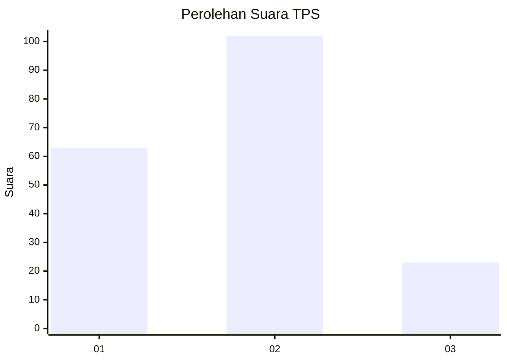
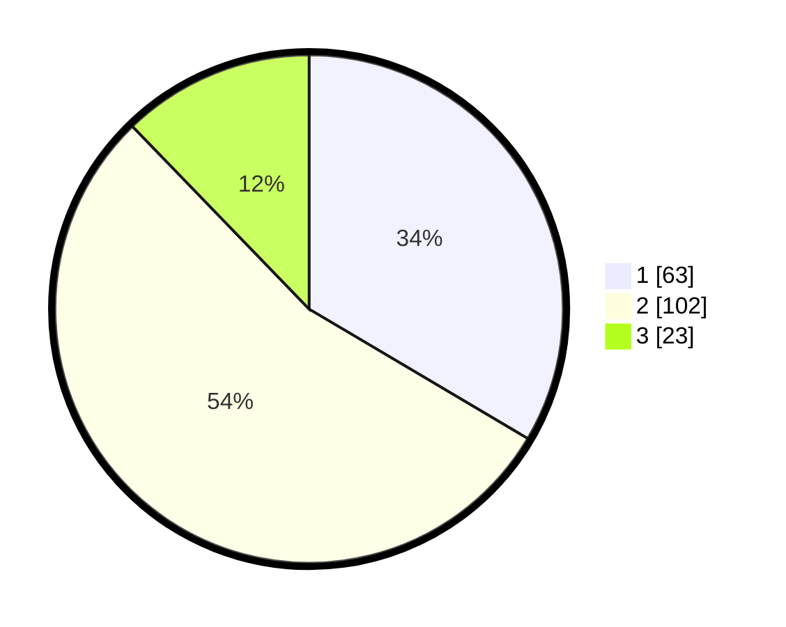

# Hasil

## Grafik

## Tabel

| No. | Nama Paslon    | Suara | Suara (raw) | Persentase |
|:--- |:-------------- | -----:| -----------:| ----------:|
| 1   | ANIES MUHAIMIN | 63    | [63][p-1]   | 33,51      |
| 2   | PRABOWO GIBRAN | 102   | [102][p-2]  | 54,26      |
| 3   | GANJAR MAHFUD  | 23    | [23][p-3]   | 12,23      |

[p-1]: https://github.com/gigit-pemilu/pemilu-2024/blob/main/pilpres/hitung-suara/sub/35-jawa-timur/sub/09-jember/sub/30-silo/sub/2001-sempolan/sub/027-tps/sub/paslon-1.txt
[p-2]: https://github.com/gigit-pemilu/pemilu-2024/blob/main/pilpres/hitung-suara/sub/35-jawa-timur/sub/09-jember/sub/30-silo/sub/2001-sempolan/sub/027-tps/sub/paslon-2.txt
[p-3]: https://github.com/gigit-pemilu/pemilu-2024/blob/main/pilpres/hitung-suara/sub/35-jawa-timur/sub/09-jember/sub/30-silo/sub/2001-sempolan/sub/027-tps/sub/paslon-3.txt

## Foto C Plano

https://sirekap-obj-formc.kpu.go.id/07a2/pemilu/ppwp/35/09/30/20/01/3509302001027-20240220-125114--a7bf4fda-f7d5-4c64-8100-acbeb3cbfb38.jpg

https://sirekap-obj-formc.kpu.go.id/07a2/pemilu/ppwp/35/09/30/20/01/3509302001027-20240220-124722--527425fb-2af3-45c6-ae51-e968b1aef3a4.jpg

https://sirekap-obj-formc.kpu.go.id/07a2/pemilu/ppwp/35/09/30/20/01/3509302001027-20240220-124823--4b5f903c-4cc6-452d-a350-36dc342f4df7.jpg

## Metadata

| Key        | Value               |
| ---------- | ------------------- |
| Time Stamp | 2024-02-22 22:00:00 |

