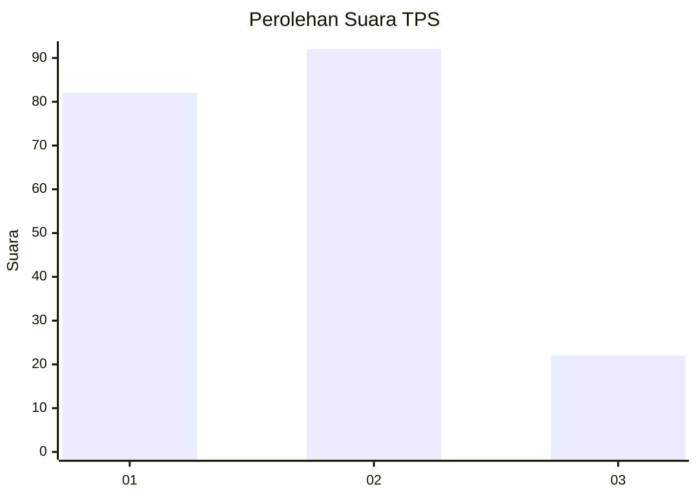
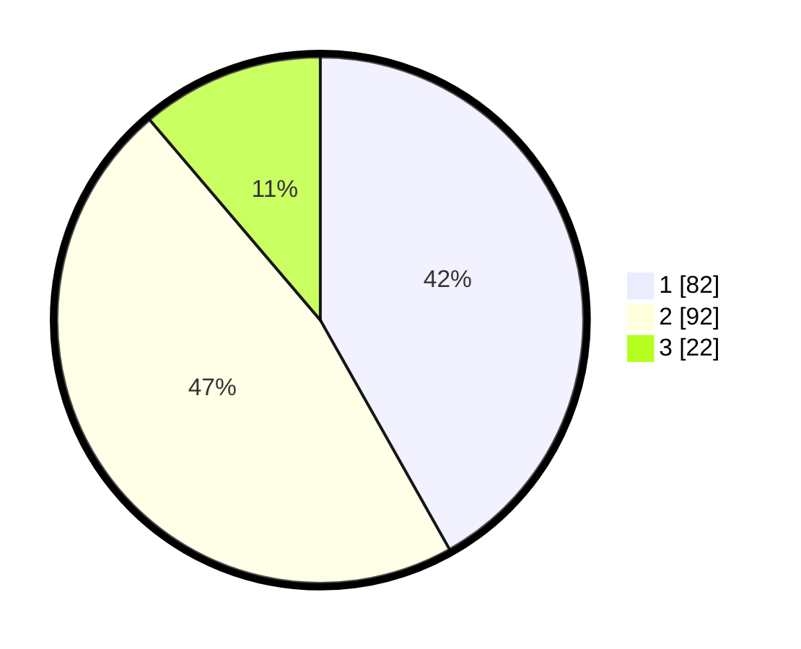

# Hasil

## Grafik

## Tabel

| No. | Nama Paslon    | Suara | Suara (raw) | Persentase |
|:--- |:-------------- | -----:| -----------:| ----------:|
| 1   | ANIES MUHAIMIN | 82    | [82][p-1]   | 41,84      |
| 2   | PRABOWO GIBRAN | 92    | [92][p-2]   | 46,94      |
| 3   | GANJAR MAHFUD  | 22    | [22][p-3]   | 11,22      |

[p-1]: https://github.com/gigit-pemilu/pemilu-2024/blob/main/pilpres/hitung-suara/sub/35-jawa-timur/sub/09-jember/sub/30-silo/sub/2001-sempolan/sub/028-tps/sub/paslon-1.txt
[p-2]: https://github.com/gigit-pemilu/pemilu-2024/blob/main/pilpres/hitung-suara/sub/35-jawa-timur/sub/09-jember/sub/30-silo/sub/2001-sempolan/sub/028-tps/sub/paslon-2.txt
[p-3]: https://github.com/gigit-pemilu/pemilu-2024/blob/main/pilpres/hitung-suara/sub/35-jawa-timur/sub/09-jember/sub/30-silo/sub/2001-sempolan/sub/028-tps/sub/paslon-3.txt

## Foto C Plano

https://sirekap-obj-formc.kpu.go.id/e392/pemilu/ppwp/35/09/30/20/01/3509302001028-20240220-123831--44dc1d5d-c1a4-4e01-b1ab-f037fe1e219a.jpg

https://sirekap-obj-formc.kpu.go.id/e392/pemilu/ppwp/35/09/30/20/01/3509302001028-20240220-124542--38ed503b-371c-47de-a868-51ab0f8bedcc.jpg

https://sirekap-obj-formc.kpu.go.id/e392/pemilu/ppwp/35/09/30/20/01/3509302001028-20240220-124737--586480e2-3559-407d-a5bb-d1eb72ce9141.jpg

## Metadata

| Key        | Value               |
| ---------- | ------------------- |
| Time Stamp | 2024-02-20 13:00:00 |

