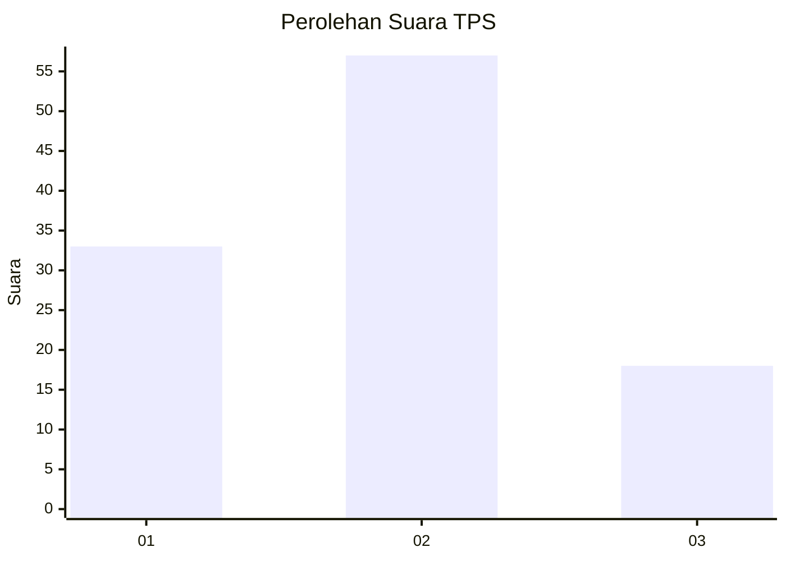
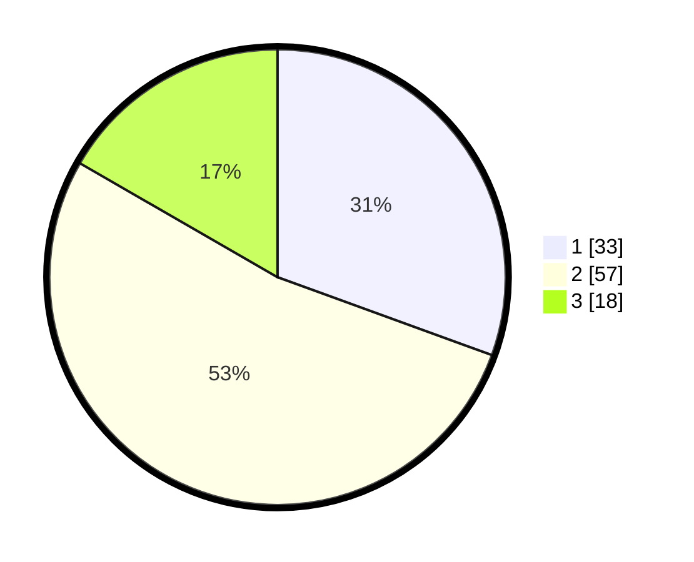

# Hasil

## Grafik

## Tabel

| No. | Nama Paslon    | Suara | Suara (raw) | Persentase |
|:--- |:-------------- | -----:| -----------:| ----------:|
| 1   | ANIES MUHAIMIN | 33    | [33][p-1]   | 30,56      |
| 2   | PRABOWO GIBRAN | 57    | [57][p-2]   | 52,78      |
| 3   | GANJAR MAHFUD  | 18    | [18][p-3]   | 16,67      |

[p-1]: https://github.com/gigit-pemilu/pemilu-2024/blob/main/pilpres/hitung-suara/sub/35-jawa-timur/sub/09-jember/sub/30-silo/sub/2001-sempolan/sub/029-tps/sub/paslon-1.txt
[p-2]: https://github.com/gigit-pemilu/pemilu-2024/blob/main/pilpres/hitung-suara/sub/35-jawa-timur/sub/09-jember/sub/30-silo/sub/2001-sempolan/sub/029-tps/sub/paslon-2.txt
[p-3]: https://github.com/gigit-pemilu/pemilu-2024/blob/main/pilpres/hitung-suara/sub/35-jawa-timur/sub/09-jember/sub/30-silo/sub/2001-sempolan/sub/029-tps/sub/paslon-3.txt

## Foto C Plano

https://sirekap-obj-formc.kpu.go.id/24a7/pemilu/ppwp/35/09/30/20/01/3509302001029-20240221-122809--833a9eb3-1f16-4edf-b7f6-5e9d77ea1f96.jpg

https://sirekap-obj-formc.kpu.go.id/24a7/pemilu/ppwp/35/09/30/20/01/3509302001029-20240221-122844--3205a34e-4948-4520-b578-df45a09b4fb7.jpg

https://sirekap-obj-formc.kpu.go.id/24a7/pemilu/ppwp/35/09/30/20/01/3509302001029-20240221-122930--b170a116-a923-4720-ba57-e406c89116c1.jpg

## Metadata

| Key        | Value               |
| ---------- | ------------------- |
| Time Stamp | 2024-02-24 22:31:28 |

