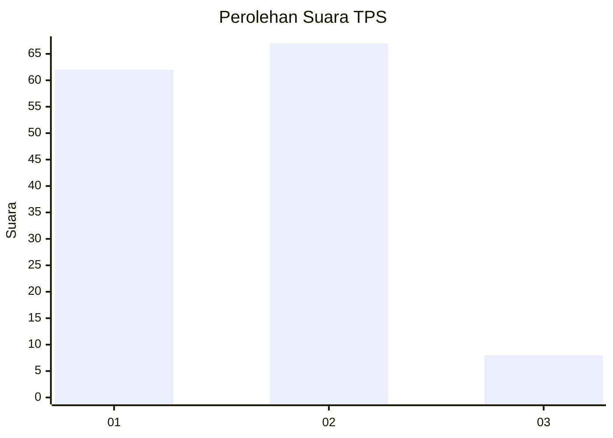
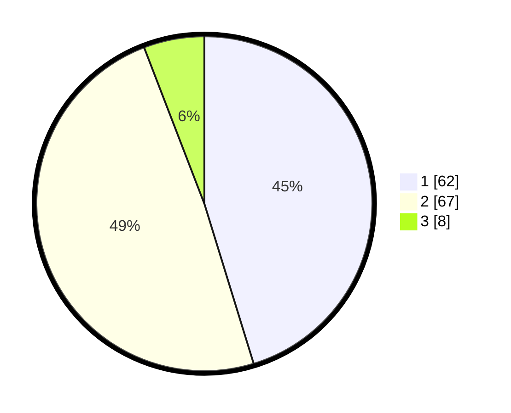

# Hasil

## Grafik

## Tabel

| No. | Nama Paslon    | Suara | Suara (raw) | Persentase |
|:--- |:-------------- | -----:| -----------:| ----------:|
| 1   | ANIES MUHAIMIN | 62    | [62][p-1]   | 45,26      |
| 2   | PRABOWO GIBRAN | 67    | [67][p-2]   | 48,91      |
| 3   | GANJAR MAHFUD  | 8     | [8][p-3]    | 5,84       |

[p-1]: https://github.com/gigit-pemilu/pemilu-2024/blob/main/pilpres/hitung-suara/sub/35-jawa-timur/sub/09-jember/sub/30-silo/sub/2001-sempolan/sub/034-tps/sub/paslon-1.txt
[p-2]: https://github.com/gigit-pemilu/pemilu-2024/blob/main/pilpres/hitung-suara/sub/35-jawa-timur/sub/09-jember/sub/30-silo/sub/2001-sempolan/sub/034-tps/sub/paslon-2.txt
[p-3]: https://github.com/gigit-pemilu/pemilu-2024/blob/main/pilpres/hitung-suara/sub/35-jawa-timur/sub/09-jember/sub/30-silo/sub/2001-sempolan/sub/034-tps/sub/paslon-3.txt

## Foto C Plano

https://sirekap-obj-formc.kpu.go.id/a54e/pemilu/ppwp/35/09/30/20/01/3509302001034-20240221-124500--8ab1aecf-4de0-496d-962a-7c4cc2e48528.jpg

https://sirekap-obj-formc.kpu.go.id/a54e/pemilu/ppwp/35/09/30/20/01/3509302001034-20240221-125138--66e09f58-86d1-4898-84e3-6986a433dbd6.jpg

https://sirekap-obj-formc.kpu.go.id/a54e/pemilu/ppwp/35/09/30/20/01/3509302001034-20240221-125311--8ed98ed3-6a3a-44f3-a823-cad4bec9bef9.jpg

## Metadata

| Key        | Value               |
| ---------- | ------------------- |
| Time Stamp | 2024-02-24 22:31:28 |

