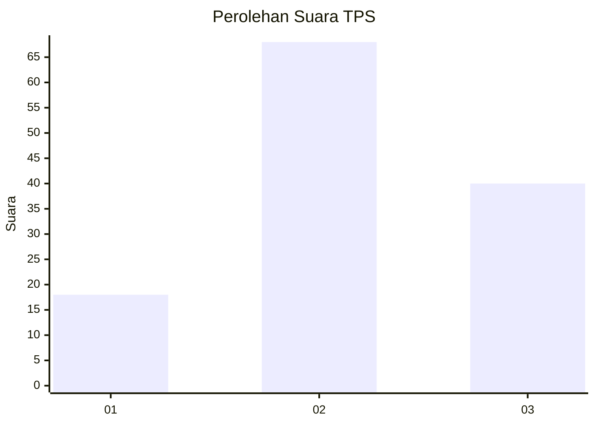
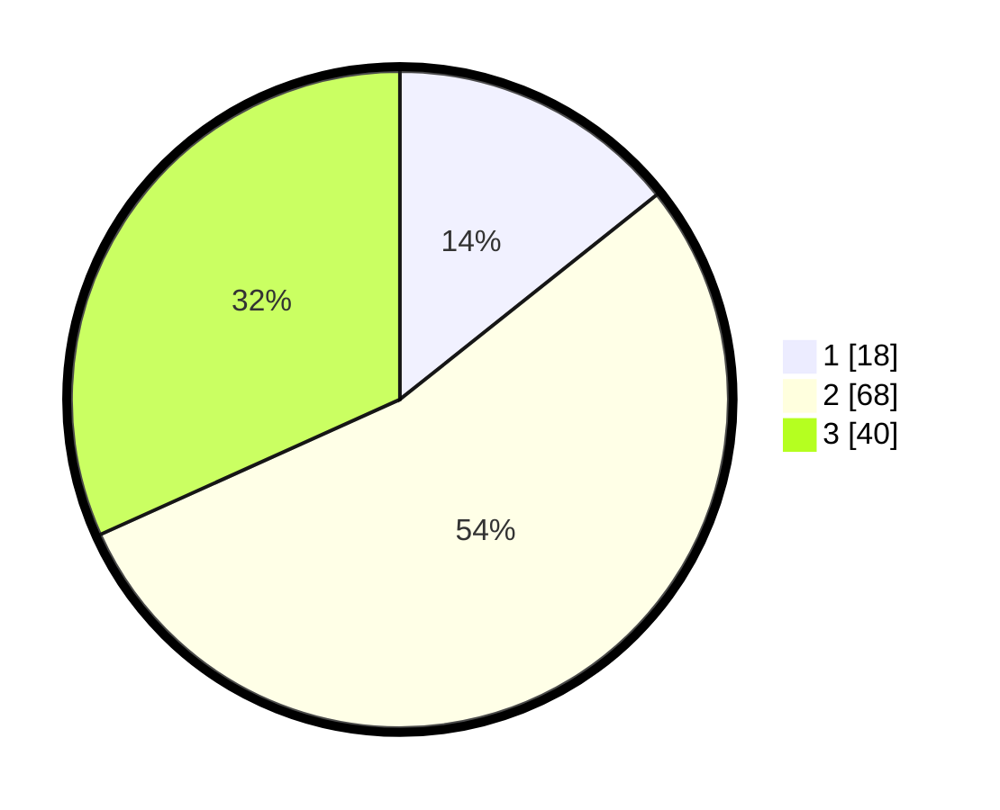

# Hasil

## Grafik

## Tabel

| No. | Nama Paslon    | Suara | Suara (raw) | Persentase |
|:--- |:-------------- | -----:| -----------:| ----------:|
| 1   | ANIES MUHAIMIN | 18    | [18][p-1]   | 14,29      |
| 2   | PRABOWO GIBRAN | 68    | [68][p-2]   | 53,97      |
| 3   | GANJAR MAHFUD  | 40    | [40][p-3]   | 31,75      |

[p-1]: https://github.com/gigit-pemilu/pemilu-2024-35-jawa-timur/blob/main/pilpres/hitung-suara/sub/35-jawa-timur/sub/09-jember/sub/30-silo/sub/2002-harjomulyo/sub/001-tps/sub/paslon-1.txt
[p-2]: https://github.com/gigit-pemilu/pemilu-2024-35-jawa-timur/blob/main/pilpres/hitung-suara/sub/35-jawa-timur/sub/09-jember/sub/30-silo/sub/2002-harjomulyo/sub/001-tps/sub/paslon-2.txt
[p-3]: https://github.com/gigit-pemilu/pemilu-2024-35-jawa-timur/blob/main/pilpres/hitung-suara/sub/35-jawa-timur/sub/09-jember/sub/30-silo/sub/2002-harjomulyo/sub/001-tps/sub/paslon-3.txt

## Foto C Plano

https://sirekap-obj-formc.kpu.go.id/aaea/pemilu/ppwp/35/09/30/20/02/3509302002001-20240215-010828--7bd11ae4-f1fd-47c2-bd4c-56e05565ba2b.jpg

https://sirekap-obj-formc.kpu.go.id/aaea/pemilu/ppwp/35/09/30/20/02/3509302002001-20240215-011002--d3b359a5-43fc-4e12-b8a3-0cd9371ad374.jpg

https://sirekap-obj-formc.kpu.go.id/aaea/pemilu/ppwp/35/09/30/20/02/3509302002001-20240215-011057--f7cdc46a-453d-479d-b356-d2a1803b3440.jpg

## Metadata

| Key        | Value               |
| ---------- | ------------------- |
| Time Stamp | 2024-02-15 16:30:25 |

