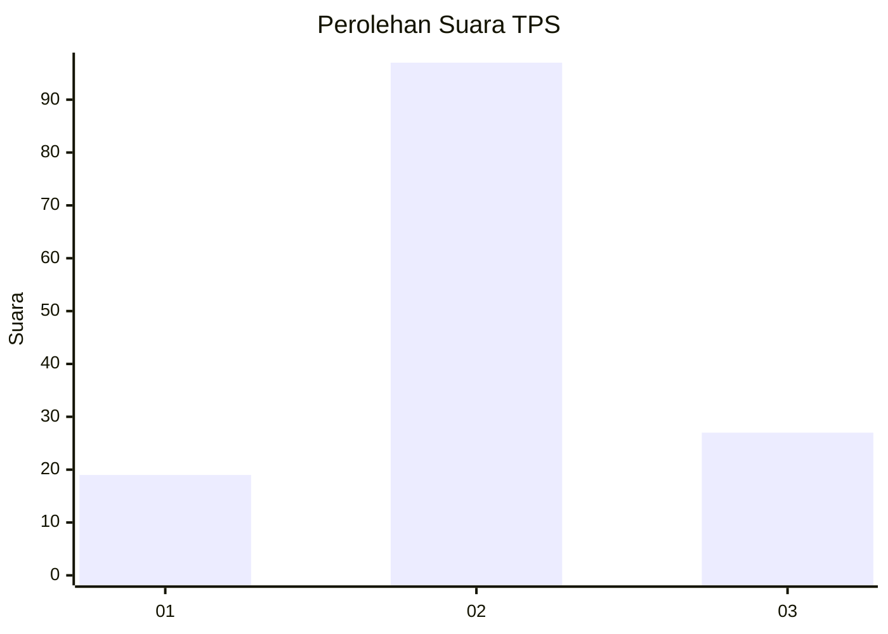
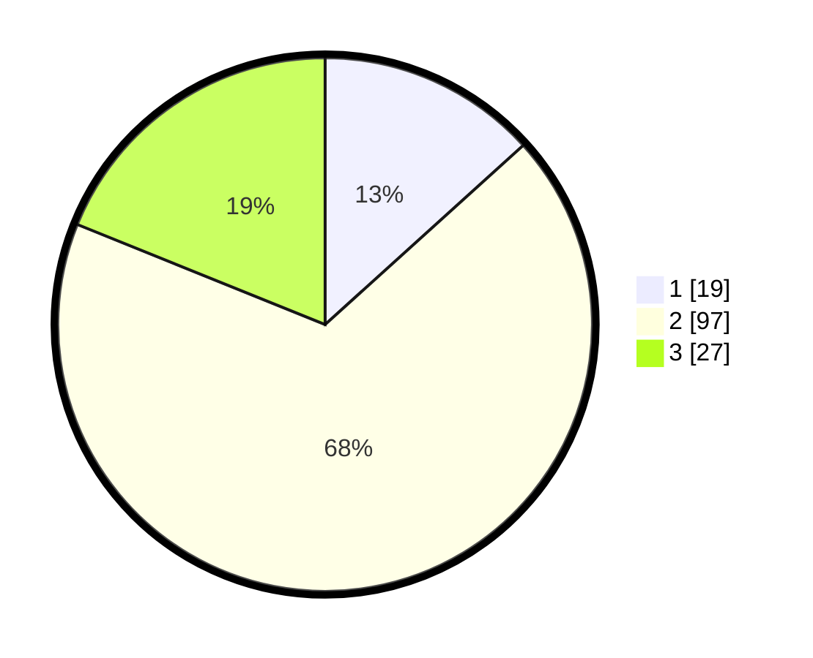

# Hasil

## Grafik

## Tabel

| No. | Nama Paslon    | Suara | Suara (raw) | Persentase |
|:--- |:-------------- | -----:| -----------:| ----------:|
| 1   | ANIES MUHAIMIN | 19    | [19][p-1]   | 13,29      |
| 2   | PRABOWO GIBRAN | 97    | [97][p-2]   | 67,83      |
| 3   | GANJAR MAHFUD  | 27    | [27][p-3]   | 18,88      |

[p-1]: https://github.com/gigit-pemilu/pemilu-2024-35-jawa-timur/blob/main/pilpres/hitung-suara/sub/35-jawa-timur/sub/09-jember/sub/30-silo/sub/2002-harjomulyo/sub/003-tps/sub/paslon-1.txt
[p-2]: https://github.com/gigit-pemilu/pemilu-2024-35-jawa-timur/blob/main/pilpres/hitung-suara/sub/35-jawa-timur/sub/09-jember/sub/30-silo/sub/2002-harjomulyo/sub/003-tps/sub/paslon-2.txt
[p-3]: https://github.com/gigit-pemilu/pemilu-2024-35-jawa-timur/blob/main/pilpres/hitung-suara/sub/35-jawa-timur/sub/09-jember/sub/30-silo/sub/2002-harjomulyo/sub/003-tps/sub/paslon-3.txt

## Foto C Plano

https://sirekap-obj-formc.kpu.go.id/7fa0/pemilu/ppwp/35/09/30/20/02/3509302002003-20240215-004444--8ddbf300-c222-409b-a84b-050137fdc14c.jpg

https://sirekap-obj-formc.kpu.go.id/7fa0/pemilu/ppwp/35/09/30/20/02/3509302002003-20240214-234631--911f6ee5-5db1-4443-a9f7-8af22f5a2b92.jpg

https://sirekap-obj-formc.kpu.go.id/7fa0/pemilu/ppwp/35/09/30/20/02/3509302002003-20240214-234800--2d5444a7-6a7d-4df4-97bc-a80c35af6b86.jpg

## Metadata

| Key        | Value               |
| ---------- | ------------------- |
| Time Stamp | 2024-02-15 15:00:29 |

