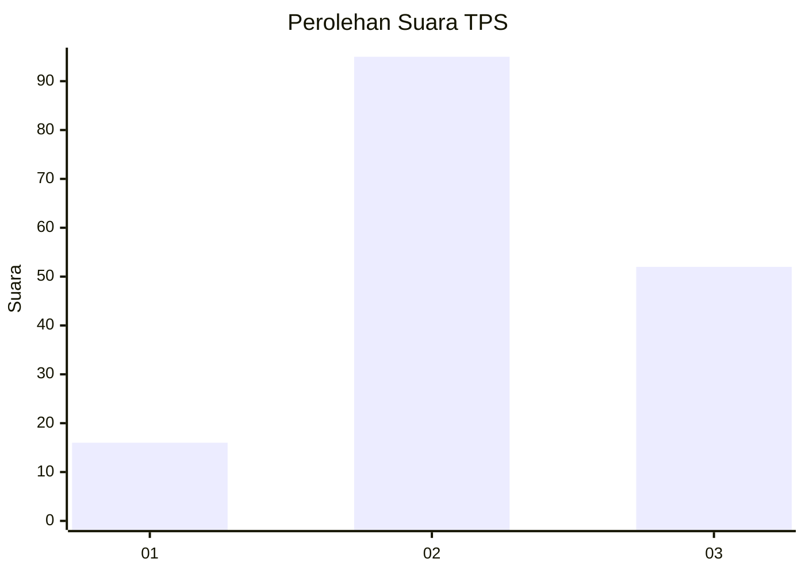
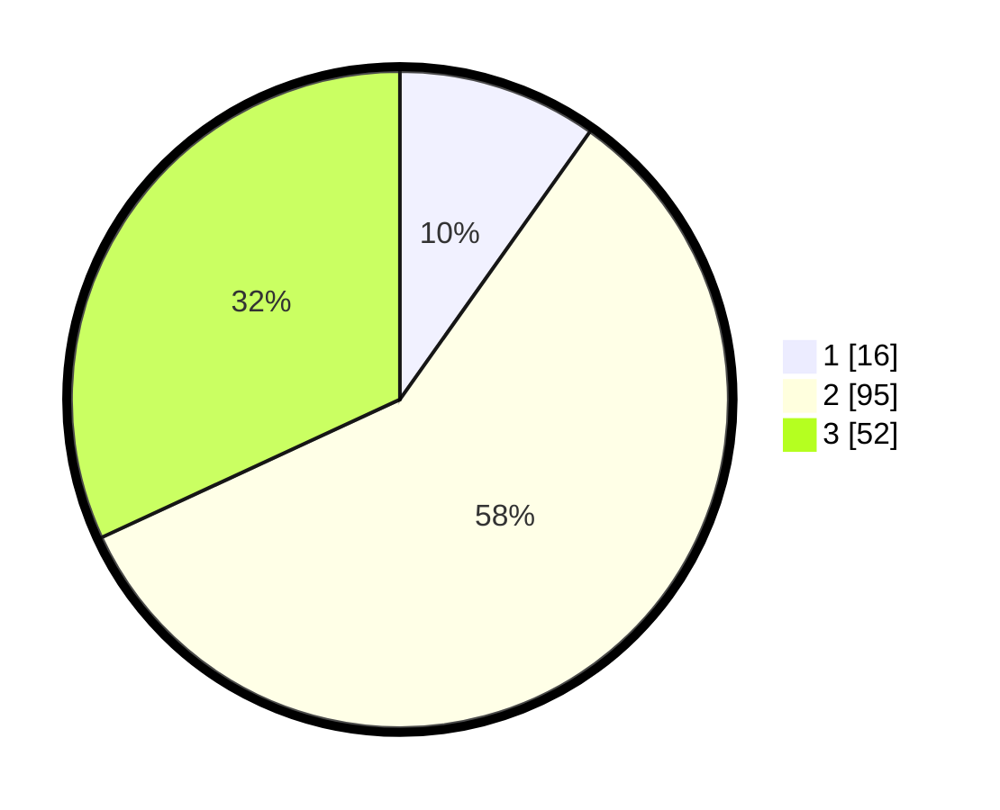

# Hasil

## Grafik

## Tabel

| No. | Nama Paslon    | Suara | Suara (raw) | Persentase |
|:--- |:-------------- | -----:| -----------:| ----------:|
| 1   | ANIES MUHAIMIN | 16    | [16][p-1]   | 9,82       |
| 2   | PRABOWO GIBRAN | 95    | [95][p-2]   | 58,28      |
| 3   | GANJAR MAHFUD  | 52    | [52][p-3]   | 31,90      |

[p-1]: https://github.com/gigit-pemilu/pemilu-2024-35-jawa-timur/blob/main/pilpres/hitung-suara/sub/35-jawa-timur/sub/09-jember/sub/30-silo/sub/2002-harjomulyo/sub/004-tps/sub/paslon-1.txt
[p-2]: https://github.com/gigit-pemilu/pemilu-2024-35-jawa-timur/blob/main/pilpres/hitung-suara/sub/35-jawa-timur/sub/09-jember/sub/30-silo/sub/2002-harjomulyo/sub/004-tps/sub/paslon-2.txt
[p-3]: https://github.com/gigit-pemilu/pemilu-2024-35-jawa-timur/blob/main/pilpres/hitung-suara/sub/35-jawa-timur/sub/09-jember/sub/30-silo/sub/2002-harjomulyo/sub/004-tps/sub/paslon-3.txt

## Foto C Plano

https://sirekap-obj-formc.kpu.go.id/9de0/pemilu/ppwp/35/09/30/20/02/3509302002004-20240214-224931--90d92045-58a1-4a48-a356-8f3f8d7f0ba1.jpg

https://sirekap-obj-formc.kpu.go.id/9de0/pemilu/ppwp/35/09/30/20/02/3509302002004-20240214-225037--d14f7578-2fee-4683-ba91-bbc6917d0510.jpg

https://sirekap-obj-formc.kpu.go.id/9de0/pemilu/ppwp/35/09/30/20/02/3509302002004-20240214-225157--03639b2e-034d-4c6f-a5bb-66587ec76a53.jpg

## Metadata

| Key        | Value               |
| ---------- | ------------------- |
| Time Stamp | 2024-02-15 15:00:29 |

