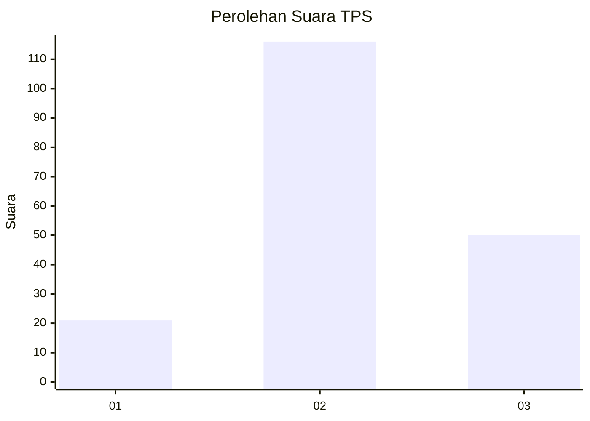
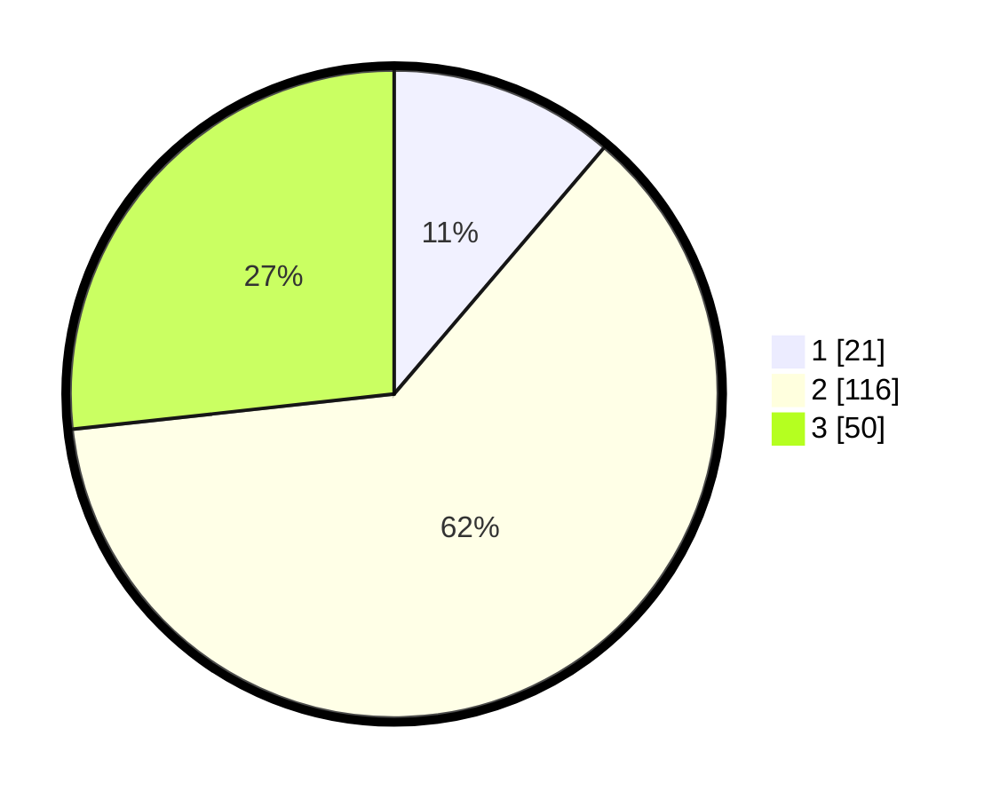

# Hasil

## Grafik

## Tabel

| No. | Nama Paslon    | Suara | Suara (raw) | Persentase |
|:--- |:-------------- | -----:| -----------:| ----------:|
| 1   | ANIES MUHAIMIN | 21    | [21][p-1]   | 11,23      |
| 2   | PRABOWO GIBRAN | 116   | [116][p-2]  | 62,03      |
| 3   | GANJAR MAHFUD  | 50    | [50][p-3]   | 26,74      |

[p-1]: https://github.com/gigit-pemilu/pemilu-2024/blob/main/pilpres/hitung-suara/sub/35-jawa-timur/sub/09-jember/sub/30-silo/sub/2002-harjomulyo/sub/005-tps/sub/paslon-1.txt
[p-2]: https://github.com/gigit-pemilu/pemilu-2024/blob/main/pilpres/hitung-suara/sub/35-jawa-timur/sub/09-jember/sub/30-silo/sub/2002-harjomulyo/sub/005-tps/sub/paslon-2.txt
[p-3]: https://github.com/gigit-pemilu/pemilu-2024/blob/main/pilpres/hitung-suara/sub/35-jawa-timur/sub/09-jember/sub/30-silo/sub/2002-harjomulyo/sub/005-tps/sub/paslon-3.txt

## Foto C Plano

https://sirekap-obj-formc.kpu.go.id/51a9/pemilu/ppwp/35/09/30/20/02/3509302002005-20240214-231012--2753c2c8-5ce2-4ee1-9e65-53296620678a.jpg

https://sirekap-obj-formc.kpu.go.id/51a9/pemilu/ppwp/35/09/30/20/02/3509302002005-20240214-231118--968e5389-dc3c-4b4e-8ba1-4adeda97485e.jpg

https://sirekap-obj-formc.kpu.go.id/51a9/pemilu/ppwp/35/09/30/20/02/3509302002005-20240214-231213--0e119a8c-cfac-4066-a560-7c6e0865665a.jpg

## Metadata

| Key        | Value               |
| ---------- | ------------------- |
| Time Stamp | 2024-02-15 15:00:29 |

