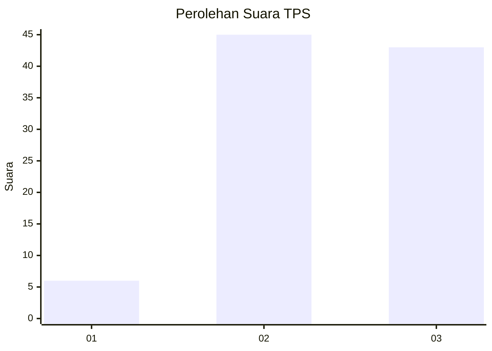
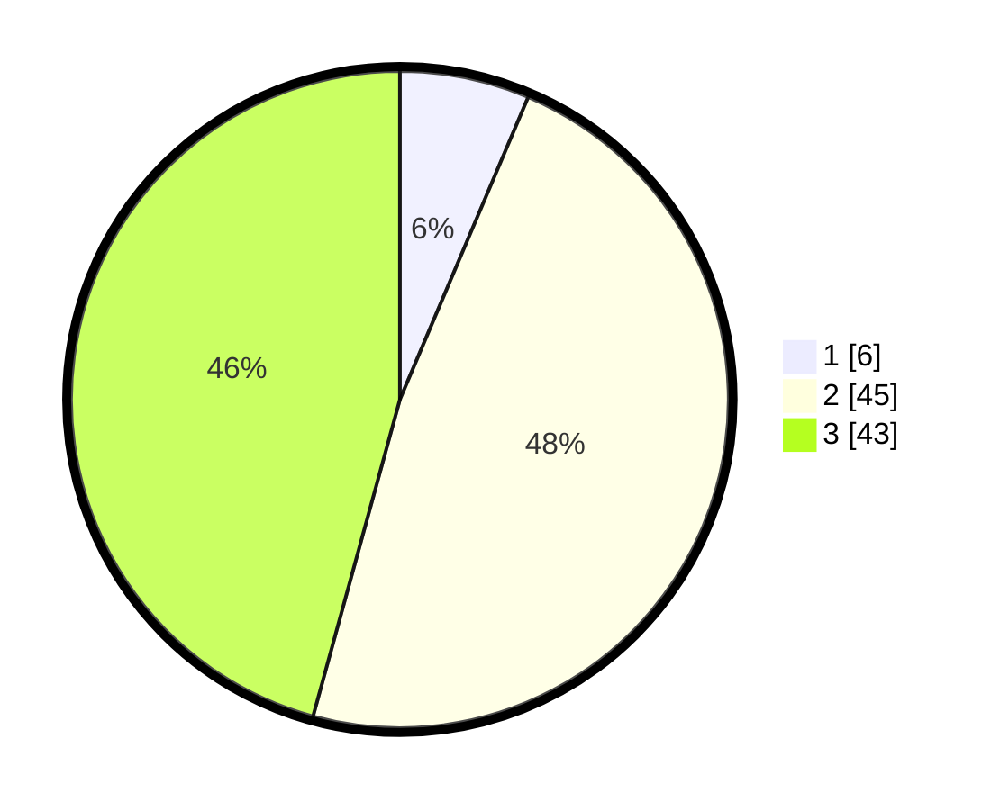

# Hasil

## Grafik

## Tabel

| No. | Nama Paslon    | Suara | Suara (raw) | Persentase |
|:--- |:-------------- | -----:| -----------:| ----------:|
| 1   | ANIES MUHAIMIN | 6     | [6][p-1]    | 6,38       |
| 2   | PRABOWO GIBRAN | 45    | [45][p-2]   | 47,87      |
| 3   | GANJAR MAHFUD  | 43    | [43][p-3]   | 45,74      |

[p-1]: https://github.com/gigit-pemilu/pemilu-2024-35-jawa-timur/blob/main/pilpres/hitung-suara/sub/35-jawa-timur/sub/09-jember/sub/30-silo/sub/2002-harjomulyo/sub/013-tps/sub/paslon-1.txt
[p-2]: https://github.com/gigit-pemilu/pemilu-2024-35-jawa-timur/blob/main/pilpres/hitung-suara/sub/35-jawa-timur/sub/09-jember/sub/30-silo/sub/2002-harjomulyo/sub/013-tps/sub/paslon-2.txt
[p-3]: https://github.com/gigit-pemilu/pemilu-2024-35-jawa-timur/blob/main/pilpres/hitung-suara/sub/35-jawa-timur/sub/09-jember/sub/30-silo/sub/2002-harjomulyo/sub/013-tps/sub/paslon-3.txt

## Foto C Plano

https://sirekap-obj-formc.kpu.go.id/85bb/pemilu/ppwp/35/09/30/20/02/3509302002013-20240217-180351--f8ec6c1a-fc9c-4cb5-80a4-6bbfbe372343.jpg

https://sirekap-obj-formc.kpu.go.id/85bb/pemilu/ppwp/35/09/30/20/02/3509302002013-20240217-180553--f97ca3ca-aff7-480f-9d8e-8bfd1e385f6e.jpg

https://sirekap-obj-formc.kpu.go.id/85bb/pemilu/ppwp/35/09/30/20/02/3509302002013-20240214-215505--5919353f-8af2-4774-825b-507b10a6ea0f.jpg

## Metadata

| Key        | Value               |
| ---------- | ------------------- |
| Time Stamp | 2024-02-25 16:00:00 |

