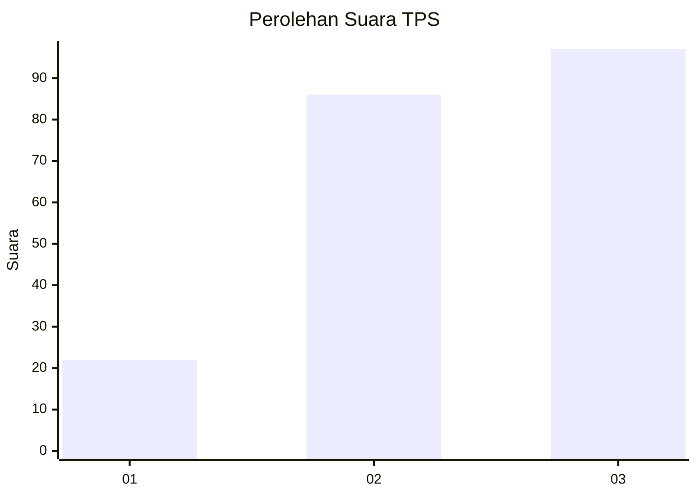
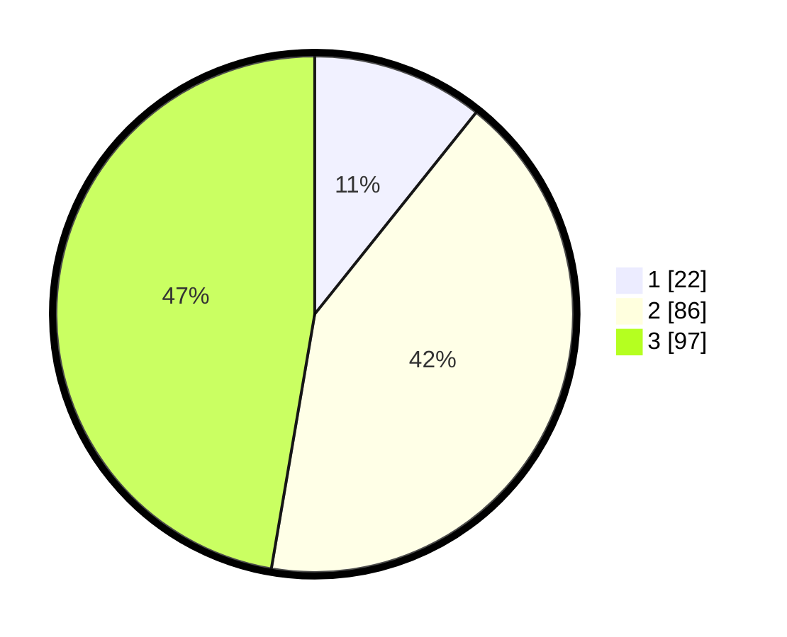

# Hasil

## Grafik

## Tabel

| No. | Nama Paslon    | Suara | Suara (raw) | Persentase |
|:--- |:-------------- | -----:| -----------:| ----------:|
| 1   | ANIES MUHAIMIN | 22    | [22][p-1]   | 10,73      |
| 2   | PRABOWO GIBRAN | 86    | [86][p-2]   | 41,95      |
| 3   | GANJAR MAHFUD  | 97    | [97][p-3]   | 47,32      |

[p-1]: https://github.com/gigit-pemilu/pemilu-2024/blob/main/pilpres/hitung-suara/sub/35-jawa-timur/sub/09-jember/sub/30-silo/sub/2002-harjomulyo/sub/021-tps/sub/paslon-1.txt
[p-2]: https://github.com/gigit-pemilu/pemilu-2024/blob/main/pilpres/hitung-suara/sub/35-jawa-timur/sub/09-jember/sub/30-silo/sub/2002-harjomulyo/sub/021-tps/sub/paslon-2.txt
[p-3]: https://github.com/gigit-pemilu/pemilu-2024/blob/main/pilpres/hitung-suara/sub/35-jawa-timur/sub/09-jember/sub/30-silo/sub/2002-harjomulyo/sub/021-tps/sub/paslon-3.txt

## Foto C Plano

https://sirekap-obj-formc.kpu.go.id/5947/pemilu/ppwp/35/09/30/20/02/3509302002021-20240214-231121--d3df4a87-eee0-42b6-8b6c-a421ca83c6d1.jpg

https://sirekap-obj-formc.kpu.go.id/5947/pemilu/ppwp/35/09/30/20/02/3509302002021-20240214-230435--48f67bd0-7c8a-4a61-a193-5546c9037dd2.jpg

https://sirekap-obj-formc.kpu.go.id/5947/pemilu/ppwp/35/09/30/20/02/3509302002021-20240214-230529--497a5851-ebdd-4056-b1d9-fbfcde9160a3.jpg

## Metadata

| Key        | Value               |
| ---------- | ------------------- |
| Time Stamp | 2024-02-15 15:00:29 |

