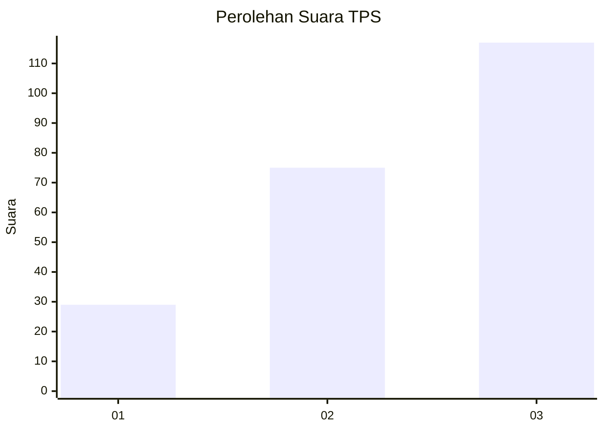
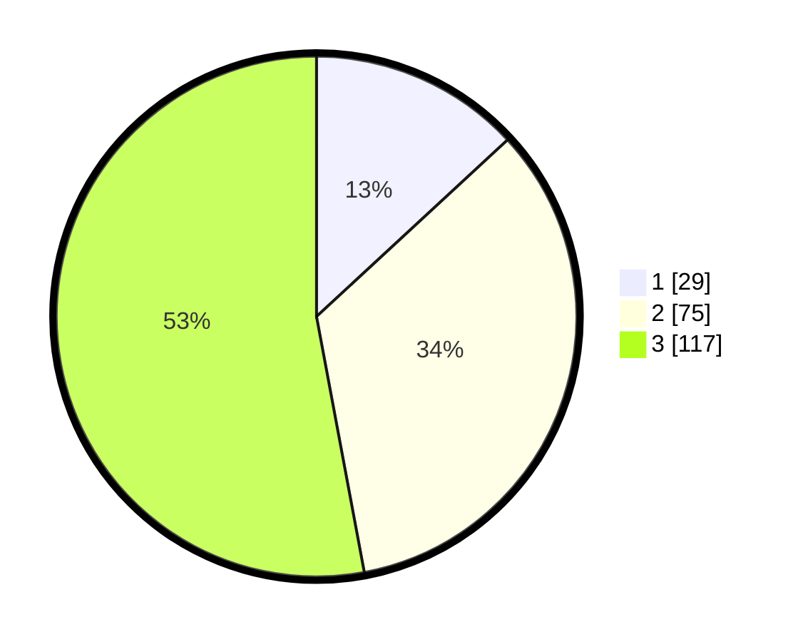

# Hasil

## Grafik

## Tabel

| No. | Nama Paslon    | Suara | Suara (raw) | Persentase |
|:--- |:-------------- | -----:| -----------:| ----------:|
| 1   | ANIES MUHAIMIN | 29    | [29][p-1]   | 13,12      |
| 2   | PRABOWO GIBRAN | 75    | [75][p-2]   | 33,94      |
| 3   | GANJAR MAHFUD  | 117   | [117][p-3]  | 52,94      |

[p-1]: https://github.com/gigit-pemilu/pemilu-2024-35-jawa-timur/blob/main/pilpres/hitung-suara/sub/35-jawa-timur/sub/09-jember/sub/30-silo/sub/2002-harjomulyo/sub/022-tps/sub/paslon-1.txt
[p-2]: https://github.com/gigit-pemilu/pemilu-2024-35-jawa-timur/blob/main/pilpres/hitung-suara/sub/35-jawa-timur/sub/09-jember/sub/30-silo/sub/2002-harjomulyo/sub/022-tps/sub/paslon-2.txt
[p-3]: https://github.com/gigit-pemilu/pemilu-2024-35-jawa-timur/blob/main/pilpres/hitung-suara/sub/35-jawa-timur/sub/09-jember/sub/30-silo/sub/2002-harjomulyo/sub/022-tps/sub/paslon-3.txt

## Foto C Plano

https://sirekap-obj-formc.kpu.go.id/a2b0/pemilu/ppwp/35/09/30/20/02/3509302002022-20240214-203223--d625d383-e3b1-4dfe-9194-0f2fad55f52e.jpg

https://sirekap-obj-formc.kpu.go.id/a2b0/pemilu/ppwp/35/09/30/20/02/3509302002022-20240214-204528--3bce5528-f293-4f9b-93e2-bd7fec089ca6.jpg

https://sirekap-obj-formc.kpu.go.id/a2b0/pemilu/ppwp/35/09/30/20/02/3509302002022-20240214-201124--145f484b-be55-4d9b-984c-2a1244fd81d1.jpg

## Metadata

| Key        | Value               |
| ---------- | ------------------- |
| Time Stamp | 2024-02-15 19:00:26 |

