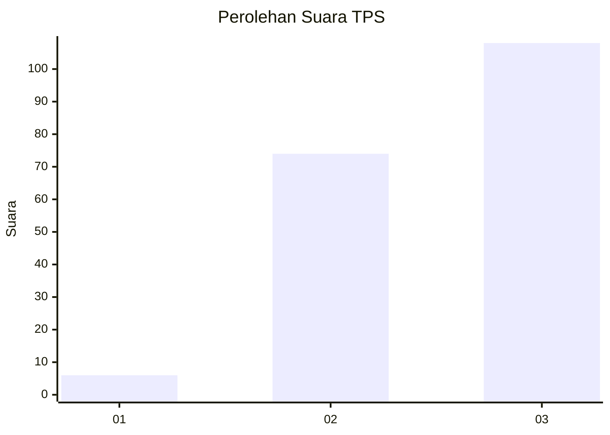
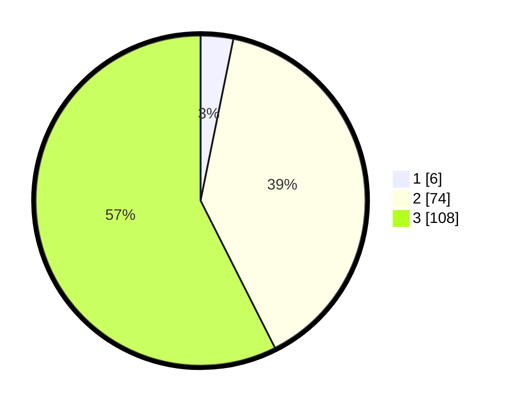

# Hasil

## Grafik

## Tabel

| No. | Nama Paslon    | Suara | Suara (raw) | Persentase |
|:--- |:-------------- | -----:| -----------:| ----------:|
| 1   | ANIES MUHAIMIN | 6     | [6][p-1]    | 3,19       |
| 2   | PRABOWO GIBRAN | 74    | [74][p-2]   | 39,36      |
| 3   | GANJAR MAHFUD  | 108   | [108][p-3]  | 57,45      |

[p-1]: https://github.com/gigit-pemilu/pemilu-2024-35-jawa-timur/blob/main/pilpres/hitung-suara/sub/35-jawa-timur/sub/09-jember/sub/30-silo/sub/2002-harjomulyo/sub/025-tps/sub/paslon-1.txt
[p-2]: https://github.com/gigit-pemilu/pemilu-2024-35-jawa-timur/blob/main/pilpres/hitung-suara/sub/35-jawa-timur/sub/09-jember/sub/30-silo/sub/2002-harjomulyo/sub/025-tps/sub/paslon-2.txt
[p-3]: https://github.com/gigit-pemilu/pemilu-2024-35-jawa-timur/blob/main/pilpres/hitung-suara/sub/35-jawa-timur/sub/09-jember/sub/30-silo/sub/2002-harjomulyo/sub/025-tps/sub/paslon-3.txt

## Foto C Plano

https://sirekap-obj-formc.kpu.go.id/6179/pemilu/ppwp/35/09/30/20/02/3509302002025-20240215-015649--25f57e32-8558-47c8-ad9f-069c91d6098a.jpg

https://sirekap-obj-formc.kpu.go.id/6179/pemilu/ppwp/35/09/30/20/02/3509302002025-20240215-015800--c3be00a5-2601-4b21-b9db-185af4c14b5f.jpg

https://sirekap-obj-formc.kpu.go.id/6179/pemilu/ppwp/35/09/30/20/02/3509302002025-20240215-015836--035dba7b-6362-47ea-aa24-ba89e7d52a40.jpg

## Metadata

| Key        | Value               |
| ---------- | ------------------- |
| Time Stamp | 2024-02-15 15:00:29 |

