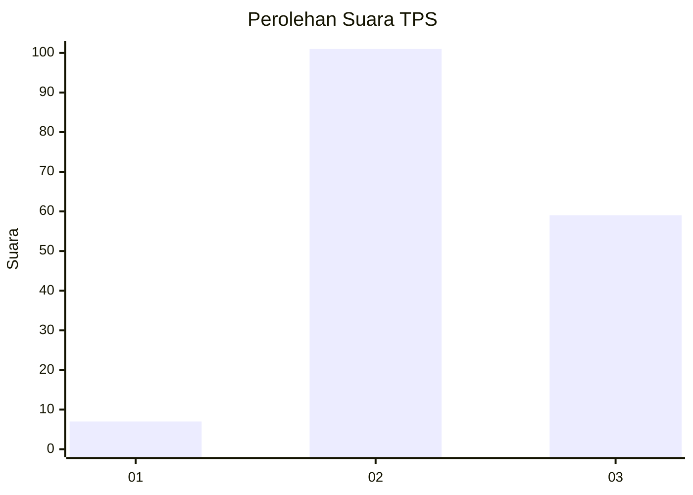
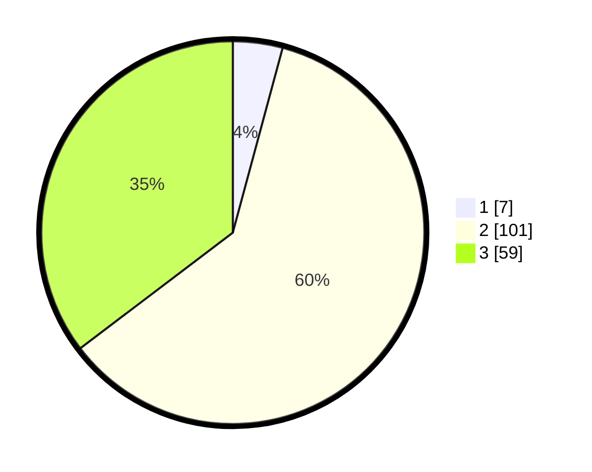

# Hasil

## Grafik

## Tabel

| No. | Nama Paslon    | Suara | Suara (raw) | Persentase |
|:--- |:-------------- | -----:| -----------:| ----------:|
| 1   | ANIES MUHAIMIN | 7     | [7][p-1]    | 4,19       |
| 2   | PRABOWO GIBRAN | 101   | [101][p-2]  | 60,48      |
| 3   | GANJAR MAHFUD  | 59    | [59][p-3]   | 35,33      |

[p-1]: https://github.com/gigit-pemilu/pemilu-2024/blob/main/pilpres/hitung-suara/sub/35-jawa-timur/sub/09-jember/sub/30-silo/sub/2002-harjomulyo/sub/032-tps/sub/paslon-1.txt
[p-2]: https://github.com/gigit-pemilu/pemilu-2024/blob/main/pilpres/hitung-suara/sub/35-jawa-timur/sub/09-jember/sub/30-silo/sub/2002-harjomulyo/sub/032-tps/sub/paslon-2.txt
[p-3]: https://github.com/gigit-pemilu/pemilu-2024/blob/main/pilpres/hitung-suara/sub/35-jawa-timur/sub/09-jember/sub/30-silo/sub/2002-harjomulyo/sub/032-tps/sub/paslon-3.txt

## Foto C Plano

https://sirekap-obj-formc.kpu.go.id/afa7/pemilu/ppwp/35/09/30/20/02/3509302002032-20240214-222505--858b121c-5ff3-4c2b-ad2f-8f4c70329682.jpg

https://sirekap-obj-formc.kpu.go.id/afa7/pemilu/ppwp/35/09/30/20/02/3509302002032-20240214-231131--1f55ed0d-7ef0-4801-b5d7-bd19c7c6ef98.jpg

https://sirekap-obj-formc.kpu.go.id/afa7/pemilu/ppwp/35/09/30/20/02/3509302002032-20240214-231319--80f8e92b-5751-4871-9fbc-ff5bf5f5c55e.jpg

## Metadata

| Key        | Value               |
| ---------- | ------------------- |
| Time Stamp | 2024-02-15 19:00:26 |

