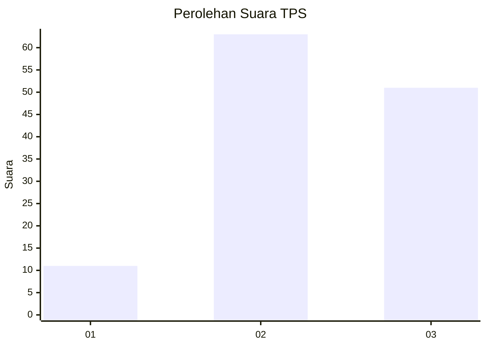
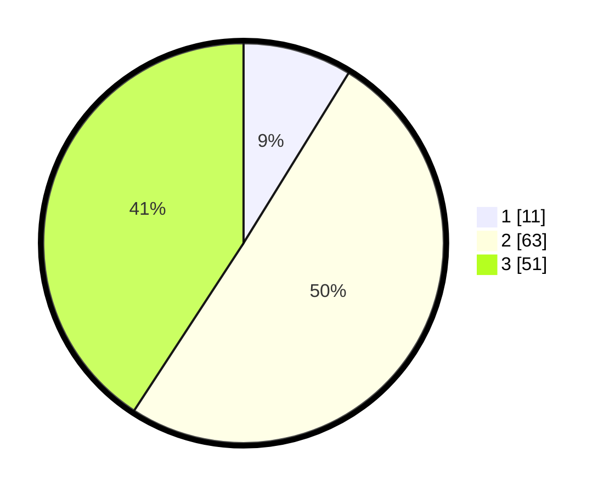

# Hasil

## Grafik

## Tabel

| No. | Nama Paslon    | Suara | Suara (raw) | Persentase |
|:--- |:-------------- | -----:| -----------:| ----------:|
| 1   | ANIES MUHAIMIN | 11    | [11][p-1]   | 8,80       |
| 2   | PRABOWO GIBRAN | 63    | [63][p-2]   | 50,40      |
| 3   | GANJAR MAHFUD  | 51    | [51][p-3]   | 40,80      |

[p-1]: https://github.com/gigit-pemilu/pemilu-2024-35-jawa-timur/blob/main/pilpres/hitung-suara/sub/35-jawa-timur/sub/09-jember/sub/30-silo/sub/2002-harjomulyo/sub/033-tps/sub/paslon-1.txt
[p-2]: https://github.com/gigit-pemilu/pemilu-2024-35-jawa-timur/blob/main/pilpres/hitung-suara/sub/35-jawa-timur/sub/09-jember/sub/30-silo/sub/2002-harjomulyo/sub/033-tps/sub/paslon-2.txt
[p-3]: https://github.com/gigit-pemilu/pemilu-2024-35-jawa-timur/blob/main/pilpres/hitung-suara/sub/35-jawa-timur/sub/09-jember/sub/30-silo/sub/2002-harjomulyo/sub/033-tps/sub/paslon-3.txt

## Foto C Plano

https://sirekap-obj-formc.kpu.go.id/8dd3/pemilu/ppwp/35/09/30/20/02/3509302002033-20240214-194617--7d4bb295-0a4a-49b8-856e-0149697458d5.jpg

https://sirekap-obj-formc.kpu.go.id/8dd3/pemilu/ppwp/35/09/30/20/02/3509302002033-20240214-194151--de1a5262-651b-4ac7-b67a-ba16ab5fbda4.jpg

https://sirekap-obj-formc.kpu.go.id/8dd3/pemilu/ppwp/35/09/30/20/02/3509302002033-20240214-194752--a0ca33ec-a39c-42c5-b096-6c40c2d57c60.jpg

## Metadata

| Key        | Value               |
| ---------- | ------------------- |
| Time Stamp | 2024-02-15 19:00:26 |

