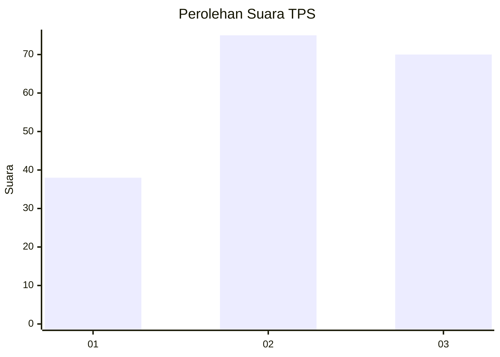
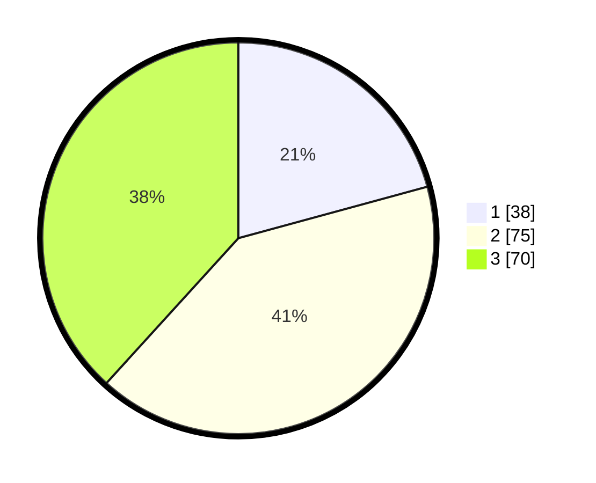

# Hasil

## Grafik

## Tabel

| No. | Nama Paslon    | Suara | Suara (raw) | Persentase |
|:--- |:-------------- | -----:| -----------:| ----------:|
| 1   | ANIES MUHAIMIN | 38    | [38][p-1]   | 20,77      |
| 2   | PRABOWO GIBRAN | 75    | [75][p-2]   | 40,98      |
| 3   | GANJAR MAHFUD  | 70    | [70][p-3]   | 38,25      |

[p-1]: https://github.com/gigit-pemilu/pemilu-2024-35-jawa-timur/blob/main/pilpres/hitung-suara/sub/35-jawa-timur/sub/09-jember/sub/30-silo/sub/2002-harjomulyo/sub/036-tps/sub/paslon-1.txt
[p-2]: https://github.com/gigit-pemilu/pemilu-2024-35-jawa-timur/blob/main/pilpres/hitung-suara/sub/35-jawa-timur/sub/09-jember/sub/30-silo/sub/2002-harjomulyo/sub/036-tps/sub/paslon-2.txt
[p-3]: https://github.com/gigit-pemilu/pemilu-2024-35-jawa-timur/blob/main/pilpres/hitung-suara/sub/35-jawa-timur/sub/09-jember/sub/30-silo/sub/2002-harjomulyo/sub/036-tps/sub/paslon-3.txt

## Foto C Plano

https://sirekap-obj-formc.kpu.go.id/a572/pemilu/ppwp/35/09/30/20/02/3509302002036-20240215-034146--a729c6d9-915a-47db-8147-edf2805984ce.jpg

https://sirekap-obj-formc.kpu.go.id/a572/pemilu/ppwp/35/09/30/20/02/3509302002036-20240215-034335--92b574e9-a091-4262-8c19-ff9906900942.jpg

https://sirekap-obj-formc.kpu.go.id/a572/pemilu/ppwp/35/09/30/20/02/3509302002036-20240215-034509--aba1cd14-1102-4ad4-a9f5-838747bda367.jpg

## Metadata

| Key        | Value               |
| ---------- | ------------------- |
| Time Stamp | 2024-02-15 15:00:29 |

