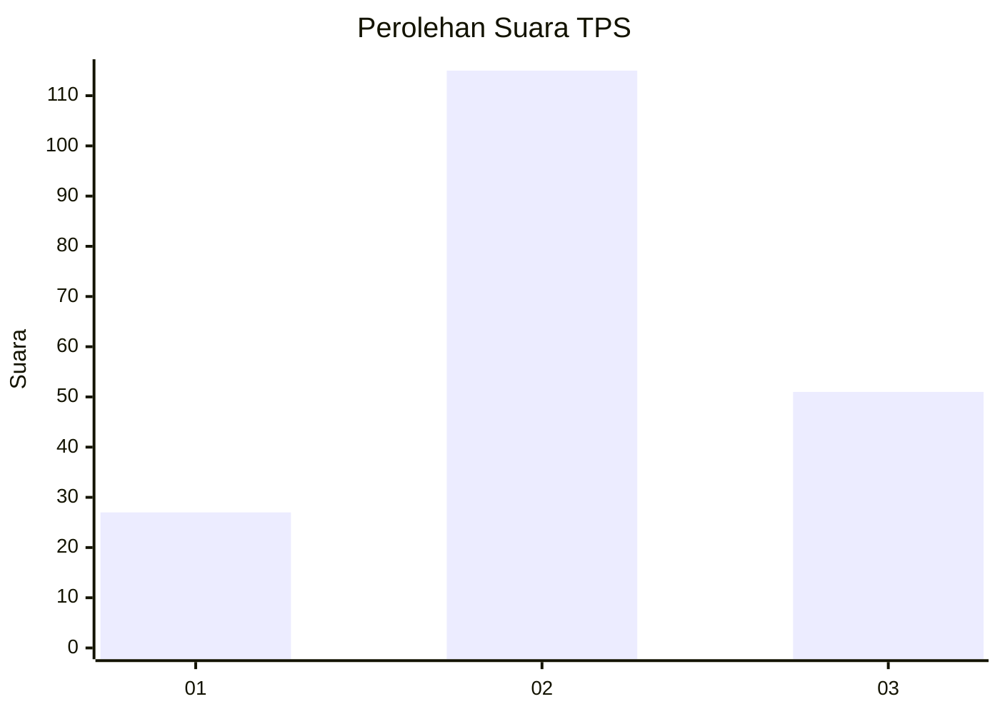
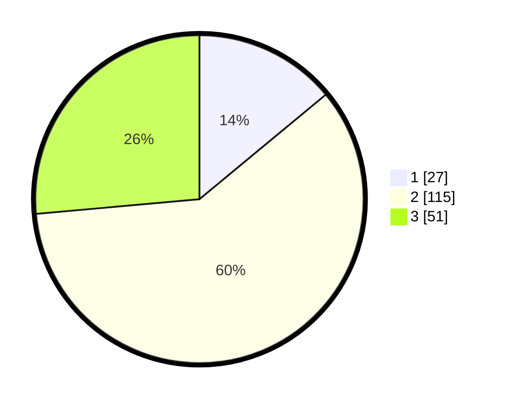

# Hasil

## Grafik

## Tabel

| No. | Nama Paslon    | Suara | Suara (raw) | Persentase |
|:--- |:-------------- | -----:| -----------:| ----------:|
| 1   | ANIES MUHAIMIN | 27    | [27][p-1]   | 13,99      |
| 2   | PRABOWO GIBRAN | 115   | [115][p-2]  | 59,59      |
| 3   | GANJAR MAHFUD  | 51    | [51][p-3]   | 26,42      |

[p-1]: https://github.com/gigit-pemilu/pemilu-2024/blob/main/pilpres/hitung-suara/sub/35-jawa-timur/sub/09-jember/sub/30-silo/sub/2003-karangharjo/sub/006-tps/sub/paslon-1.txt
[p-2]: https://github.com/gigit-pemilu/pemilu-2024/blob/main/pilpres/hitung-suara/sub/35-jawa-timur/sub/09-jember/sub/30-silo/sub/2003-karangharjo/sub/006-tps/sub/paslon-2.txt
[p-3]: https://github.com/gigit-pemilu/pemilu-2024/blob/main/pilpres/hitung-suara/sub/35-jawa-timur/sub/09-jember/sub/30-silo/sub/2003-karangharjo/sub/006-tps/sub/paslon-3.txt

## Foto C Plano

https://sirekap-obj-formc.kpu.go.id/014b/pemilu/ppwp/35/09/30/20/03/3509302003006-20240215-002750--31bd5d67-0a79-4272-adb5-1f95bdcbad0d.jpg

https://sirekap-obj-formc.kpu.go.id/014b/pemilu/ppwp/35/09/30/20/03/3509302003006-20240215-000406--9333abb8-2dd2-43c6-98b3-ad1d9199e17f.jpg

https://sirekap-obj-formc.kpu.go.id/014b/pemilu/ppwp/35/09/30/20/03/3509302003006-20240215-000511--c2558d42-6349-42cb-aa5f-e2a0377e8a2a.jpg

## Metadata

| Key        | Value               |
| ---------- | ------------------- |
| Time Stamp | 2024-02-15 19:00:26 |

