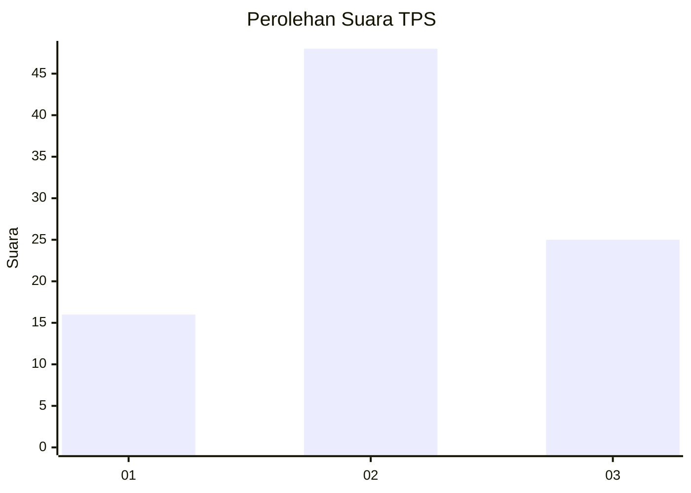
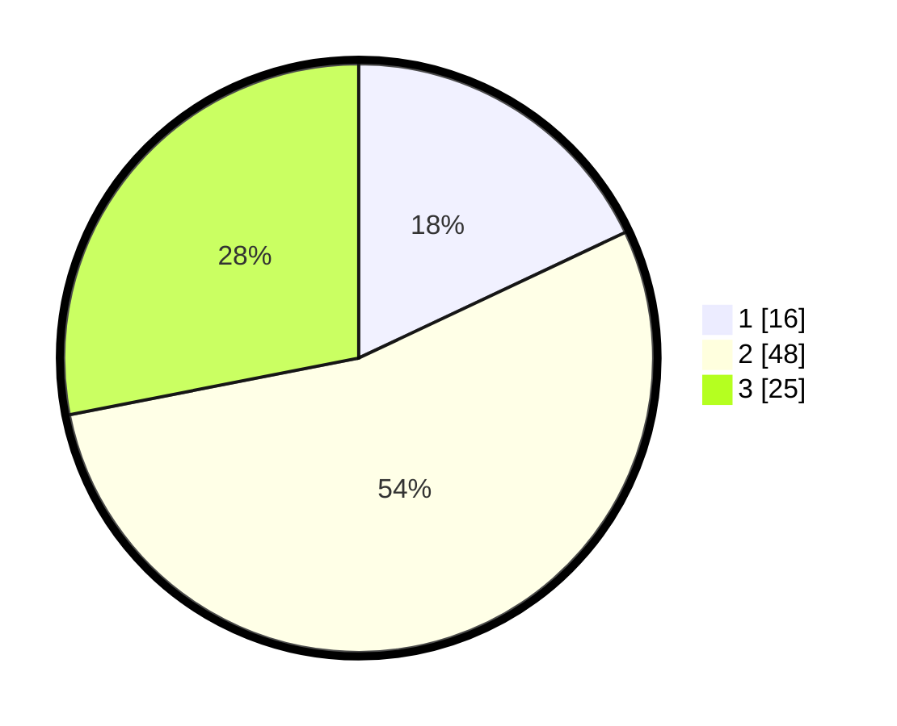

# Hasil

## Grafik

## Tabel

| No. | Nama Paslon    | Suara | Suara (raw) | Persentase |
|:--- |:-------------- | -----:| -----------:| ----------:|
| 1   | ANIES MUHAIMIN | 16    | [16][p-1]   | 17,98      |
| 2   | PRABOWO GIBRAN | 48    | [48][p-2]   | 53,93      |
| 3   | GANJAR MAHFUD  | 25    | [25][p-3]   | 28,09      |

[p-1]: https://github.com/gigit-pemilu/pemilu-2024-35-jawa-timur/blob/main/pilpres/hitung-suara/sub/35-jawa-timur/sub/09-jember/sub/30-silo/sub/2003-karangharjo/sub/009-tps/sub/paslon-1.txt
[p-2]: https://github.com/gigit-pemilu/pemilu-2024-35-jawa-timur/blob/main/pilpres/hitung-suara/sub/35-jawa-timur/sub/09-jember/sub/30-silo/sub/2003-karangharjo/sub/009-tps/sub/paslon-2.txt
[p-3]: https://github.com/gigit-pemilu/pemilu-2024-35-jawa-timur/blob/main/pilpres/hitung-suara/sub/35-jawa-timur/sub/09-jember/sub/30-silo/sub/2003-karangharjo/sub/009-tps/sub/paslon-3.txt

## Foto C Plano

https://sirekap-obj-formc.kpu.go.id/f29c/pemilu/ppwp/35/09/30/20/03/3509302003009-20240214-210612--58cc2782-d8ce-4438-8099-fa74832c32aa.jpg

https://sirekap-obj-formc.kpu.go.id/f29c/pemilu/ppwp/35/09/30/20/03/3509302003009-20240214-210651--6ea4efec-7fca-4687-b8fa-70bb96c1cc35.jpg

https://sirekap-obj-formc.kpu.go.id/f29c/pemilu/ppwp/35/09/30/20/03/3509302003009-20240214-210722--d80b88fa-4a43-4aec-ad23-93b60db81541.jpg

## Metadata

| Key        | Value               |
| ---------- | ------------------- |
| Time Stamp | 2024-02-15 16:30:25 |

