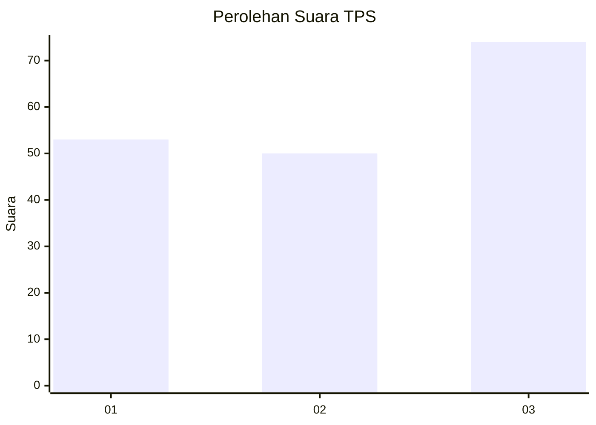
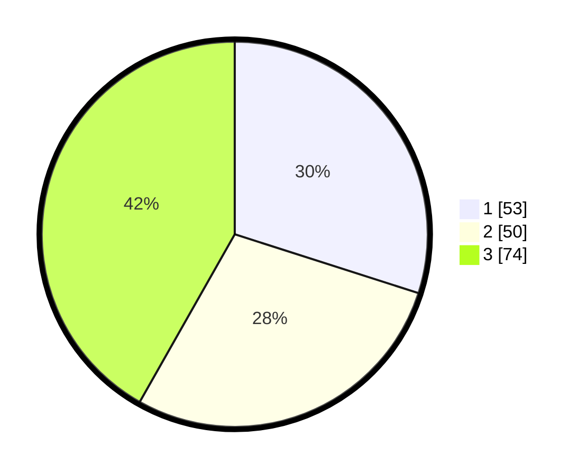

# Hasil

## Grafik

## Tabel

| No. | Nama Paslon    | Suara | Suara (raw) | Persentase |
|:--- |:-------------- | -----:| -----------:| ----------:|
| 1   | ANIES MUHAIMIN | 53    | [53][p-1]   | 29,94      |
| 2   | PRABOWO GIBRAN | 50    | [50][p-2]   | 28,25      |
| 3   | GANJAR MAHFUD  | 74    | [74][p-3]   | 41,81      |

[p-1]: https://github.com/gigit-pemilu/pemilu-2024-35-jawa-timur/blob/main/pilpres/hitung-suara/sub/35-jawa-timur/sub/09-jember/sub/30-silo/sub/2003-karangharjo/sub/018-tps/sub/paslon-1.txt
[p-2]: https://github.com/gigit-pemilu/pemilu-2024-35-jawa-timur/blob/main/pilpres/hitung-suara/sub/35-jawa-timur/sub/09-jember/sub/30-silo/sub/2003-karangharjo/sub/018-tps/sub/paslon-2.txt
[p-3]: https://github.com/gigit-pemilu/pemilu-2024-35-jawa-timur/blob/main/pilpres/hitung-suara/sub/35-jawa-timur/sub/09-jember/sub/30-silo/sub/2003-karangharjo/sub/018-tps/sub/paslon-3.txt

## Foto C Plano

https://sirekap-obj-formc.kpu.go.id/2f16/pemilu/ppwp/35/09/30/20/03/3509302003018-20240214-212704--1845b346-7fc4-40f6-bd9e-4b13f543977a.jpg

https://sirekap-obj-formc.kpu.go.id/2f16/pemilu/ppwp/35/09/30/20/03/3509302003018-20240214-212852--1bd9662f-3e25-430f-b860-9516afbbdbc2.jpg

https://sirekap-obj-formc.kpu.go.id/2f16/pemilu/ppwp/35/09/30/20/03/3509302003018-20240214-213017--ca882778-2823-4eec-a72d-1b9b6a102766.jpg

## Metadata

| Key        | Value               |
| ---------- | ------------------- |
| Time Stamp | 2024-02-15 17:00:25 |

