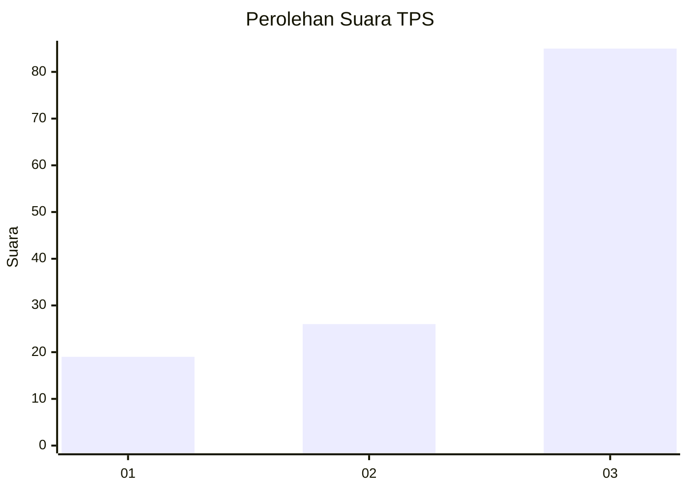
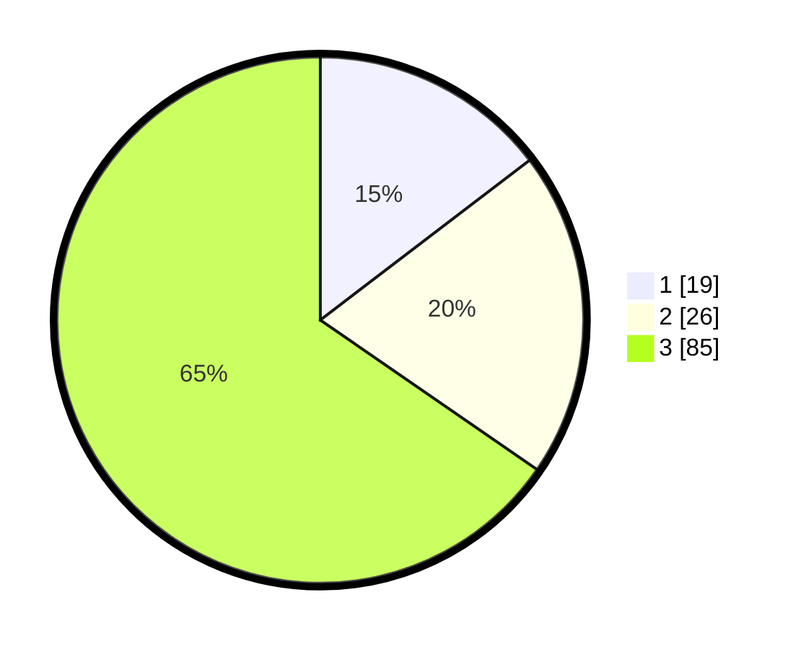

# Hasil

## Grafik

## Tabel

| No. | Nama Paslon    | Suara | Suara (raw) | Persentase |
|:--- |:-------------- | -----:| -----------:| ----------:|
| 1   | ANIES MUHAIMIN | 19    | [19][p-1]   | 14,62      |
| 2   | PRABOWO GIBRAN | 26    | [26][p-2]   | 20,00      |
| 3   | GANJAR MAHFUD  | 85    | [85][p-3]   | 65,38      |

[p-1]: https://github.com/gigit-pemilu/pemilu-2024/blob/main/pilpres/hitung-suara/sub/35-jawa-timur/sub/09-jember/sub/30-silo/sub/2003-karangharjo/sub/019-tps/sub/paslon-1.txt
[p-2]: https://github.com/gigit-pemilu/pemilu-2024/blob/main/pilpres/hitung-suara/sub/35-jawa-timur/sub/09-jember/sub/30-silo/sub/2003-karangharjo/sub/019-tps/sub/paslon-2.txt
[p-3]: https://github.com/gigit-pemilu/pemilu-2024/blob/main/pilpres/hitung-suara/sub/35-jawa-timur/sub/09-jember/sub/30-silo/sub/2003-karangharjo/sub/019-tps/sub/paslon-3.txt

## Foto C Plano

https://sirekap-obj-formc.kpu.go.id/4897/pemilu/ppwp/35/09/30/20/03/3509302003019-20240215-165420--b7042814-8144-4fd1-bcd5-6f77bed04f51.jpg

https://sirekap-obj-formc.kpu.go.id/4897/pemilu/ppwp/35/09/30/20/03/3509302003019-20240215-165710--6b3ca55f-fb4d-4905-aa4b-c02d68a93c90.jpg

https://sirekap-obj-formc.kpu.go.id/4897/pemilu/ppwp/35/09/30/20/03/3509302003019-20240215-204759--c29aea6a-a58c-4e51-ab00-ec5b4c6558fb.jpg

## Metadata

| Key        | Value               |
| ---------- | ------------------- |
| Time Stamp | 2024-02-15 21:01:18 |

