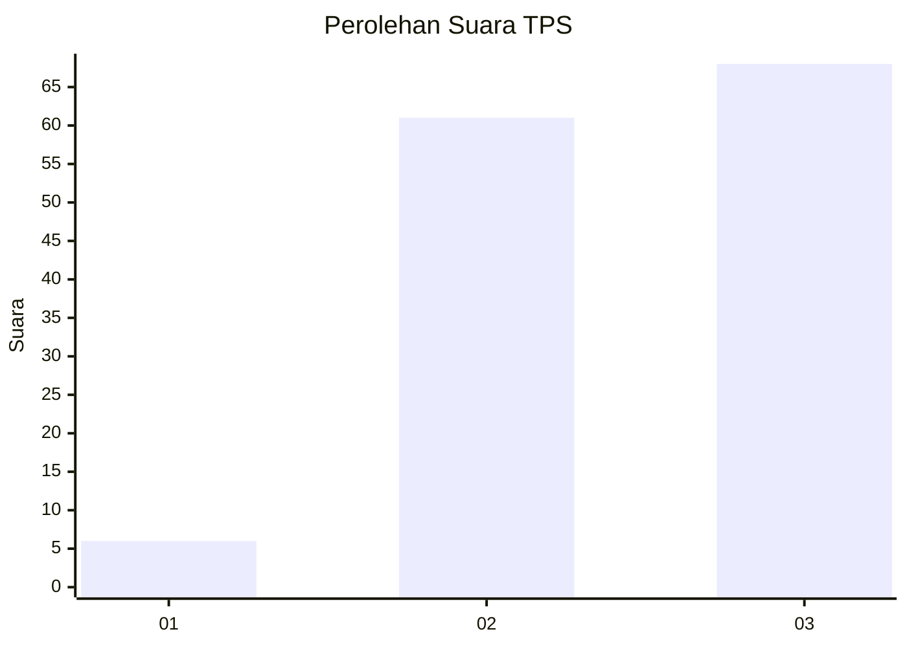
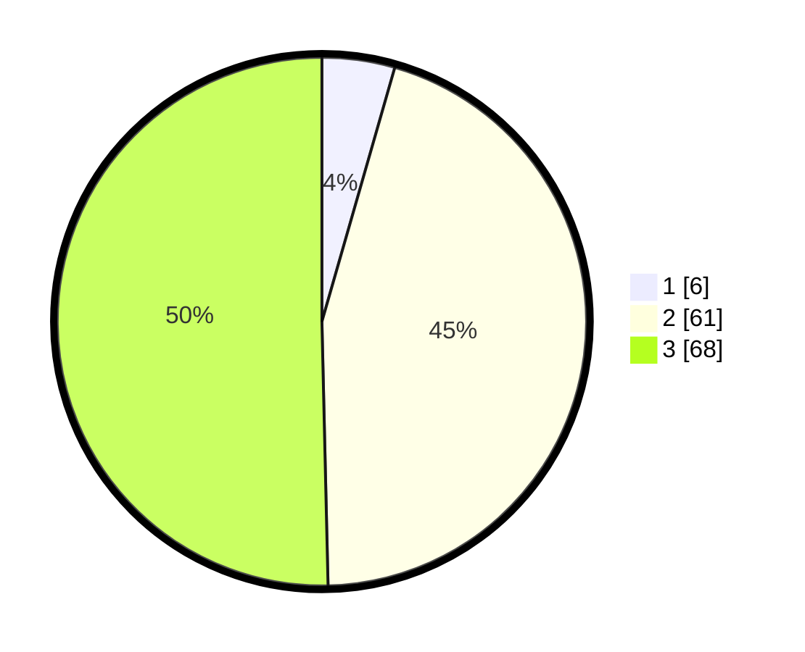

# Hasil

## Grafik

## Tabel

| No. | Nama Paslon    | Suara | Suara (raw) | Persentase |
|:--- |:-------------- | -----:| -----------:| ----------:|
| 1   | ANIES MUHAIMIN | 6     | [6][p-1]    | 4,44       |
| 2   | PRABOWO GIBRAN | 61    | [61][p-2]   | 45,19      |
| 3   | GANJAR MAHFUD  | 68    | [68][p-3]   | 50,37      |

[p-1]: https://github.com/gigit-pemilu/pemilu-2024/blob/main/pilpres/hitung-suara/sub/35-jawa-timur/sub/09-jember/sub/30-silo/sub/2003-karangharjo/sub/023-tps/sub/paslon-1.txt
[p-2]: https://github.com/gigit-pemilu/pemilu-2024/blob/main/pilpres/hitung-suara/sub/35-jawa-timur/sub/09-jember/sub/30-silo/sub/2003-karangharjo/sub/023-tps/sub/paslon-2.txt
[p-3]: https://github.com/gigit-pemilu/pemilu-2024/blob/main/pilpres/hitung-suara/sub/35-jawa-timur/sub/09-jember/sub/30-silo/sub/2003-karangharjo/sub/023-tps/sub/paslon-3.txt

## Foto C Plano

https://sirekap-obj-formc.kpu.go.id/1e9e/pemilu/ppwp/35/09/30/20/03/3509302003023-20240220-164504--80008d12-8b10-4983-9baf-8e2953980c94.jpg

https://sirekap-obj-formc.kpu.go.id/1e9e/pemilu/ppwp/35/09/30/20/03/3509302003023-20240220-164616--9e28c6b9-b286-4daa-b344-f041073ad86a.jpg

https://sirekap-obj-formc.kpu.go.id/1e9e/pemilu/ppwp/35/09/30/20/03/3509302003023-20240220-170506--8cf52c94-1645-4b4b-9f15-686f17470675.jpg

## Metadata

| Key        | Value               |
| ---------- | ------------------- |
| Time Stamp | 2024-02-24 22:31:28 |

