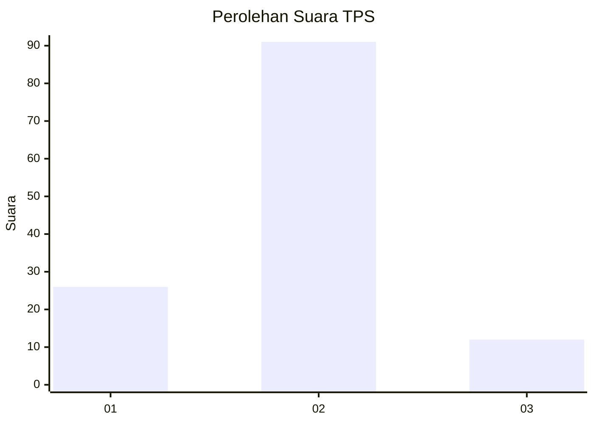
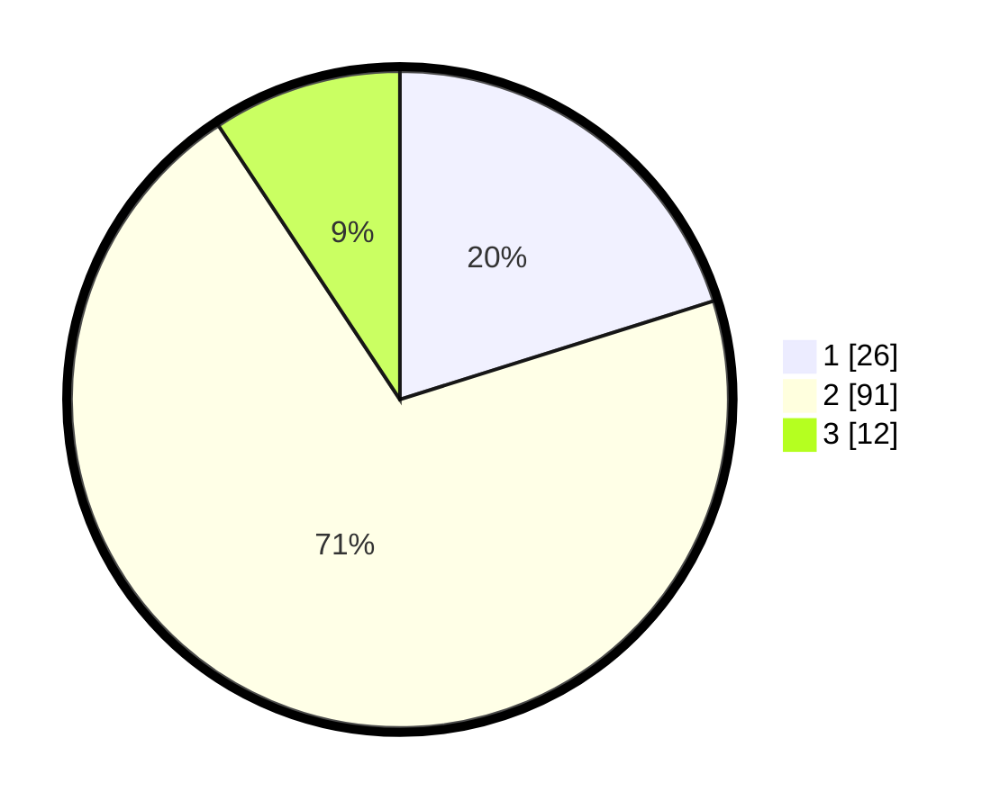

# Hasil

## Grafik

## Tabel

| No. | Nama Paslon    | Suara | Suara (raw) | Persentase |
|:--- |:-------------- | -----:| -----------:| ----------:|
| 1   | ANIES MUHAIMIN | 26    | [26][p-1]   | 20,16      |
| 2   | PRABOWO GIBRAN | 91    | [91][p-2]   | 70,54      |
| 3   | GANJAR MAHFUD  | 12    | [12][p-3]   | 9,30       |

[p-1]: https://github.com/gigit-pemilu/pemilu-2024/blob/main/pilpres/hitung-suara/sub/35-jawa-timur/sub/09-jember/sub/30-silo/sub/2003-karangharjo/sub/038-tps/sub/paslon-1.txt
[p-2]: https://github.com/gigit-pemilu/pemilu-2024/blob/main/pilpres/hitung-suara/sub/35-jawa-timur/sub/09-jember/sub/30-silo/sub/2003-karangharjo/sub/038-tps/sub/paslon-2.txt
[p-3]: https://github.com/gigit-pemilu/pemilu-2024/blob/main/pilpres/hitung-suara/sub/35-jawa-timur/sub/09-jember/sub/30-silo/sub/2003-karangharjo/sub/038-tps/sub/paslon-3.txt

## Foto C Plano

https://sirekap-obj-formc.kpu.go.id/85ab/pemilu/ppwp/35/09/30/20/03/3509302003038-20240214-203811--597d943e-9c1c-41f2-9597-06f0d95fd0bf.jpg

https://sirekap-obj-formc.kpu.go.id/85ab/pemilu/ppwp/35/09/30/20/03/3509302003038-20240214-203921--b9897094-1c22-4bf0-a6d7-77dc4a3e2887.jpg

https://sirekap-obj-formc.kpu.go.id/85ab/pemilu/ppwp/35/09/30/20/03/3509302003038-20240214-203655--ccd719f4-53a7-45d8-a62e-a33654298426.jpg

## Metadata

| Key        | Value               |
| ---------- | ------------------- |
| Time Stamp | 2024-02-15 15:00:29 |

