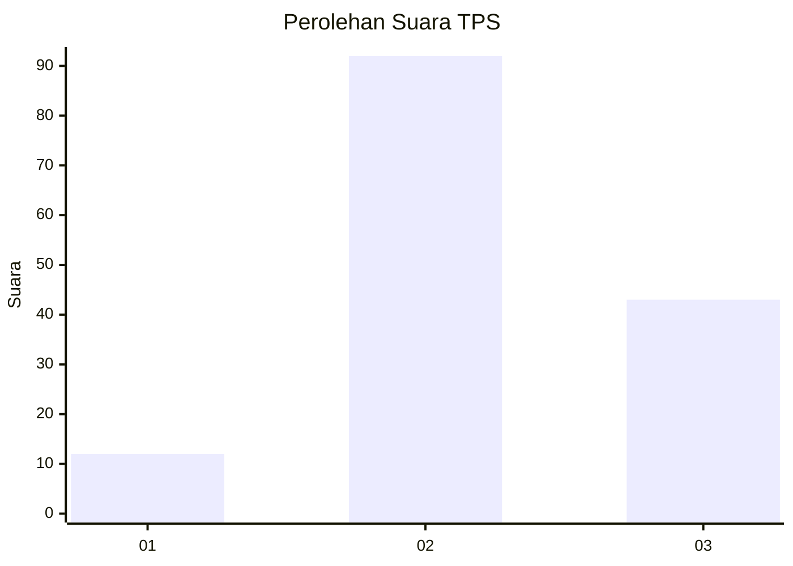
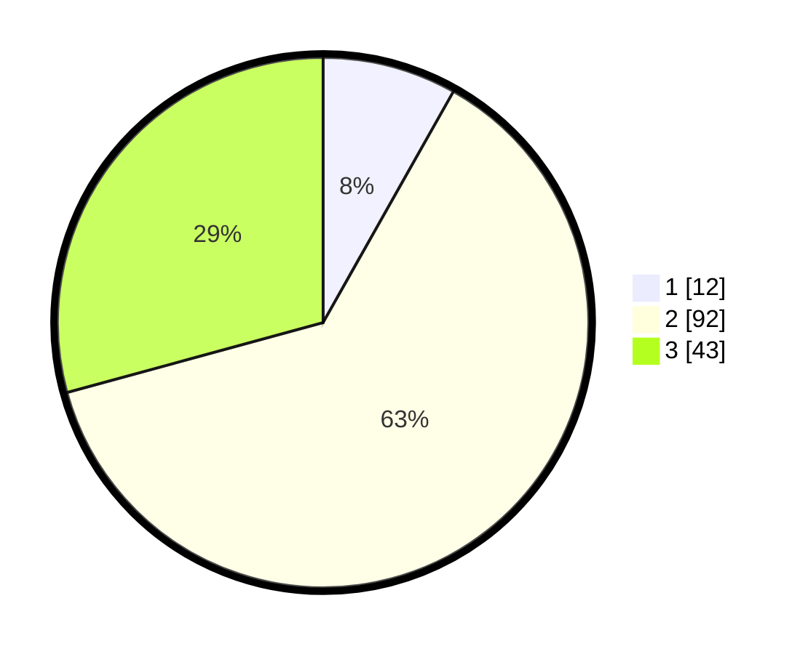

# Hasil

## Grafik

## Tabel

| No. | Nama Paslon    | Suara | Suara (raw) | Persentase |
|:--- |:-------------- | -----:| -----------:| ----------:|
| 1   | ANIES MUHAIMIN | 12    | [12][p-1]   | 8,16       |
| 2   | PRABOWO GIBRAN | 92    | [92][p-2]   | 62,59      |
| 3   | GANJAR MAHFUD  | 43    | [43][p-3]   | 29,25      |

[p-1]: https://github.com/gigit-pemilu/pemilu-2024/blob/main/pilpres/hitung-suara/sub/35-jawa-timur/sub/09-jember/sub/30-silo/sub/2003-karangharjo/sub/040-tps/sub/paslon-1.txt
[p-2]: https://github.com/gigit-pemilu/pemilu-2024/blob/main/pilpres/hitung-suara/sub/35-jawa-timur/sub/09-jember/sub/30-silo/sub/2003-karangharjo/sub/040-tps/sub/paslon-2.txt
[p-3]: https://github.com/gigit-pemilu/pemilu-2024/blob/main/pilpres/hitung-suara/sub/35-jawa-timur/sub/09-jember/sub/30-silo/sub/2003-karangharjo/sub/040-tps/sub/paslon-3.txt

## Foto C Plano

https://sirekap-obj-formc.kpu.go.id/5fa4/pemilu/ppwp/35/09/30/20/03/3509302003040-20240214-215824--cef8aecb-ad36-407b-84e1-7b04ae588379.jpg

https://sirekap-obj-formc.kpu.go.id/5fa4/pemilu/ppwp/35/09/30/20/03/3509302003040-20240214-213616--6eced5f6-65ed-4c4c-8339-092e047b50bc.jpg

https://sirekap-obj-formc.kpu.go.id/5fa4/pemilu/ppwp/35/09/30/20/03/3509302003040-20240214-220226--734fcf71-117f-4920-83e8-42b917a56552.jpg

## Metadata

| Key        | Value               |
| ---------- | ------------------- |
| Time Stamp | 2024-02-15 19:30:26 |

