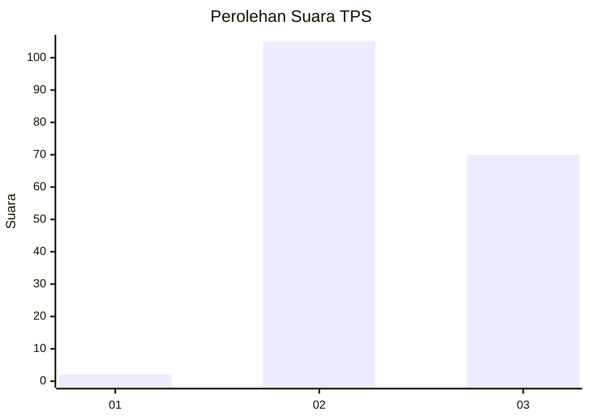
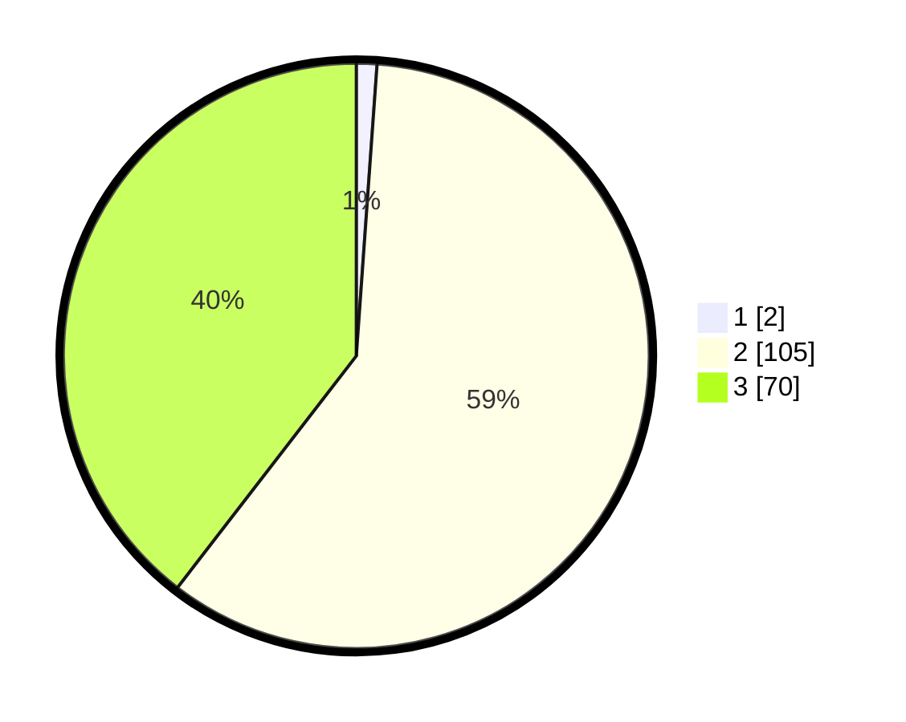

# Hasil

## Grafik

## Tabel

| No. | Nama Paslon    | Suara | Suara (raw) | Persentase |
|:--- |:-------------- | -----:| -----------:| ----------:|
| 1   | ANIES MUHAIMIN | 2     | [2][p-1]    | 1,13       |
| 2   | PRABOWO GIBRAN | 105   | [105][p-2]  | 59,32      |
| 3   | GANJAR MAHFUD  | 70    | [70][p-3]   | 39,55      |

[p-1]: https://github.com/gigit-pemilu/pemilu-2024/blob/main/pilpres/hitung-suara/sub/35-jawa-timur/sub/09-jember/sub/30-silo/sub/2003-karangharjo/sub/041-tps/sub/paslon-1.txt
[p-2]: https://github.com/gigit-pemilu/pemilu-2024/blob/main/pilpres/hitung-suara/sub/35-jawa-timur/sub/09-jember/sub/30-silo/sub/2003-karangharjo/sub/041-tps/sub/paslon-2.txt
[p-3]: https://github.com/gigit-pemilu/pemilu-2024/blob/main/pilpres/hitung-suara/sub/35-jawa-timur/sub/09-jember/sub/30-silo/sub/2003-karangharjo/sub/041-tps/sub/paslon-3.txt

## Foto C Plano

https://sirekap-obj-formc.kpu.go.id/619f/pemilu/ppwp/35/09/30/20/03/3509302003041-20240214-141533--eaf68a6c-1626-4026-b9f1-7f02ad2793e9.jpg

https://sirekap-obj-formc.kpu.go.id/619f/pemilu/ppwp/35/09/30/20/03/3509302003041-20240215-002102--04ae1422-9fd1-4c0b-8a0c-67be36ca41e6.jpg

https://sirekap-obj-formc.kpu.go.id/619f/pemilu/ppwp/35/09/30/20/03/3509302003041-20240214-141712--57d53c0a-1364-4eaf-93ca-d820a70f8af6.jpg

## Metadata

| Key        | Value               |
| ---------- | ------------------- |
| Time Stamp | 2024-02-15 17:00:25 |

