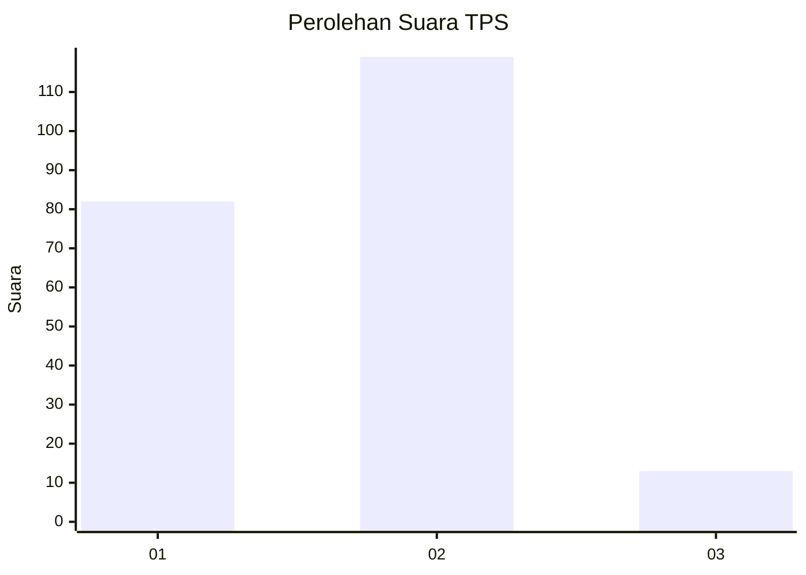
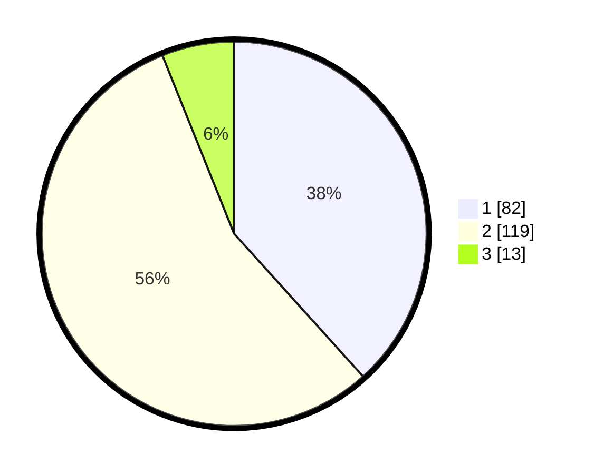

# Hasil

## Grafik

## Tabel

| No. | Nama Paslon    | Suara | Suara (raw) | Persentase |
|:--- |:-------------- | -----:| -----------:| ----------:|
| 1   | ANIES MUHAIMIN | 82    | [82][p-1]   | 38,32      |
| 2   | PRABOWO GIBRAN | 119   | [119][p-2]  | 55,61      |
| 3   | GANJAR MAHFUD  | 13    | [13][p-3]   | 6,07       |

[p-1]: https://github.com/gigit-pemilu/pemilu-2024/blob/main/pilpres/hitung-suara/sub/35-jawa-timur/sub/09-jember/sub/30-silo/sub/2004-silo/sub/012-tps/sub/paslon-1.txt
[p-2]: https://github.com/gigit-pemilu/pemilu-2024/blob/main/pilpres/hitung-suara/sub/35-jawa-timur/sub/09-jember/sub/30-silo/sub/2004-silo/sub/012-tps/sub/paslon-2.txt
[p-3]: https://github.com/gigit-pemilu/pemilu-2024/blob/main/pilpres/hitung-suara/sub/35-jawa-timur/sub/09-jember/sub/30-silo/sub/2004-silo/sub/012-tps/sub/paslon-3.txt

## Foto C Plano

https://sirekap-obj-formc.kpu.go.id/159e/pemilu/ppwp/35/09/30/20/04/3509302004012-20240214-204912--a405c616-5007-493a-a6f2-28a22213ab04.jpg

https://sirekap-obj-formc.kpu.go.id/159e/pemilu/ppwp/35/09/30/20/04/3509302004012-20240214-205039--bd517dc3-1312-40f1-9585-c7f366e101ec.jpg

https://sirekap-obj-formc.kpu.go.id/159e/pemilu/ppwp/35/09/30/20/04/3509302004012-20240214-205226--96477541-407d-4a4e-ab9b-e6de8ce22c4d.jpg

## Metadata

| Key        | Value               |
| ---------- | ------------------- |
| Time Stamp | 2024-02-15 17:00:25 |

