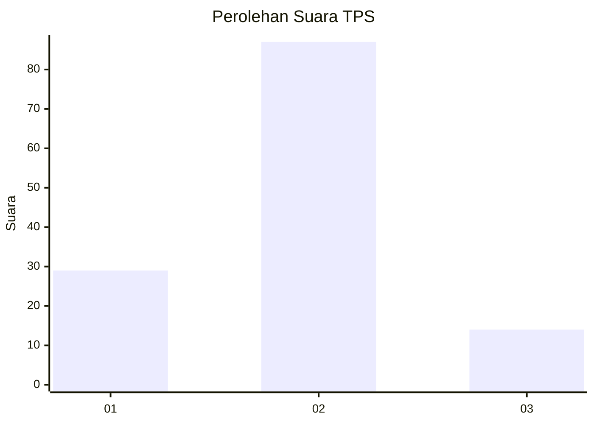

# Hasil

## Grafik

## Tabel

| No. | Nama Paslon    | Suara | Suara (raw) | Persentase |
|:--- |:-------------- | -----:| -----------:| ----------:|
| 1   | ANIES MUHAIMIN | 29    | [29][p-1]   | 22,31      |
| 2   | PRABOWO GIBRAN | 87    | [87][p-2]   | 66,92      |
| 3   | GANJAR MAHFUD  | 14    | [14][p-3]   | 10,77      |

[p-1]: https://github.com/gigit-pemilu/pemilu-2024/blob/main/pilpres/hitung-suara/sub/35-jawa-timur/sub/09-jember/sub/30-silo/sub/2004-silo/sub/018-tps/sub/paslon-1.txt
[p-2]: https://github.com/gigit-pemilu/pemilu-2024/blob/main/pilpres/hitung-suara/sub/35-jawa-timur/sub/09-jember/sub/30-silo/sub/2004-silo/sub/018-tps/sub/paslon-2.txt
[p-3]: https://github.com/gigit-pemilu/pemilu-2024/blob/main/pilpres/hitung-suara/sub/35-jawa-timur/sub/09-jember/sub/30-silo/sub/2004-silo/sub/018-tps/sub/paslon-3.txt

## Foto C Plano

https://sirekap-obj-formc.kpu.go.id/d326/pemilu/ppwp/35/09/30/20/04/3509302004018-20240214-215849--39148495-cb65-4317-90c7-e5e648e67c84.jpg

https://sirekap-obj-formc.kpu.go.id/d326/pemilu/ppwp/35/09/30/20/04/3509302004018-20240215-055606--f4cf8e2c-3ac8-45f9-97b4-79acdc20071c.jpg

https://sirekap-obj-formc.kpu.go.id/d326/pemilu/ppwp/35/09/30/20/04/3509302004018-20240215-055557--54e54e0b-5fa7-4e86-aebf-1ecf6f6b5cdf.jpg

## Metadata

| Key        | Value               |
| ---------- | ------------------- |
| Time Stamp | 2024-02-15 17:00:25 |

