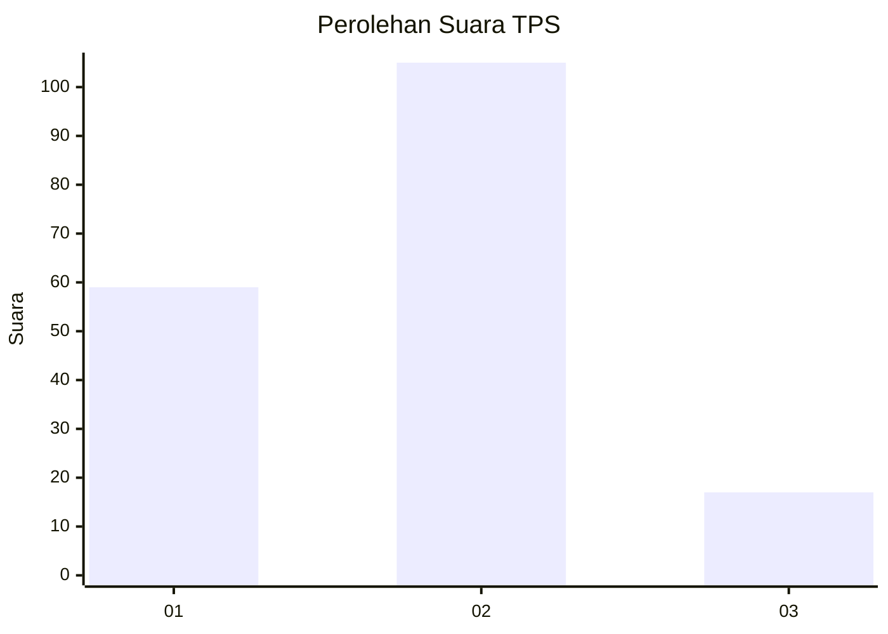
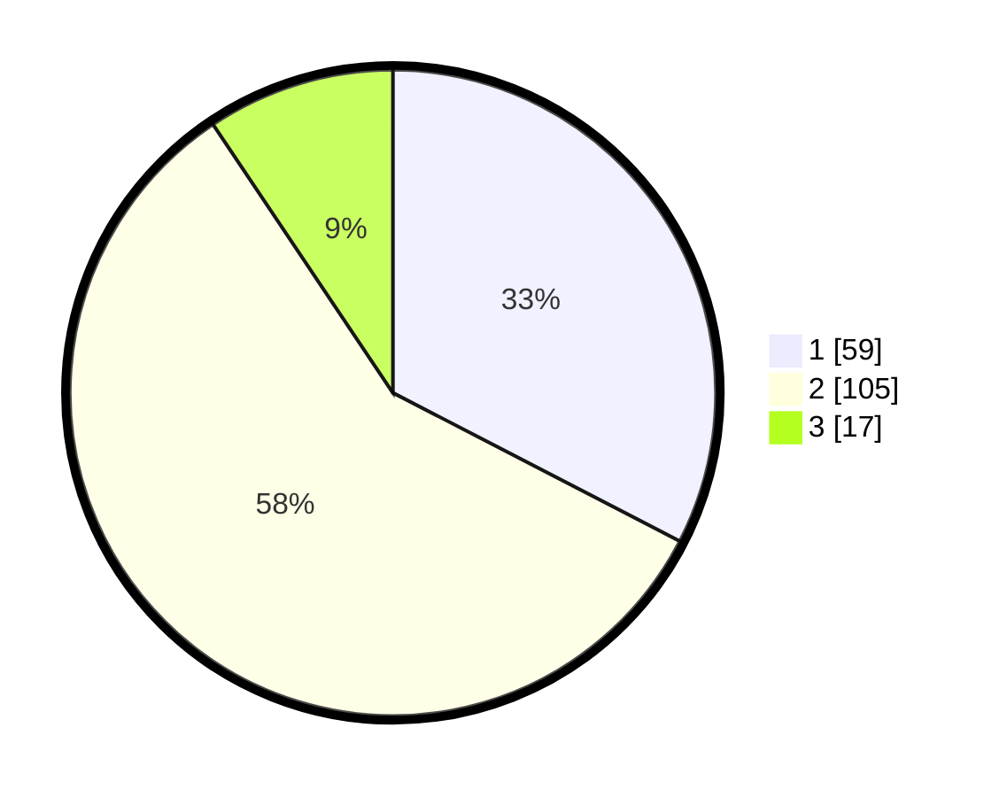

# Hasil

## Grafik

## Tabel

| No. | Nama Paslon    | Suara | Suara (raw) | Persentase |
|:--- |:-------------- | -----:| -----------:| ----------:|
| 1   | ANIES MUHAIMIN | 59    | [59][p-1]   | 32,60      |
| 2   | PRABOWO GIBRAN | 105   | [105][p-2]  | 58,01      |
| 3   | GANJAR MAHFUD  | 17    | [17][p-3]   | 9,39       |

[p-1]: https://github.com/gigit-pemilu/pemilu-2024-35-jawa-timur/blob/main/pilpres/hitung-suara/sub/35-jawa-timur/sub/09-jember/sub/30-silo/sub/2004-silo/sub/021-tps/sub/paslon-1.txt
[p-2]: https://github.com/gigit-pemilu/pemilu-2024-35-jawa-timur/blob/main/pilpres/hitung-suara/sub/35-jawa-timur/sub/09-jember/sub/30-silo/sub/2004-silo/sub/021-tps/sub/paslon-2.txt
[p-3]: https://github.com/gigit-pemilu/pemilu-2024-35-jawa-timur/blob/main/pilpres/hitung-suara/sub/35-jawa-timur/sub/09-jember/sub/30-silo/sub/2004-silo/sub/021-tps/sub/paslon-3.txt

## Foto C Plano

https://sirekap-obj-formc.kpu.go.id/f980/pemilu/ppwp/35/09/30/20/04/3509302004021-20240215-190053--cd913afd-62ba-4bca-a362-460cf9671e75.jpg

https://sirekap-obj-formc.kpu.go.id/f980/pemilu/ppwp/35/09/30/20/04/3509302004021-20240215-190213--7e1b22a1-2fd3-4195-8d44-99f44964d6c0.jpg

https://sirekap-obj-formc.kpu.go.id/f980/pemilu/ppwp/35/09/30/20/04/3509302004021-20240215-190304--da1527a3-0cc8-4443-a09a-2dadbe8c4e9b.jpg

## Metadata

| Key        | Value               |
| ---------- | ------------------- |
| Time Stamp | 2024-02-15 19:30:26 |

