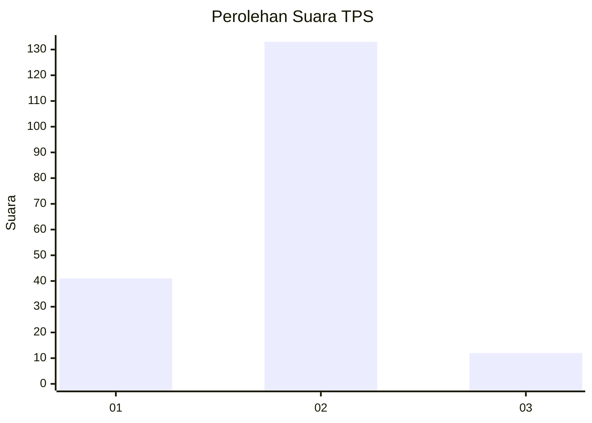

# Hasil

## Grafik

## Tabel

| No. | Nama Paslon    | Suara | Suara (raw) | Persentase |
|:--- |:-------------- | -----:| -----------:| ----------:|
| 1   | ANIES MUHAIMIN | 41    | [41][p-1]   | 22,04      |
| 2   | PRABOWO GIBRAN | 133   | [133][p-2]  | 71,51      |
| 3   | GANJAR MAHFUD  | 12    | [12][p-3]   | 6,45       |

[p-1]: https://github.com/gigit-pemilu/pemilu-2024-35-jawa-timur/blob/main/pilpres/hitung-suara/sub/35-jawa-timur/sub/09-jember/sub/30-silo/sub/2004-silo/sub/023-tps/sub/paslon-1.txt
[p-2]: https://github.com/gigit-pemilu/pemilu-2024-35-jawa-timur/blob/main/pilpres/hitung-suara/sub/35-jawa-timur/sub/09-jember/sub/30-silo/sub/2004-silo/sub/023-tps/sub/paslon-2.txt
[p-3]: https://github.com/gigit-pemilu/pemilu-2024-35-jawa-timur/blob/main/pilpres/hitung-suara/sub/35-jawa-timur/sub/09-jember/sub/30-silo/sub/2004-silo/sub/023-tps/sub/paslon-3.txt

## Foto C Plano

https://sirekap-obj-formc.kpu.go.id/767e/pemilu/ppwp/35/09/30/20/04/3509302004023-20240214-204513--c4b88262-03da-48f6-9ccc-a24369fa4adb.jpg

https://sirekap-obj-formc.kpu.go.id/767e/pemilu/ppwp/35/09/30/20/04/3509302004023-20240214-204806--cbc1c22a-3caa-45a7-b8b8-39e79f67af83.jpg

https://sirekap-obj-formc.kpu.go.id/767e/pemilu/ppwp/35/09/30/20/04/3509302004023-20240214-221429--499f35ac-9de6-4d1c-92b1-35a69e5361ed.jpg

## Metadata

| Key        | Value               |
| ---------- | ------------------- |
| Time Stamp | 2024-02-15 17:00:25 |

