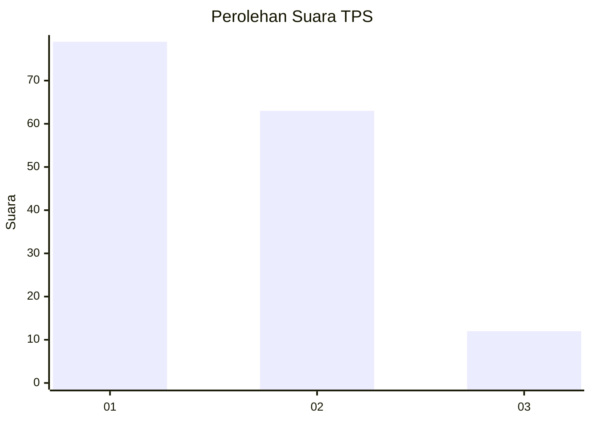
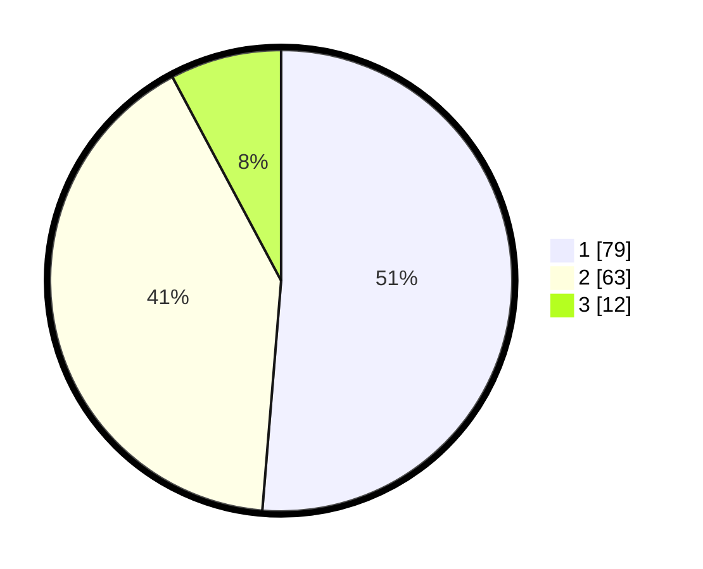

# Hasil

## Grafik

## Tabel

| No. | Nama Paslon    | Suara | Suara (raw) | Persentase |
|:--- |:-------------- | -----:| -----------:| ----------:|
| 1   | ANIES MUHAIMIN | 79    | [79][p-1]   | 51,30      |
| 2   | PRABOWO GIBRAN | 63    | [63][p-2]   | 40,91      |
| 3   | GANJAR MAHFUD  | 12    | [12][p-3]   | 7,79       |

[p-1]: https://github.com/gigit-pemilu/pemilu-2024/blob/main/pilpres/hitung-suara/sub/35-jawa-timur/sub/09-jember/sub/30-silo/sub/2004-silo/sub/025-tps/sub/paslon-1.txt
[p-2]: https://github.com/gigit-pemilu/pemilu-2024/blob/main/pilpres/hitung-suara/sub/35-jawa-timur/sub/09-jember/sub/30-silo/sub/2004-silo/sub/025-tps/sub/paslon-2.txt
[p-3]: https://github.com/gigit-pemilu/pemilu-2024/blob/main/pilpres/hitung-suara/sub/35-jawa-timur/sub/09-jember/sub/30-silo/sub/2004-silo/sub/025-tps/sub/paslon-3.txt

## Foto C Plano

https://sirekap-obj-formc.kpu.go.id/a361/pemilu/ppwp/35/09/30/20/04/3509302004025-20240214-231052--02e388e6-d4fc-4ae4-880f-4b9e388abbdc.jpg

https://sirekap-obj-formc.kpu.go.id/a361/pemilu/ppwp/35/09/30/20/04/3509302004025-20240214-231208--8b59361a-c9f3-4683-a299-de93147f15b7.jpg

https://sirekap-obj-formc.kpu.go.id/a361/pemilu/ppwp/35/09/30/20/04/3509302004025-20240214-231317--b997e9aa-6324-4d15-ae91-562c22799b3b.jpg

## Metadata

| Key        | Value               |
| ---------- | ------------------- |
| Time Stamp | 2024-02-15 17:00:25 |

